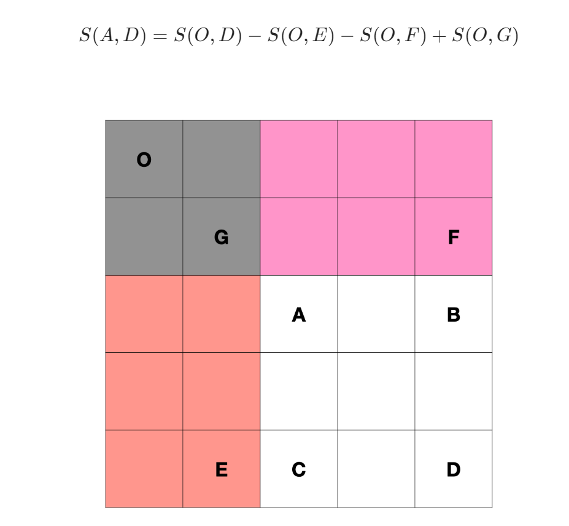

# PrefixSum

### [303. 区域和检索 - 数组不可变](https://leetcode-cn.com/problems/range-sum-query-immutable/)

```java
class NumArray {
    int[] arr;
    public NumArray(int[] nums) {
        arr = new int[nums.length + 1];
        for(int i = 0; i < nums.length; i++) {
            arr[i + 1] = arr[i] + nums[i];
        }
    }
    
    public int sumRange(int left, int right) {
        return arr[right + 1] - arr[left];
    }
}
```

构造一个前缀和数组，通过`arr[right + 1] - arr[left]`得到解答

### [304. 二维区域和检索 - 矩阵不可变](https://leetcode-cn.com/problems/range-sum-query-2d-immutable/)

#### 一维前缀和

```java
class NumMatrix {
    int[][] prefix;
    public NumMatrix(int[][] matrix) {
        int n = matrix.length, m = matrix[0].length;
        prefix = new int[n][m + 1];
        for(int i = 0; i < n; i++) {
            for(int j = 0; j < m; j++) {
                prefix[i][j + 1] = prefix[i][j] + matrix[i][j];
            }
        }
    }
    
    public int sumRegion(int row1, int col1, int row2, int col2) {
        int sum = 0;
        for(int i = row1; i <= row2; i++) {
            sum += prefix[i][col2 + 1] - prefix[i][col1];
        }
        return sum;
    }
}
```

每行初始化一个前缀和

#### 二维前缀和

```java
class NumMatrix {
    int[][] prefix;
    public NumMatrix(int[][] matrix) {
        int n = matrix.length, m = matrix[0].length;
        prefix = new int[n + 1][m + 1];
        for(int i = 0; i < n; i++) {
            for(int j = 0; j < m; j++) {
                prefix[i + 1][j + 1] = prefix[i + 1][j] + prefix[i][j + 1] - prefix[i][j] + matrix[i][j];
            }
        }
    }
    
    public int sumRegion(int row1, int col1, int row2, int col2) {
        return prefix[row2 + 1][col2 + 1] - prefix[row2 + 1][col1] - prefix[row1][col2 + 1] + prefix[row1][col1];
    }
}
```

构造前缀和、计算思路如下图所示。



### [560. 和为 K 的子数组](https://leetcode-cn.com/problems/subarray-sum-equals-k/)

#### 前缀和+暴力

```java
class Solution {
    public int subarraySum(int[] nums, int k) {
        int n = nums.length, cnt = 0;
        int[] prefix = new int[n + 1];
        for(int i = 0; i < n; i++) {
            prefix[i + 1] = prefix[i] + nums[i];
        }
        for(int i = 0; i <= n; i++) {
            for(int j = i + 1; j <= n; j++) {
                if(prefix[j] - prefix[i] == k) {
                    cnt++;
                }
            }
        }
        return cnt;
    }
}
```

前缀和逐个计算

#### 前缀和+哈希

```java
class Solution {
    public int subarraySum(int[] nums, int k) {
        //边存边查
        int n = nums.length;
        int prefix = 0, cnt = 0;
        Map<Integer, Integer> map = new HashMap<>();
        map.put(0, 1);
        for(int i = 0; i < n; i++) {
            prefix += nums[i];
            if(map.containsKey(prefix - k)) {
                cnt += map.get(prefix - k); 
            } 
            map.put(prefix, map.getOrDefault(prefix, 0) + 1);
        }
        return cnt;
    }
}
```

边计算前缀和，计算和为k数组数量，边存哈希。

