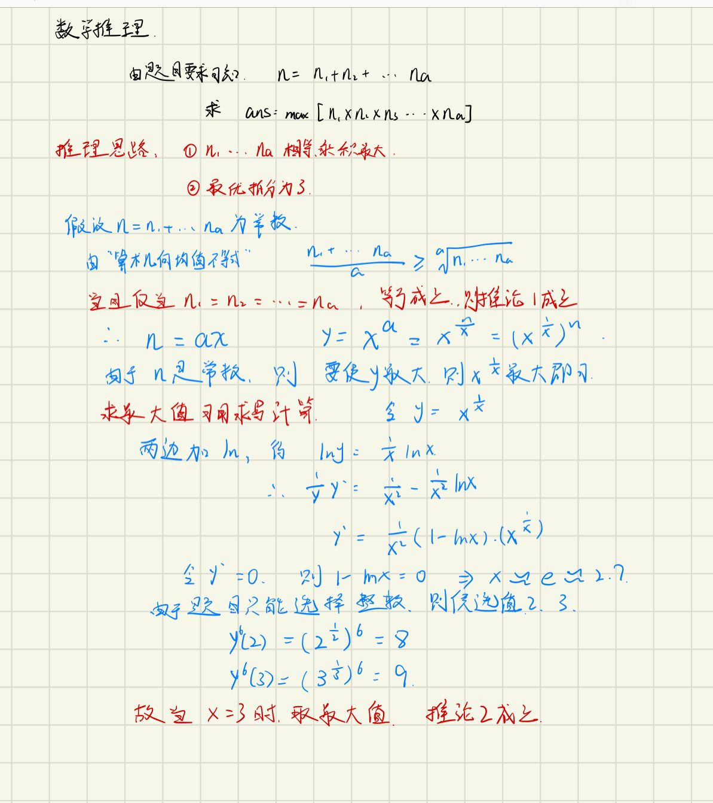

# 分割整数

[TOC]

### [91. 解码方法](https://leetcode-cn.com/problems/decode-ways/)

```java
class Solution {
    public int numDecodings(String s) {
        int n = s.length();
        char[] c = s.toCharArray();
        if(c[0] == '0'){
            return 0;
        } 
        int[] dp = new int[n + 1];
        dp[0] = 1;
        dp[1] = 1;
        for(int i = 1; i < n; i++) {
            int num = (c[i - 1] -'0')* 10 + (c[i] - '0');
            if(num > 10 && num <= 26 && num != 20) {
                dp[i + 1] = dp[i] + dp[i - 1];
            } else if(c[i] == '0') {
                if(num != 10 && num != 20) {
                    return 0;
                } else {
                    dp[i + 1] = dp[i - 1];
                }
            } else {
                dp[i + 1] = dp[i];
            }
        }
        return dp[n];
    }
}
```

##### 思路

分情况讨论

1. 如果刚开始就是0，则不可能实现编码，返回0
2. 如果在11-26（除了20），这个范围可以分开编码，比如可以当11，也可1,1。即f(x) = f(x - 1) + f(x - 2)
3. 如果当前为0，则必须依附前面的值，
   1. 如果为10或20，则为f(x) = f(x - 2); 
   2. 如果为30、40、……、90  则无法实现编码，直接返回0
4. 其余情况，无法分开编码，则将结果往传递，即f(x) = f(x - 1)

#### 代码+空间优化

```java
class Solution {
    public int numDecodings(String s) {
        char[] c = s.toCharArray();
        if(c[0] == '0') return 0;
        int pre = 1, cur = 1;
        for(int i = 1; i < c.length; i++) {
            int tmp = cur;
            if(c[i] == '0') {
                if(c[i - 1] == '1' || c[i - 1] == '2') {
                    cur = pre;
                } else {
                    return 0;
                }
            } else if (c[i - 1] == '1' || (c[i - 1] == '2' && c[i] >= '1' && c[i] <= '6')) {
                cur = cur + pre;
            }
            pre = tmp;
        }
        return cur;
    }
}
```


1. 由于只需要前面两次的值，所以可以用常量来代替数组，实现空间优化
2. 采用更为方便的分类讨论方式，实现代码优化


### [279. 完全平方数](https://leetcode-cn.com/problems/perfect-squares/)

```java
class Solution {
    public int numSquares(int n) {
        int[] dp = new int[n + 1];
        Arrays.fill(dp, n);
        dp[0] = 0;
        for(int i = 1; i <= n; i++) {
            for(int j = 1; i >= j*j; j++) {
                dp[i] = Math.min(dp[i], dp[i - j*j] + 1);
            }
        }
        return dp[n];
    }
}
```

##### 思路

状态方程： dp[i] = Math.min(dp[i], dp[i - j*j] + 1);

1. 首先是先初始化为最大值，同时dp[0]初始化为0。
2. i从1开始去记录之前的计算路径。
3. j从1开始计算符合最小的dp[i - j*j]。

### [343. 整数拆分](https://leetcode-cn.com/problems/integer-break/)

```java
class Solution {
    public int integerBreak(int n) {
        if(n < 4) return n - 1;
        int cnt = n / 3;
        int k = n % 3;
        if(k == 0) {
            return (int)Math.pow(3, cnt);
        } else if(k == 1){
            return (int)Math.pow(3, cnt - 1) * 4;
        } else {
            return (int)Math.pow(3, cnt) * 2;
        }
    }
}
```

##### 思路

**数学推理：**



**拆分规则：**
最优： 3 。把数字 n 可能拆为多个因子 3 ，余数可能为 0,1,2三种情况。
次优： 2 。若余数为 2 ；则保留，不再拆为 1+1 。
最差： 1 。若余数为 1 ；则应把一份 3 + 1 替换为 2 + 2，因为 2×2>3×1。

### [剑指 Offer 46. 把数字翻译成字符串](https://leetcode-cn.com/problems/ba-shu-zi-fan-yi-cheng-zi-fu-chuan-lcof/)

```java
class Solution {
    public int translateNum(int num) {
        int pre_num = num % 10, pre_ans = 1, ans = 1;
        num /= 10;
        while(num > 0) {
            int a = num % 10 * 10 + pre_num;
            //分情况讨论
            int c = a >= 10 && a <= 25 ? ans + pre_ans : ans;
            pre_ans = ans;
            ans = c;
            pre_num = num % 10;
            num /= 10;
        }
        return ans;
    }
}
```

从左往右跟从右往左一样，从左往右可以将数字转字符串处理


