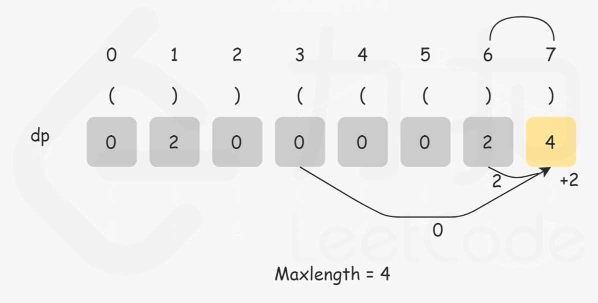
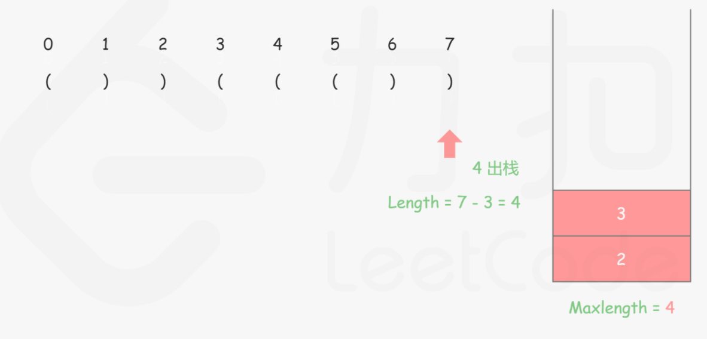
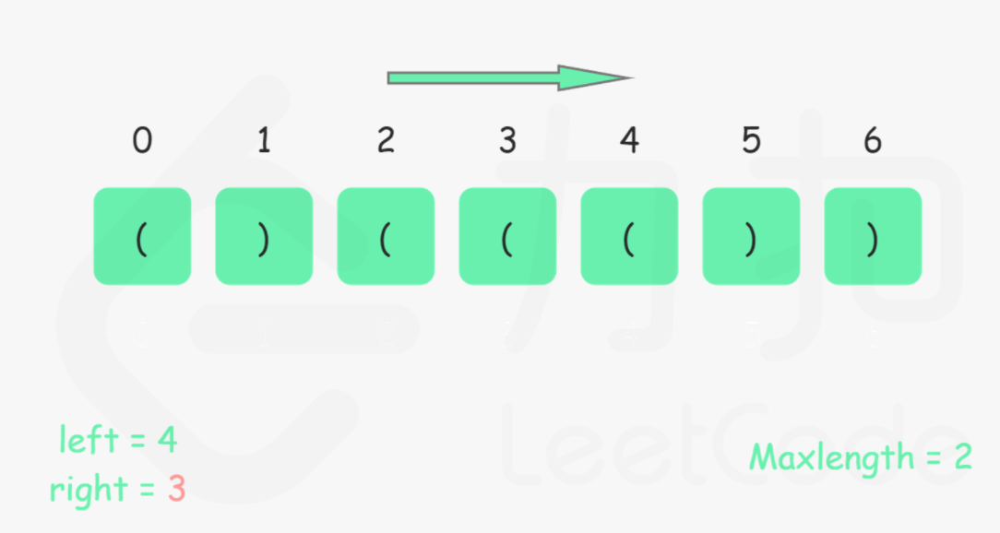
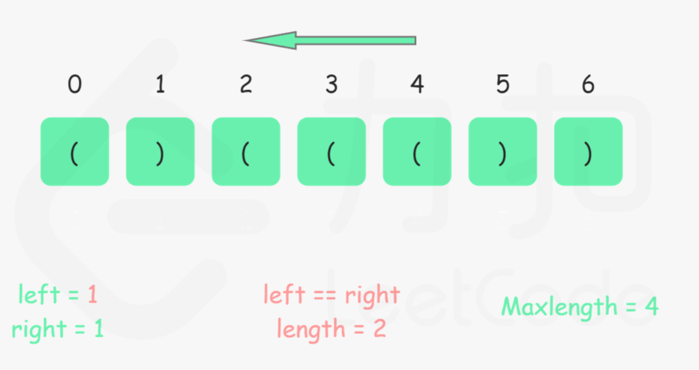

### [32. 最长有效括号](https://leetcode-cn.com/problems/longest-valid-parentheses/)

#### 动态规划

```java
class Solution {
    public int longestValidParentheses(String s) {
        int max = 0;
        int[] dp = new int[s.length()];
        for(int i = 1; i < s.length(); i++) {
            if(s.charAt(i) == ')') {
                if(s.charAt(i - 1) == '(') {
                    dp[i] = (i - 2 >= 0 ? dp[i - 2] : 0) + 2;
                } else if (i - dp[i - 1] - 1 >= 0 && s.charAt(i - dp[i - 1] - 1) == '(') {
                    dp[i] = dp[ i - 1] + (i - dp[i - 1] - 2 >= 0 ? dp[i - dp[i - 1] - 2] : 0) + 2;
                }
                max = Math.max(max,dp[i]);
            }
        }
        return max;
    }
}
```

状态定义：dp[i] 为当前索引中，前面连续匹配的括号长度。

状态转移：如果s.charAt(i) == ')'

* 当`s.charAt(i - 1) == '('`，说明可以跟上一个括号匹配，将`dp[i - 2]`的值向后传递并+2
* 当`s.charAt(i - dp[i - 1] - 1) == '('`即前面至少有一对匹配，而当前为连续匹配，需要去掉已匹配的部分，将之前的` dp[i - dp[i - 1] - 2]`跟上一个匹配的`dp[ i - 1]`合并并+2



#### 栈

```java
class Solution {
    public int longestValidParentheses(String s) {
        int max = 0;
        Deque<Integer> stack = new ArrayDeque();
        stack.add(-1);
        for(int i = 0; i < s.length(); i++) {
            if(s.charAt(i) == '(') {
                stack.add(i);
            } else {
                stack.pollLast();
                if(stack.isEmpty()) {
                    stack.add(i);
                } else {
                    max = Math.max(max, i - stack.peekLast());
                }
            }
        }
        return max;
    }
}
```

先通过栈顶加入-1作为哨兵，作为第一次不匹配的媒介

* 当`s.charAt(i) == '('` 压栈
* 否则，弹出并对栈判空
  * 栈为空，压栈
  * 不为空，计算最大值



#### 双指针

```java
class Solution {
    public int longestValidParentheses(String s) {
        int n = s.length();
        int left = 0, right = 0, max = 0;
        for(int i = 0; i < n; i++) {
            if(s.charAt(i) == '(') {
                left++;
            } else {
                right++;
            }
            if(left < right) {
                left = 0;
                right = 0;
            } else if (left == right){
                max = Math.max(max, 2 * left);
            }
        }
        left = 0;
        right = 0;
        for(int i = n - 1; i >= 0; i--) {
            if(s.charAt(i) == '(') {
                left++;
            } else {
                right++;
            }
            if(left > right) {
                left = 0;
                right = 0;
            } else if (left == right){
                max = Math.max(max, 2 * left);
            }
        }
        return max;
    }
}
```

贪心计算，如果只计算一遍 ，会漏掉类似`(()`的情况，所以需要两边都对left、right指针计算，求两边的最大值




