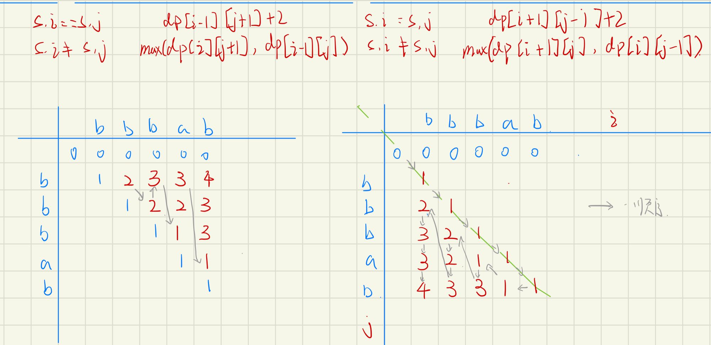
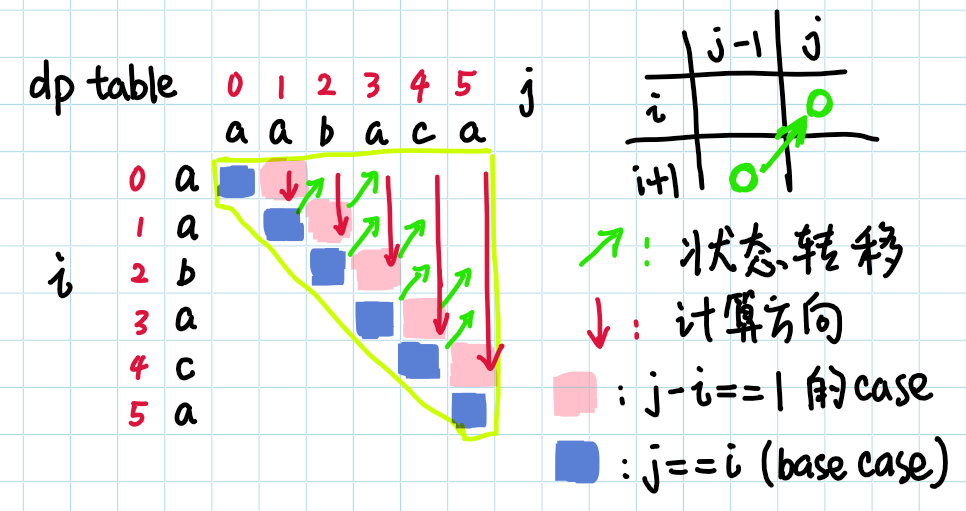

# 回文串

[TOC]


### [5. 最长回文子串](https://leetcode-cn.com/problems/longest-palindromic-substring/)

```java
class Solution {
    public String longestPalindrome(String s) {
        int n = s.length();
        int i = 0, j = 2 * n + 1, max = 0;
        int start = 0, end = 0;
        while(i < j) {
            int l = i / 2, r = (i + 1) / 2;
            while(l >= 0 && r < n && s.charAt(l) == s.charAt(r)){
                l--;
                r++;
            }
            if(r - l > max) {
                start = l + 1;
                end = r;
                max = r - l;
            }
            i++;
        }
        return s.substring(start, end);
    }
}
```

* 将n长度的字符串分割成2 * n + 1个位置

* 对每个位置，通过中心扩散，向两边检验回文长度，当长度大于之前所计算长度，则更新start、end索引值

### [516. 最长回文子序列](https://leetcode-cn.com/problems/longest-palindromic-subsequence/)

```java
class Solution {
    public int longestPalindromeSubseq(String s) {
        int n = s.length();
        int[][] dp = new int[n + 1][n + 1];
        for(int i = 1; i <= n; i++) {
            dp[i][i] = 1;
            for(int j = i - 1; j > 0; j--) {
                if(s.charAt(i - 1) == s.charAt(j - 1)) {
                    dp[i][j] = dp[i - 1][j + 1] + 2;
                } else {
                    dp[i][j] = Math.max(dp[i - 1][j], dp[i][j + 1]);
                }
            }
        }
        return dp[n][1];
    }
}
```

* s.i == s.j  则在原有的回文串长度下，增加长度2

* s.i != s.j   则可能是由`dp[i - 1][j], dp[i][j + 1]`中较大的回文串决定当前回文串长度。



### [647. 回文子串](https://leetcode-cn.com/problems/palindromic-substrings/)

#### 动态规划

```java
class Solution {
    public int countSubstrings(String s) {
        int n = s.length(), ans = 0;
        boolean[][] dp = new boolean [n][n];
        for(int i = 0; i < n; i++) {
            for(int j = 0; j <= i; j++) {
                if(s.charAt(i) == s.charAt(j) && (i - j < 2 || dp[i - 1][j + 1])) {
                    dp[i][j] = true;
                    ans++;
                }
            }
        }
        return ans;
    }
}
```

`s.charAt(i) == s.charAt(j) && (i - j < 2 || dp[i - 1][j + 1])`中

当左右字符相同时

1. 左右字符是同一个
2. 左右字符内是一个回文子串，如“abcba”中  如果'a'相同，若"bcb"已经是回文子串，则当前子串为回文子串

符合上述条件，将当前子串标志为回文串`dp[i][j]=true` 同时 ans+1

#### 中心扩展

```java
class Solution {
    public int countSubstrings(String s) {
        int n = s.length();
        int i = 0, j = 2 * n + 1;
        int sum = 0;
        while(i <= j) {
            int l = i / 2, r = (i + 1) / 2 ;
            while(l >= 0 && r < n && s.charAt(l) == s.charAt(r)) {
                sum++;
                l--;
                r++;
            }
            i++;
        }
        return sum;
    }
}
```

中心扩展时，若当前左右字符相同，由于内部子串已经验证为回文串并且进行过sum++操作，则当前新的回文串也只需要执行sum++，标识为一个新的回文串。

通过中心扩散的方式扫描，能够找到所有符合条件的回文串




* 