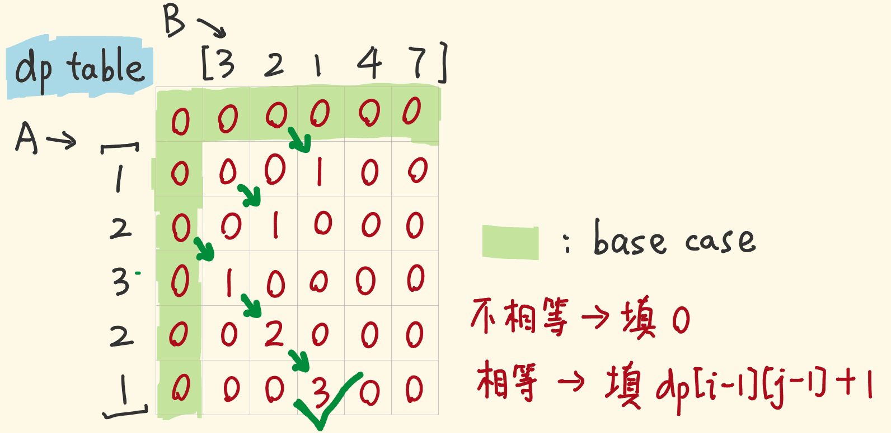

[TOC] 


# 最长递增子序列

### [300. 最长递增子序列](https://leetcode-cn.com/problems/longest-increasing-subsequence/)

```java
class Solution {
        int n = nums.length;
        int[] dp = new int[n];
        int k = 0;
        for(int i = 0; i < n; i++) {
            int l = 0, r = k;
            while(l < r) {
                int mid = l + (r - l) / 2;
                if(dp[mid] < nums[i]) {
                    l = mid + 1;
                } else {
                    r = mid;
                }
            }
            dp[l] = nums[i];
            if(k == l) {
                k++;
            } 
        }
        return k;
    }
}
```

##### 思路

1. 由于dp数组有序，可通过二分法提高查找位置效率，可以快速找到该替换的位置。
2. 其次k == l时，向后扩展一位。


### [435. 无重叠区间](https://leetcode-cn.com/problems/non-overlapping-intervals/)

```java
class Solution {
    public int eraseOverlapIntervals(int[][] intervals) {
        Arrays.sort(intervals, (a, b)->(a[1] - b[1]));
        int pre = Integer.MIN_VALUE, cnt = 0;
        for(int[] nums : intervals) {
            if(nums[0] < pre) {
                cnt++;
            } else {
                pre = nums[1];
            }
        }
        return cnt;
    }
}
```

##### 思路

1. 首先先判断采用哪位作为排序依据，由于是用上一个数字的后位比较当前的前位值，所以采用a[1] - b[1]
2. 根据题意分类
   1. 重叠，cnt++
   2. 不重叠，更新pre

### [376. 摆动序列](https://leetcode-cn.com/problems/wiggle-subsequence/)

#### 峰谷法

```java
class Solution {
    public int wiggleMaxLength(int[] nums) {
        int n = nums.length, cnt = 1;
        for(int i = 1; i < n;) {
            if(nums[i] > nums[i - 1]) {
                while(i < n && nums[i] >= nums[i - 1]) {
                    i++;
                }
                cnt++;
            } else if(nums[i] < nums[i - 1]) {
                while(i < n && nums[i] <= nums[i - 1]) {
                    i++;
                }
                cnt++;
            } else {
                i++;
            }
        }
        return cnt;
    }
}
```

##### 思路

1. 每次找到波峰或者波谷
2. 在寻找的过程中注意`nums[i] >= nums[i - 1]`中的等号


#### 贪心策略优化

```java
class Solution {
    public int wiggleMaxLength(int[] nums) {
        int up = 1, down = 1;
        for(int i = 1; i < nums.length; i++) {
            if(nums[i] > nums[i - 1]){
                up = down + 1;
            } else if(nums[i] < nums[i - 1]) {
                down = up + 1;
            }
        }
        return Math.max(up, down);
    }
}
```

##### 思路

1. 如果没有发生交叉，进行无效累加。
2. 发生交叉则更新up通过down更新（down通过up更新）


### [452. 用最少数量的箭引爆气球](https://leetcode-cn.com/problems/minimum-number-of-arrows-to-burst-balloons/)

```java
class Solution {
    public int findMinArrowShots(int[][] points) {
        Arrays.sort(points, (a, b)-> (a[1] >= b[1] ? 1 : -1));
        int cnt = 0;
        long pre = Long.MIN_VALUE;
        for(int[] nums : points) {
            if(pre < nums[0]) {
                cnt++;
                pre = nums[1];
            }
        }
        return cnt;
    }
}
```

##### 思路

1. 首先依旧采用右端升序，并且等同于无重叠问题
2. 特殊用例`[[-2147483646,-2147483645],[2147483646,2147483647]]`
   1. 由于在`(a,b)->(a[0] - b[0]);`进行减法操作会发生溢出，导致无法得到正确结果
   2. 故可以采用`(a, b)-> (a[1] >= b[1] ? 1 : -1)`解决

### [646. 最长数对链](https://leetcode-cn.com/problems/maximum-length-of-pair-chain/)

```java
class Solution {
    public int findLongestChain(int[][] pairs) {
        Arrays.sort(pairs, (a,b)->(a[0] - b[0]));
        int cnt = 0, pre = Integer.MIN_VALUE;

        for(int i = 0; i < pairs.length; i++) {
            if(pairs[i][0] > pre) {
                cnt++;
                pre = pairs[i][1];
            } else {
                pre = Math.min(pairs[i][1], pre);
            }
        }
        return cnt;
    }
}
```

##### 思路

1. 用一个pre常量暂存上一次不重叠链的后位数，作为下一次判断的依据
2. 先进行排序，然后分两种情况讨论
   1. 不重叠，则计数+1，更新pre
   2. 重叠，则让pre尽可能小。


#### 贪心策略

```java
class Solution {
    public int findLongestChain(int[][] pairs) {
        Arrays.sort(pairs, (a, b)->(a[1]-b[1]));
        int cnt =0, pre = Integer.MIN_VALUE;
        for(int[] nums : pairs) {
            if(nums[0] > pre) {
                cnt++;
                pre = nums[1];
            }
        }
        return cnt;
    }
}
```

##### 思路

1. 根据后位数进行排序
2. 无重叠部分进行计数，更新pre


### [674. 最长连续递增序列](https://leetcode-cn.com/problems/longest-continuous-increasing-subsequence/)

```java
class Solution {
    public int findLengthOfLCIS(int[] nums) {
        int n = nums.length, cnt = 1, max = 1;
        for(int i = 1; i < n;) {
            while(i < n && nums[i] > nums[i - 1]) {
                cnt++;
                i++;
            }
            max = Math.max(max ,cnt);
            while(i < n && nums[i] <= nums[i - 1]) {
                i++;
            }
            cnt = 1;
        } 
        return max;
    }
}
```

##### 思路

1. 峰谷法，先找到最高点，再掉回最低点

#### 代码优化

```java
class Solution {
    public int findLengthOfLCIS(int[] nums) {
        int n = nums.length, cnt = 1, max = 1;
        for(int i = 1; i < n; i++) {
            if(nums[i] > nums[i - 1]) {
                cnt++;
            } else {
                cnt = 1;
            }
            max = Math.max(max, cnt);
        }
        return max;
    }
}
```

# 最长公共子序列

### [53. 最大子数组和](https://leetcode-cn.com/problems/maximum-subarray/)（连续）

```java
class Solution {
    public int maxSubArray(int[] nums) {
        int sum = 0, max = Integer.MIN_VALUE;
        for(int i = 0; i < nums.length; i++) {
            sum = (sum < 0 ? 0 : sum) + nums[i];
            max = Math.max(max, sum);
        }
        return max;
    }
}
```

##### 思路

1. 贪心法，当累加小于0，则从0开始计数

### [718. 最长重复子数组](https://leetcode-cn.com/problems/maximum-length-of-repeated-subarray/)（连续）

```java
class Solution {
    public int findLength(int[] nums1, int[] nums2) {
        int n = nums1.length, m = nums2.length, max = 0;
        int[][] dp = new int[n + 1][m + 1];
        for(int i = 1; i <= n; i++) {
            for(int j = 1; j <= m; j++) {
                if(nums1[i - 1] == nums2[j - 1]) {
                    dp[i][j] = dp[i - 1][j - 1] + 1;
                } 
                max = Math.max(dp[i][j], max);
            }
        }
        return max;
    }
}
```

##### 思路

1. 该题目要求为连续子数组，所以
   1. 当`nums1[i - 1] == nums2[j - 1]`时，进行+1
   2. 当`nums1[i - 1] != nums2[j - 1]`置零，重新计数。
2. 用max存储全局最大值




#### 降维优化

```java
class Solution {
    public int findLength(int[] nums1, int[] nums2) {
        int n = nums1.length, m = nums2.length, max = 0;
        int[] dp = new int[m + 1];
        for(int i = 1; i <= n; i++) {
            for(int j = m ; j > 0; j--) {
                if(nums1[i - 1] == nums2[j - 1]) {
                    dp[j] = dp[j - 1] + 1;
                } else {
                    dp[j] = 0;
                }
                max = Math.max(dp[j], max);
            }
        }
        return max;
    }
}
```

##### 思路

1. 注意访问顺序，从上到下，从右到左。
2. 由于转变成一维，所以需要对不相等的进行0初始化。


### [1035. 不相交的线](https://leetcode-cn.com/problems/uncrossed-lines/)（不连续）

```java
class Solution {
    public int maxUncrossedLines(int[] nums1, int[] nums2) {
        int n = nums1.length, m = nums2.length;
        int[][] dp = new int[n + 1][m + 1];
        for(int i = 1; i <= n; i++) {
            for(int j = 1; j <= m; j++) {
                if(nums1[i - 1] == nums2[j - 1]) {
                    dp[i][j] = dp[i - 1][j - 1] + 1;
                } else {
                    dp[i][j] = Math.max(dp[i - 1][j], dp[i][j - 1]);
                }
            }
        }
        return dp[n][m];
    }
}
```

##### 思路

1. 实际上是最长公共子序列问题，同题1143,代码可完全相同

### [1143. 最长公共子序列](https://leetcode-cn.com/problems/longest-common-subsequence/)（不连续）

```java
class Solution {
    public int longestCommonSubsequence(String text1, String text2) {
        int n = text1.length(), m = text2.length();
        int[][] dp = new int[n + 1][m + 1];

        for(int i = 1; i <= n; i++) {
            for(int j = 1; j <= m; j++) {
                if(text1.charAt(i - 1) == text2.charAt(j - 1)) {
                    dp[i][j] = dp[i - 1][j - 1] + 1;
                } else{
                    dp[i][j] = Math.max(dp[i - 1][j], dp[i][j - 1]);
                }
            }
        }
        return dp[n][m];
    }
}
```

##### 思路

1. 动态规划记录路径
2. 分两种情况
   1. 不相等时，路径由左边和上边两条取其中较大者，即`dp[i][j] = Math.max(dp[i - 1][j], dp[i][j - 1]);`
   2. 相等时，取其两个字符串的上一个位置比较的值，即`dp[i][j] = dp[i - 1][j - 1] + 1;`


* 
