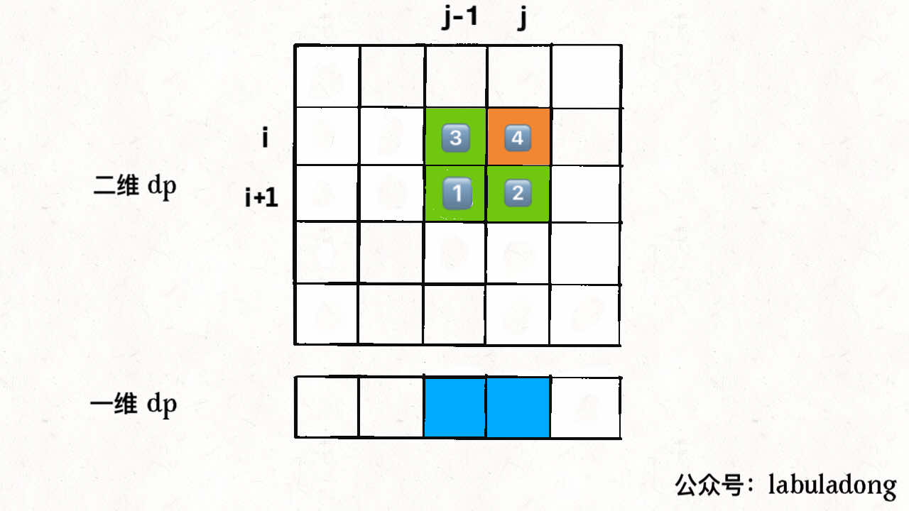
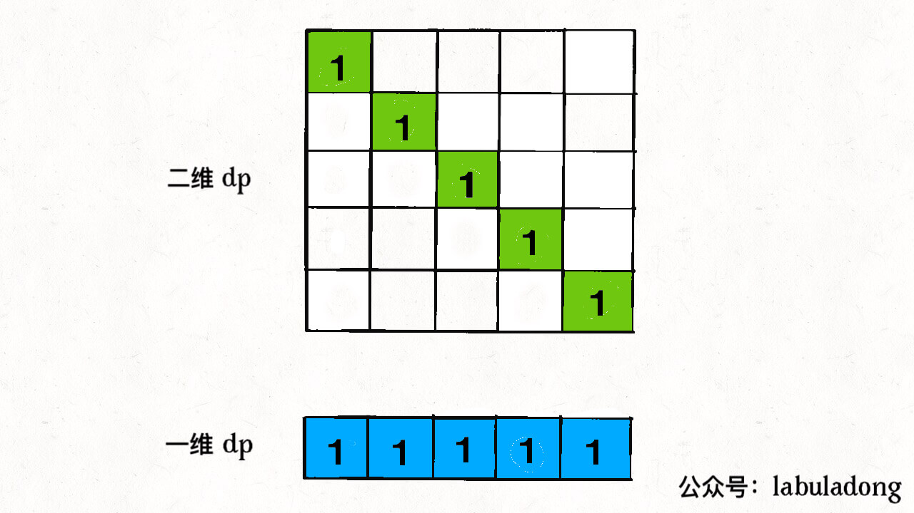

# 总结

[TOC]

### 三要素

重叠子问题、最优子结构、状态转移方程就是动态规划三要素

**要符合「最优子结构」，子问题间必须互相独立**。

其中**写出状态转移方程是最困难的**

### 步骤思路

**明确 base case -> 明确「状态」-> 明确「选择」 -> 定义 dp 数组/函数的含义**。

```java
# 初始化 base case
dp[0][0][...] = base
# 进行状态转移
for 状态1 in 状态1的所有取值：
    for 状态2 in 状态2的所有取值：
        for ...
            dp[状态1][状态2][...] = 求最值(选择1，选择2...)
```

### 解法

**1、暴力递归**：发现重叠子问题

**2、带备忘录的递归解法**：使用数组或哈希表

上面两种是自顶向下递归解法(分解规模，到达初始状态f(1)、f(2)))，动态规划是自底向上递推(从初始状态f(1)、f(2)开始，向后递推到想要答案)

**3、`dp` 数组的迭代（递推）解法**：将备忘录独立成一张表

### 理解最优子结构

比如你想求 `amount = 11` 时的最少硬币数（原问题），如果你知道凑出 `amount = 10` 的最少硬币数（子问题），你只需要把子问题的答案加一（再选一枚面值为 1 的硬币）就是原问题的答案。因为硬币的数量是没有限制的，所以子问题之间没有相互制，是互相独立的。

**最优子结构性质作为动态规划问题的必要条件，一定是让你求最值的**

### 举例

**凑零钱问题**

既然知道了这是个动态规划问题，就要思考**如何列出正确的状态转移方程**？

1、**确定 base case**，这个很简单，显然目标金额 `amount` 为 0 时算法返回 0，因为不需要任何硬币就已经凑出目标金额了。

2、**确定「状态」，也就是原问题和子问题中会变化的变量**。由于硬币数量无限，硬币的面额也是题目给定的，只有目标金额会不断地向 base case 靠近，所以唯一的「状态」就是目标金额 `amount`。

3、**确定「选择」，也就是导致「状态」产生变化的行为**。目标金额为什么变化呢，因为你在选择硬币，你每选择一枚硬币，就相当于减少了目标金额。所以说所有硬币的面值，就是你的「选择」。

4、**明确 `dp` 函数/数组的定义**。我们这里讲的是自顶向下的解法，所以会有一个递归的 `dp` 函数，一般来说函数的参数就是状态转移中会变化的量，也就是上面说到的「状态」；函数的返回值就是题目要求我们计算的量。就本题来说，状态只有一个，即「目标金额」，题目要求我们计算凑出目标金额所需的最少硬币数量。

**所以我们可以这样定义 `dp` 函数：`dp(n)` 表示，输入一个目标金额 `n`，返回凑出目标金额 `n` 所需的最少硬币数量**。

### 数学归纳法

**我们先假设这个结论在 `k < n` 时成立，然后根据这个假设，想办法推导证明出 `k = n` 的时候此结论也成立**。

假设 `dp[0...i-1]` 都已经被算出来了，然后问自己：怎么通过这些结果算出 `dp[i]`？

### 最优子结构反例

再举个例子：假设你们学校有 10 个班，你已知每个班的最大分数差（最高分和最低分的差值）。那么现在我让你计算全校学生中的最大分数差，你会不会算？可以想办法算，但是肯定不能通过已知的这 10 个班的最大分数差推到出来。因为这 10 个班的最大分数差不一定就包含全校学生的最大分数差，比如全校的最大分数差可能是 3 班的最高分和 6 班的最低分之差。

这次我给你提出的问题就**不符合最优子结构**，因为你没办通过每个班的最优值推出全校的最优值，没办法通过子问题的最优值推出规模更大的问题的最优值。前文 [动态规划详解](https://labuladong.gitee.io/algo/3/24/70/) 说过，想满足最优子结，子问题之间必须互相独立。全校的最大分数差可能出现在两个班之间，显然子问题不独立，所以这个问题本身不符合最优子结构。

### 看出重叠问题

**最简单粗暴的方式就是画图，把递归树画出来，看看有没有重复的节点**。

**但稍加思考就可以知道，其实根本没必要画图，可以通过递归框架直接判断是否存在重叠子问题**。

具体操作就是直接删掉代码细节，抽象出该解法的递归框架：

```java
int dp(int[][] grid, int i, int j) {
    dp(grid, i - 1, j), // #1
    dp(grid, i, j - 1)  // #2
}
```

### dp数组遍历顺序

**1、遍历的过程中，所需的状态必须是已经计算出来的**。

**2、遍历结束后，存储结果的那个位置必须已经被计算出来**。

#### 编辑距离


正向遍历

#### 回文子序列


要么从左至右斜着遍历，要么从下向上从左到右遍历

### 空间压缩

#### 状态方程压缩

**想得到 `dp[i+1][j-1]`，就必须在它被覆盖之前用一个临时变量 `temp` 把它存起来，并把这个变量的值保留到计算 `dp[i][j]` 的时候**



#### base case 压缩

投影到一维



### 背包问题

[494. 目标和（中等）](https://leetcode-cn.com/problems/target-sum)

变成背包问题的标准形式：

**有一个背包，容量为 `sum`，现在给你 `N` 个物品，第 `i` 个物品的重量为 `nums[i - 1]`（注意 `1 <= i <= N`），每个物品只有一个，请问你有几种不同的方法能够恰好装满这个背包**？

现在，这就是一个正宗的动态规划问题了，下面按照我们一直强调的动态规划套路走流程：

**第一步要明确两点，「状态」和「选择」**。

对于背包问题，这个都是一样的，状态就是「背包的容量」和「可选择的物品」，选择就是「装进背包」或者「不装进背包」。

**第二步要明确 `dp` 数组的定义**。

按照背包问题的套路，可以给出如下定义：

`dp[i][j] = x` 表示，若只在前 `i` 个物品中选择，若当前背包的容量为 `j`，则最多有 `x` 种方法可以恰好装满背包。

翻译成我们探讨的子集问题就是，若只在 `nums` 的前 `i` 个元素中选择，若目标和为 `j`，则最多有 `x` 种方法划分子集。

根据这个定义，显然 `dp[0][..] = 0`，因为没有物品的话，根本没办法装背包；但是 `dp[0][0]` 应该是个例外，因为如果背包的最大载重为 0，「什么都不装」也算是一种装法，即 `dp[0][0] = 1`。

我们所求的答案就是 `dp[N][sum]`，即使用所有 `N` 个物品，有几种方法可以装满容量为 `sum` 的背包。

**第三步，根据「选择」，思考状态转移的逻辑**。

回想刚才的 `dp` 数组含义，可以根据「选择」对 `dp[i][j]` 得到以下状态转移：

如果不把 `nums[i]` 算入子集，**或者说你不把这第 `i` 个物品装入背包**，那么恰好装满背包的方法数就取决于上一个状态 `dp[i-1][j]`，继承之前的结果。

如果把 `nums[i]` 算入子集，**或者说你把这第 `i` 个物品装入了背包**，那么只要看前 `i - 1` 个物品有几种方法可以装满 `j - nums[i-1]` 的重量就行了，所以取决于状态 `dp[i-1][j-nums[i-1]]`。

> PS：注意我们说的 `i` 是从 1 开始算的，而数组 `nums` 的索引时从 0 开始算的，所以 `nums[i-1]` 代表的是第 `i` 个物品的重量，`j - nums[i-1]` 就是背包装入物品 `i` 之后还剩下的容量。

**由于 `dp[i][j]` 为装满背包的总方法数，所以应该以上两种选择的结果求和，得到状态转移方程**：

```java
dp[i][j] = dp[i-1][j] + dp[i-1][j-nums[i-1]];
```

`dp[i][j]` 只和前一行 `dp[i-1][..]` 有关，那么肯定可以优化成一维 `dp`：

**`j` 要从后往前遍历，不然会被覆盖**