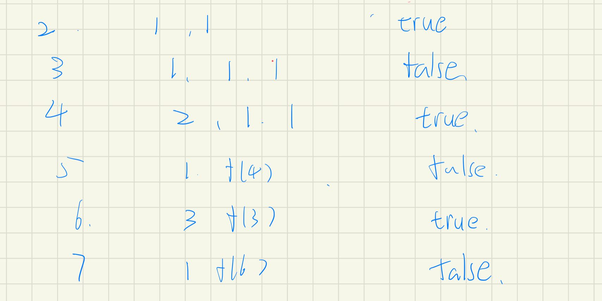
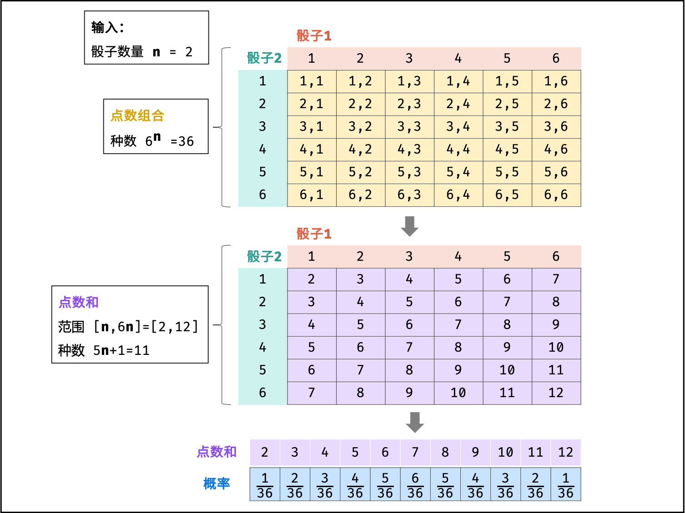
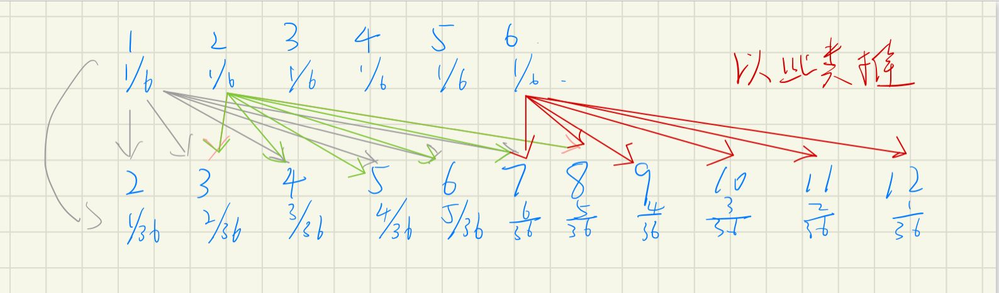
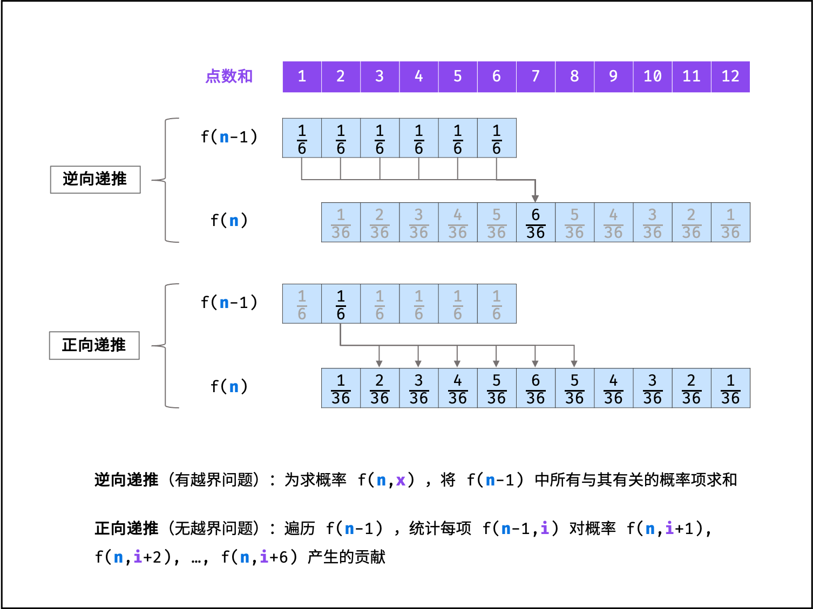

# 数学

[TOC]


### [118. 杨辉三角](https://leetcode-cn.com/problems/pascals-triangle/)

```java
class Solution {
    public List<List<Integer>> generate(int numRows) {
        List<List<Integer>> list = new ArrayList();
        List<Integer> pre = new ArrayList();
        pre.add(1);
        list.add(new ArrayList(pre));
        for(int i = 2; i <= numRows; i++) {
            List<Integer> cur = new ArrayList();
            cur.add(1);
            for(int j = 1; j < i - 1; j++) {
                cur.add(pre.get(j - 1) + pre.get(j));
            }
            cur.add(1);
            list.add(new ArrayList(cur));
            pre = cur;
        }
        return list;
    }
}
```

* 每层通过上层计算，故需要存pre列表
* 初始化第一层，和每层的首尾值为1
* 状态方程  cur.add(pre.get(j - 1) + pre.get(j));

### [119. 杨辉三角 II](https://leetcode-cn.com/problems/pascals-triangle-ii/)

```java
class Solution {
    public List<Integer> getRow(int rowIndex) {
        List<Integer> pre = new ArrayList();
        pre.add(1);
        for(int i = 2; i <= rowIndex + 1; i++) {
            List<Integer> cur = new ArrayList();
            cur.add(1);
            for(int j = 1; j < i - 1; j++){
                cur.add(pre.get(j - 1) + pre.get(j));
            }
            cur.add(1);
            pre = cur;
        }
        return pre;
    }
}
```

设置两个数组，当前层由上层累加

### [221. 最大正方形](https://leetcode-cn.com/problems/maximal-square/)

```java
class Solution {
    public int maximalSquare(char[][] matrix) {
        int n = matrix.length, m = matrix[0].length, max = 0;
        int[][] dp = new int[n + 1][m + 1];
        for(int i = 1; i <= n; i++) {
            for(int j = 1; j <= m; j++) {
                if(matrix[i - 1][j - 1] == '1') {
                    dp[i][j] = Math.min(Math.min(dp[i - 1][j], dp[i][j - 1]), dp[i - 1][j - 1]) + 1;
                    max = Math.max(dp[i][j], max);
                }
            }
        }
        return max * max;
    }
}
```

**状态转移：**

`dp[i][j] = Math.min(Math.min(dp[i - 1][j], dp[i][j - 1]), dp[i - 1][j - 1]) + 1;`

由左、上、左上三个位置的最小值 + 1 决定当前能构建的最大正方形

### [264. 丑数 II](https://leetcode-cn.com/problems/ugly-number-ii/)

#### 优先队列

```java
class Solution {
    public int nthUglyNumber(int n) {
        PriorityQueue<Long> queue = new PriorityQueue<>();
        queue.add(1L);
        long cur = 1L;
        for(int i = 0; i < n; i++) {
            cur = queue.poll();
            queue.add(cur * 2);
            queue.add(cur * 3);
            queue.add(cur * 5);
            while(cur == queue.peek()){
                queue.poll();
            }
        }
        return (int)cur;
    }
}
```

从1开始，将当前丑数分别 *2 *3 *5 的结果存入优先队列，则堆顶为最小值，每次取出的为第i个丑数。

#### 优先队列去重

```java
class Solution {
    public int nthUglyNumber(int n) {
        int[] arr = new int[]{2, 3, 5};
        PriorityQueue<Long> queue = new PriorityQueue<>();
        Set<Long> set = new HashSet<>();
        queue.add(1L);
        long cur = 1L;
        for(int i = 0; i < n; i++) {
            cur = queue.poll();
            for(int num : arr) {
                Long t = num * cur;
                if(!set.contains(t)) {
                    queue.add(t);
                    set.add(t);
                }
            }
        }
        return (int)cur;
    }
}
```

#### 动态规划/三指针

```java
class Solution {
    public int nthUglyNumber(int n) {
        int[] dp = new int[n + 1];
        dp[1] = 1;
        int p1 = 1, p2 = 1, p3 = 1;
        for(int i = 2; i <= n; i++){
            //dp[p1]而不是p1
            int num1 = dp[p1] * 2, num2 = dp[p2] * 3, num3 = dp[p3] * 5;
            dp[i] = Math.min(num1, Math.min(num2, num3));
            if (dp[i] == num1) {
                p1++;
            }
            if (dp[i] == num2) {
                p2++;
            }
            if (dp[i] == num3) {
                p3++;
            }
        }
        return dp[n];
    }
}
```

第1轮  1 * 2 、1 * 3 、 1 * 5找出最小值，则作为最小丑数

此时 2为最小值，则开始计算 2 * 2、 1 * 3 、 1 *5

接下来是 2 * 2、 2 * 3 、 1 *5

 3 * 2、 2 * 3 、 1 *5

以此类推。

### [338. 比特位计数](https://leetcode-cn.com/problems/counting-bits/)

#### 两倍循环

```java
class Solution {
    public int[] countBits(int n) {
        if(n == 0) return new int[]{0};
        int[] dp = new int[n + 1];
        dp[1] = 1;
        int k = 2;
        while(k <= n){
            for(int i = k; i < 2 * k && i <= n; i++){
                dp[i] = dp[i - k] + 1;
            }
            k = 2 *k; 
        }
        return dp;
    }
}
```

#### 奇偶分类

```java
class Solution {
    public int[] countBits(int n) {
        int[] dp = new int[n + 1];
        for(int i = 1; i <= n; i++) {
            //奇数比前面偶数+1
            if(i % 2 == 1) {
                dp[i] = dp[i - 1] + 1;
            //和/2的值一样多，相当于抹掉0  
            } else {
                dp[i] = dp[i / 2];
            }
        }
        return dp;
    }
}
```

从该题中，奇数比前面的偶数+1，  前面的偶数可以由dp[i/2] 得到，则可以将状态方程合并

#### 动态规划

```java
class Solution {
    public int[] countBits(int n) {
        int[] dp = new int[n + 1];
        for(int i = 0; i <= n; i++) {
            dp[i] = dp[i >> 1] + (i & 1);
        }
        return dp;
    }
}
```

### [1025. 除数博弈](https://leetcode-cn.com/problems/divisor-game/)

#### 动态规划

```java
class Solution {
    public boolean divisorGame(int n) {
        boolean[] dp = new boolean[n + 1];
        dp[1] = false;
        for(int i = 2; i <= n; i++) {
            for(int j = 1; j <= i / 2; j++) {
                if(i % j == 0 && !dp[i - j]) {
                    dp[i] = true;
                    break;
                } 
            }
        }
        return dp[n];
    }
}
```

爱丽丝选完，剩下`dp[i - j]`的结果为false，则爱丽丝获胜



#### 数学推理

```java
class Solution {
    public boolean divisorGame(int n) {
        return n % 2 == 0;
    }
}
```

1. N为奇数，则约数必然为奇数，奇数-奇数=偶数。N为偶数，则约数可奇可偶
2. 最终谁先到N谁赢
3. 爱丽丝先手
   1. N为偶数，则选1即可，另一方面临N为奇数，稳赢
   2. N为奇数，则不管选什么，另一方都是偶数，另一方一直选1，则稳输

### [剑指 Offer 60. n个骰子的点数](https://leetcode-cn.com/problems/nge-tou-zi-de-dian-shu-lcof/)

```java
class Solution {
    public double[] dicesProbability(int n) {
        double[] arr = new double[6];
        Arrays.fill(arr, 1.0/6.0);
        for(int i = 2; i <= n; i++) {
            double[] tmp = new double[5 * i + 1];
            for(int j = 0; j < arr.length; j++) {
                for(int k = 0; k < 6; k++) {
                    //用arr[j]而不是arr(k) ，/6.0而不是/6
                    tmp[k + j] += arr[j] / 6.0; 
                }
            }
            arr = tmp;
        }
        return arr;
    }
}
```



第一次色子扔1，第二次扔任意数，则2-7都由出现一次。

同理第一次仍2，第二次扔任意数，则3-8都会出现一次。

同理，最终如下图。



两种递推方式


