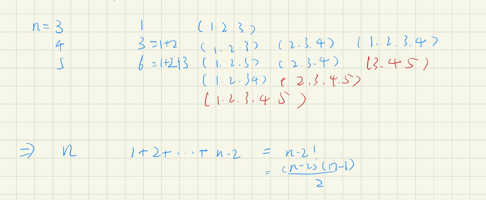
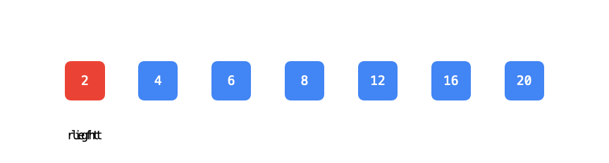

# 数值区间

[TOC]

### [303. 区域和检索 - 数组不可变](https://leetcode-cn.com/problems/range-sum-query-immutable/)

#### 前缀和

```java
class NumArray {
    int[] dp;
    public NumArray(int[] nums) {
        dp = new int[nums.length + 1];
        for(int i = 1; i <= nums.length; i++) {
            dp[i] = dp[i - 1] + nums[i - 1];
        }
    }
    
    public int sumRange(int left, int right) {
        return dp[right + 1] - dp[left];
    }
}
```

##### 思路

1. 创建一个带前缀和的数组，当需要某段的值则通过dp[right + 1] - dp[left]计算即可。

### [413. 等差数列划分](https://leetcode-cn.com/problems/arithmetic-slices/)

#### 滑动窗口

```java
class Solution {
    public int numberOfArithmeticSlices(int[] nums) {
        if(nums.length < 3) return 0;
        int sum = 0, cnt = 0; 
        for(int i = 1; i < nums.length - 1; i++) {
            if(nums[i] - nums[i - 1] == nums[i + 1] - nums[i]) {
                if(cnt < 3) {
                    cnt = 3;
                } else {
                    cnt++;
                }
            } else if (cnt >= 3) {
                sum += ((cnt - 2) * (cnt - 1)) / 2;
                cnt = 0;
            }
        }
        if(cnt > 0) {
          sum += ((cnt - 2) * (cnt - 1)) / 2;  
        }
        return sum;
    }
}
```

##### 思路

1. 找出符合等差队列的个数，可能有多段，所以每段都要进行计算。
2. 推理出等差数列个数所对应子数组个数。





#### 动态规划

```java
class Solution {
    public int numberOfArithmeticSlices(int[] nums) {
        int n = nums.length, res = 0;
        if(n < 3) return 0;
        int[] dp = new int[n];
        for(int i = 1; i < n - 1; i++) {
            if(nums[i] - nums[i - 1] == nums[i + 1] - nums[i]) {
                dp[i] = dp[i - 1] + 1;
                res += dp[i];
            }
        }
        return res;
    }
}
```

##### 思路

由于从等差数列大于等于3开始，每增加1个数，累加也会增加1个数

即dp[i] = dp[i - 1] + 1

而当不符合时，又会重新从0开始计算。