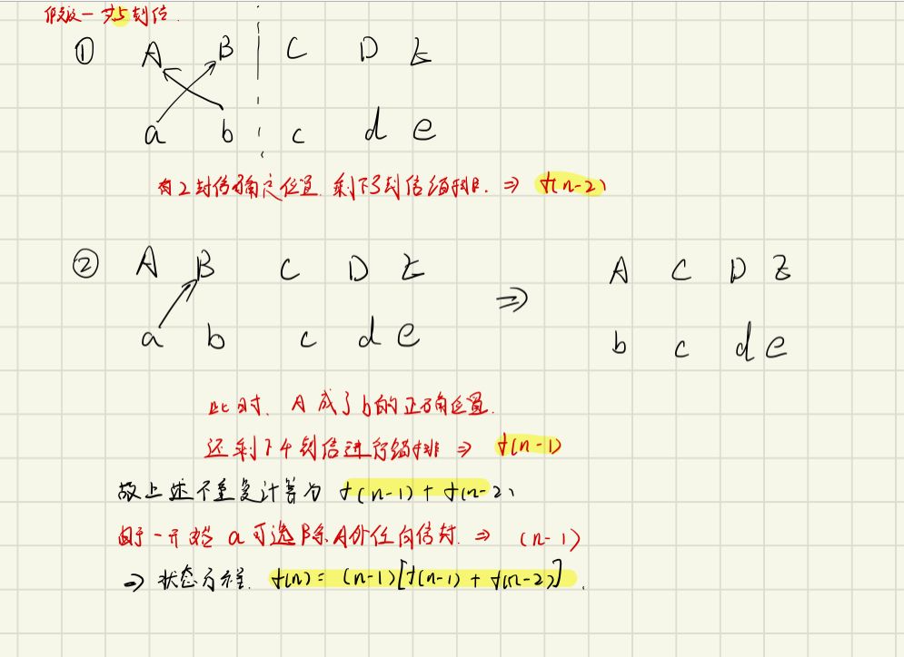
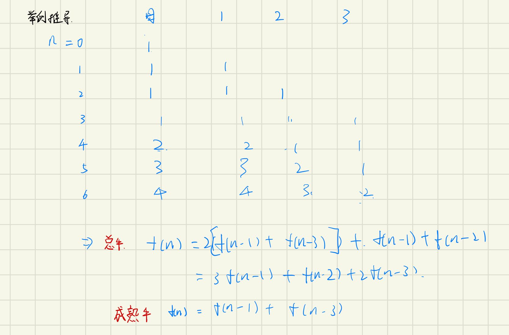

# 斐波那契数列

### [70. 爬楼梯](https://leetcode-cn.com/problems/climbing-stairs/)

```java
class Solution {
    public int climbStairs(int n) {
        int a = 0, b = 1;
        for(int i = 0; i < n; i++) {
            int c = a + b;
            a = b;
            b = c;
        }
        return b;
    }
}
```

##### 思路	

f(n) = f(n - 1) + f(n - 2)

### [198. 打家劫舍](https://leetcode-cn.com/problems/house-robber/)

```java
class Solution {
    public int rob(int[] nums) {
        int a = 0, b = 0;
        for(int i = 0; i < nums.length; i++) {
            int c = Math.max(b , a + nums[i]);
            a = b; 
            b = c;
        }
        return b;
    }
}
```

##### 思路

1. 利用两个常量来存储f(x - 2)和f(x - 1)的状态。
2. 取其中Math.max(f(x - 1), f(x - 2) + cur)。

### [213. 打家劫舍 II](https://leetcode-cn.com/problems/house-robber-ii/)

```java
class Solution {
    public int rob(int[] nums) {
        int n = nums.length;
        if(n == 1) {
            return nums[0];
        }
        return Math.max(rob(nums, 0, n - 1), rob(nums, 1, n)); 
    }

    public int rob(int[] nums, int start, int end) {
        int a = 0, b = 0;
        for(int i = start; i < end; i++) {
            int c = Math.max(b, a + nums[i]);
            a = b;
            b = c;
        }
        return b;
    }
}
```

##### 思路

1. 在打家劫舍的基础上，由于首尾不能同时偷，所以分成两次遍历，取其最大。即1到n-1 和2到n这两个范围。

### [746. 使用最小花费爬楼梯](https://leetcode-cn.com/problems/min-cost-climbing-stairs/)

```java
class Solution {
    public int minCostClimbingStairs(int[] cost) {
        int pre = cost[0], cur = cost[1];
        for(int i = 2; i < cost.length; i++) {
            int tmp = cur;
            cur = Math.min(pre, cur) + cost[i];
            pre = tmp;
        }
        return Math.min(pre, cur);
    }
}
```

跟198. 打家劫舍很像

#### [剑指 Offer 10- I. 斐波那契数列](https://leetcode-cn.com/problems/fei-bo-na-qi-shu-lie-lcof/)

```java
class Solution {
    public int fib(int n) {
        int a = 0, b = 1, i = 0;
        int mod = 1000000007;
        while(i < n) {
            int c = b;
            b = (a + b) % mod;
            a = c;
            i++;
        }
        return a;
    }
}
```

爬楼梯同思路

### 原创题：信件错排

题目描述：有 N 个 信 和 信封，它们被打乱，求错误装信方式的数量。

```java
public class ErrorLetter {
    public static void main(String[] args) {
        int a = 0, b = 1, n = 5;
        if(n < 2) System.out.println(0);
        for(int i = 3; i <= n; i++) {
            int c = (i - 1)*(a + b);
            a = b;
            b = c;
        }
        System.out.println(b);
    }
}
```

##### 思路

首先信a可以选投除A外任何信封，此时有n-1个选择

对于信b，有以下两种情况

1. 投给A，则此时剩下3封信3个信封，得到f(n - 2)种情况
2. 投给除了A、B的其他信封，（此时可以将A信封暂时代替为正确位置），则相当于有4个信封4封信，得到f(n - 1)种情况

将所有情况累积得到状态方程

f(n) = (n - 1)[f(n - 1) +f(n - 2)]



  D(1)＝0，D(2)＝1，D(3)＝2，D(4)＝9，D(5)＝44

### 原创题：母牛生产

题目描述：假设农场中成熟的母牛每年都会生 1 头小母牛，并且永远不会死。第一年有 1 只小母牛，从第二年开始，母牛开始生小母牛。每只小母牛 3 年之后成熟又可以生小母牛。给定整数 N，求 N 年后牛的数量。

第 i 年成熟的牛的数量为：

```java
public class CowProduction {
    public static void main(String[] args) {
        int n = 6;
        int[] dp = new int[n + 1];
        dp[1] = 1;
        dp[2] = 1;
        for (int i = 3; i <= n; i++) {
            dp[i] = dp[i - 1] + dp[i - 3];
        }
        System.out.println(dp[n]);
    }
}

```

##### 思路：

举例推导即可，如下图所示



