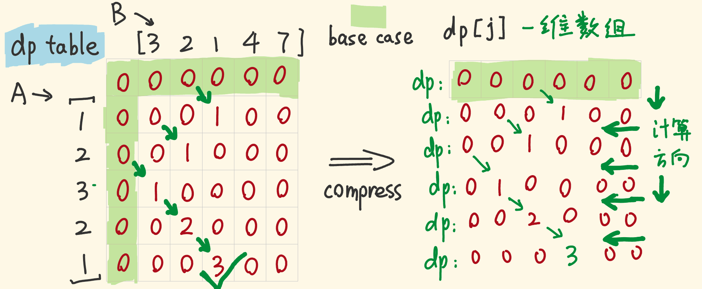

# 最长公共子序列

### [53. 最大子数组和](https://leetcode-cn.com/problems/maximum-subarray/)（连续）

```java
class Solution {
    public int maxSubArray(int[] nums) {
        int sum = 0, max = Integer.MIN_VALUE;
        for(int i = 0; i < nums.length; i++) {
            sum = (sum < 0 ? 0 : sum) + nums[i];
            max = Math.max(max, sum);
        }
        return max;
    }
}
```

##### 思路

1. 贪心法，当累加小于0，则从0开始计数

### [718. 最长重复子数组](https://leetcode-cn.com/problems/maximum-length-of-repeated-subarray/)（连续）

```java
class Solution {
    public int findLength(int[] nums1, int[] nums2) {
        int n = nums1.length, m = nums2.length, max = 0;
        int[][] dp = new int[n + 1][m + 1];
        for(int i = 1; i <= n; i++) {
            for(int j = 1; j <= m; j++) {
                if(nums1[i - 1] == nums2[j - 1]) {
                    dp[i][j] = dp[i - 1][j - 1] + 1;
                } 
                max = Math.max(dp[i][j], max);
            }
        }
        return max;
    }
}
```

##### 思路

1. 该题目要求为连续子数组，所以
   1. 当`nums1[i - 1] == nums2[j - 1]`时，进行+1
   2. 当`nums1[i - 1] != nums2[j - 1]`置零，重新计数。
2. 用max存储全局最大值


#### 降维优化

```java
class Solution {
    public int findLength(int[] nums1, int[] nums2) {
        int n = nums1.length, m = nums2.length, max = 0;
        int[] dp = new int[m + 1];
        for(int i = 1; i <= n; i++) {
            for(int j = m ; j > 0; j--) {
                if(nums1[i - 1] == nums2[j - 1]) {
                    dp[j] = dp[j - 1] + 1;
                } else {
                    dp[j] = 0;
                }
                max = Math.max(dp[j], max);
            }
        }
        return max;
    }
}
```

##### 思路

1. 注意访问顺序，从上到下，从右到左。
2. 由于转变成一维，所以需要对不相等的进行0初始化。



### [1035. 不相交的线](https://leetcode-cn.com/problems/uncrossed-lines/)（不连续）

```java
class Solution {
    public int maxUncrossedLines(int[] nums1, int[] nums2) {
        int n = nums1.length, m = nums2.length;
        int[][] dp = new int[n + 1][m + 1];
        for(int i = 1; i <= n; i++) {
            for(int j = 1; j <= m; j++) {
                if(nums1[i - 1] == nums2[j - 1]) {
                    dp[i][j] = dp[i - 1][j - 1] + 1;
                } else {
                    dp[i][j] = Math.max(dp[i - 1][j], dp[i][j - 1]);
                }
            }
        }
        return dp[n][m];
    }
}
```

##### 思路

1. 实际上是最长公共子序列问题，同题1143,代码可完全相同

### [1143. 最长公共子序列](https://leetcode-cn.com/problems/longest-common-subsequence/)（不连续）

```java
class Solution {
    public int longestCommonSubsequence(String text1, String text2) {
        int n = text1.length(), m = text2.length();
        int[][] dp = new int[n + 1][m + 1];

        for(int i = 1; i <= n; i++) {
            for(int j = 1; j <= m; j++) {
                if(text1.charAt(i - 1) == text2.charAt(j - 1)) {
                    dp[i][j] = dp[i - 1][j - 1] + 1;
                } else{
                    dp[i][j] = Math.max(dp[i - 1][j], dp[i][j - 1]);
                }
            }
        }
        return dp[n][m];
    }
}
```

##### 思路

1. 动态规划记录路径
2. 分两种情况
   1. 不相等时，路径由左边和上边两条取其中较大者，即`dp[i][j] = Math.max(dp[i - 1][j], dp[i][j - 1]);`
   2. 相等时，取其两个字符串的上一个位置比较的值，即`dp[i][j] = dp[i - 1][j - 1] + 1;`


