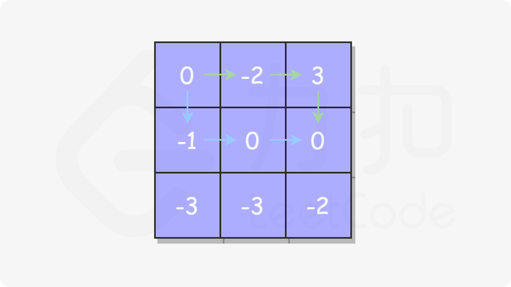
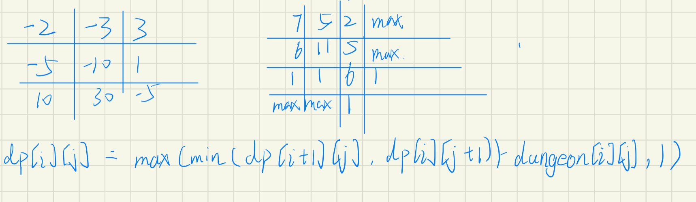
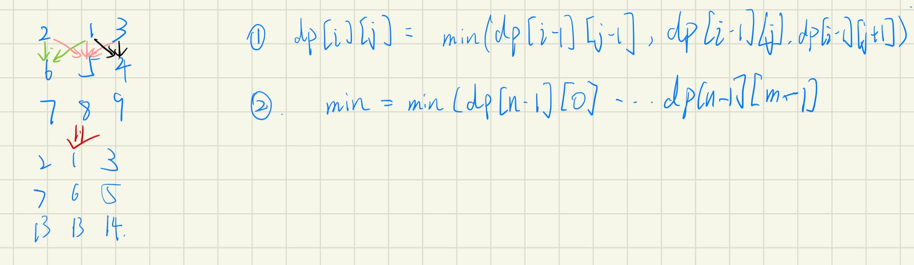

# 矩阵路径

[TOC]


### [62. 不同路径](https://leetcode-cn.com/problems/unique-paths/)

```java
class Solution {
    public int uniquePaths(int m, int n) {
        int[][] dp =  new int[m][n];
        for(int j = 0; j < n; j++) {
            dp[0][j] = 1;
        }
        for(int i = 0; i < m; i++) {
            dp[i][0] = 1;
        }
        for(int i = 1; i < m; i++) {
            for(int j = 1; j < n ; j++) {
                dp[i][j] = dp[i - 1][j] + dp[i][j - 1];
            }
        }
        return dp[m - 1][n - 1];
    }
}
```

##### 思路

1. 初始化最左边和最上边为值1
2. 其余的状态方程为左边和上边数值进行累加

### [63. 不同路径 II](https://leetcode-cn.com/problems/unique-paths-ii/)

```java
class Solution {
    public int uniquePathsWithObstacles(int[][] obstacleGrid) {
        int n = obstacleGrid.length, m = obstacleGrid[0].length;
        int[][] dp = new int[n][m];
        //可以将条件放在条件语句第二步位置，当遇到障碍物，则可以直接退出循环
        for(int i = 0; i < n && obstacleGrid[i][0] == 0; i++){
            dp[i][0] = 1;
        }
        for(int j = 0; j < m && obstacleGrid[0][j] == 0; j++){
            dp[0][j] = 1;
        }
        for(int i = 1; i < n; i++) {
            for(int j = 1; j < m; j++) {
                if(obstacleGrid[i][j] == 0){
                    dp[i][j] = dp[i - 1][j] + dp[i][j - 1];
                }
            }
        }
        return dp[n - 1][m - 1];
    }
}
```

初始化时，如果遇到障碍，则后续的路径都只能为0。

途中，遇到障碍，当前位置值为0，(即没有路径能通过这个位置)，没有障碍，路径累加`dp[i][j] = dp[i - 1][j] + dp[i][j - 1];`


### [64. 最小路径和](https://leetcode-cn.com/problems/minimum-path-sum/)

```java
class Solution {
    public int minPathSum(int[][] grid) {
        int n = grid.length, m = grid[0].length;
        for(int i = 0; i < n; i++) {
            for(int j = 0; j < m; j++) {
                if(i == 0 && j == 0) {
                    continue;
                } else if(i == 0) {
                    grid[i][j] += grid[i][j - 1];
                } else if (j == 0) {
                    grid[i][j] += grid[i - 1][j];
                } else {
                    grid[i][j] += Math.min(grid[i - 1][j], grid[i][j - 1]);
                }
            }
        }
        return grid[n - 1][m - 1];
    }
}
```

##### 思路

4个步骤

1. 起点跳过
2. 最上面的路径右左边累加
3. 最左边的路径由上面累加
4. 其余路径由左边跟上面两个值取最小

### [120. 三角形最小路径和](https://leetcode-cn.com/problems/triangle/)

#### 回溯（超时）

```java
class Solution {
    int min = Integer.MAX_VALUE;
    public int minimumTotal(List<List<Integer>> triangle) {
        int n = triangle.size();
        helper(triangle, 0, 0, 0, n);
        return min;
    }
    public void helper(List<List<Integer>> triangle, int i, int j, int sum, int n) {
        if(i == n) {
            min = Math.min (min, sum);
            return;
        }
        helper(triangle, i + 1, j, sum + triangle.get(i).get(j), n);
        helper(triangle, i + 1, j + 1, sum + triangle.get(i).get(j), n);
    }
}
```

#### 动态规划（自低向上）

```java
class Solution {
    public int minimumTotal(List<List<Integer>> triangle) {
        int n =triangle.size();
        int[] dp = new int[n + 1];
        for(int i = n - 1; i >= 0; i--) {
            for(int j = 0; j <= i; j++) {
                dp[j] = Math.min(dp[j], dp[j + 1]) + triangle.get(i).get(j);
            }
        }
        return dp[0];
    }
}
```

**状态定义**

当前位置从底向上累加最小路径，

**状态转移**

`dp[j] = Math.min(dp[j], dp[j + 1]) + triangle.get(i).get(j);`

**说明**

每个位置由底下两个位置的最小路径+当前位置值累加，得到新的最小路径。

### [174. 地下城游戏](https://leetcode-cn.com/problems/dungeon-game/)

```java
class Solution {
    public int calculateMinimumHP(int[][] dungeon) {
        int n = dungeon.length, m = dungeon[0].length;
        int[][] dp = new int[n + 1][m + 1];
        for(int i = 0; i <= n; i++) {
            Arrays.fill(dp[i], Integer.MAX_VALUE);
        }
        dp[n - 1][m] = 1;
        dp[n][m - 1] = 1;
        for(int i = n - 1; i >= 0; i--) {
            for(int j = m - 1; j >= 0; j--) {
                dp[i][j] = Math.max(Math.min(dp[i + 1][j], dp[i][j + 1]) - dungeon[i][j], 1);
            }
        }
        return dp[0][0];
    }
}
```

**关键不在于吃最多的血瓶，而是在于如何损失最少的生命值**。

❌**从左上角（`grid[0][0]`）走到 `grid[i][j]` 至少需要 `dp(grid, i, j)` 的生命值**。

✔**从 `grid[i][j]` 到达终点（右下角）所需的最少生命值是 `dp(grid, i, j)`**。



上图如果从起点出发，随着绿色路径的-2(位置为(0,1))大小，会影响绿色还是蓝色路径的选择，因此无法确定(1,2)选择的路径方案(因为期望通过计算(1,1),(0,2)得到，而不受(0,1)甚至更早的位置影响)，表明了无后效性。

所以可以选择从终点出发，将终点位置定为刚好能到达终点的值1。从右下到左上计算。

由于`dp[n - 1][m - 1]`受到`dp[n][m - 1]`和`dp[n - 1][m]`影响，所以假定为终点位置，分别初始化为1。

最终答案为`dp[0][0]`



### [931. 下降路径最小和](https://leetcode-cn.com/problems/minimum-falling-path-sum/)

```java
class Solution {
    public int minFallingPathSum(int[][] matrix) {
        int n = matrix.length, m = matrix[0].length;
        for(int i = 1; i < n; i++) {
            for(int j = 0; j < m; j++) {
                int min = matrix[i - 1][j];
                if(j - 1 >= 0){
                    min = Math.min(min, matrix[i - 1][j - 1]);
                } 
                if(j + 1 < m) {
                    min = Math.min(min, matrix[i - 1][j + 1]);
                }
                matrix[i][j] += min;
            }
        }
        int ans = Integer.MAX_VALUE;
        for(int j = 0; j < m; j++) {
            ans = Math.min(ans, matrix[n - 1][j]);
        }
        return ans;
    }
}
```

求出每个终点的最小路径，再比较所有终点的路径，取最小值



### [剑指 Offer 47. 礼物的最大价值](https://leetcode-cn.com/problems/li-wu-de-zui-da-jie-zhi-lcof/)

```java
class Solution {
    public int maxValue(int[][] grid) {
        int n = grid.length, m = grid[0].length;
        for(int i = 1; i < n; i++) {
            grid[i][0] += grid[i - 1][0];
        }
        for(int j = 1; j < m; j++) {
            grid[0][j] += grid[0][j - 1];
        }
        for(int i = 1; i < n; i++) {
            for(int j = 1; j < m; j++) {
                grid[i][j] += Math.max(grid[i - 1][j], grid[i][j - 1]);
            }
        }
        return grid[n - 1][m - 1];
    }
}
```

* 先将第一行，第一列进行累加
* 中间的通过左边和上边比较最大值进行累加，得到全局最大，即`grid[i][j] += Math.max(grid[i - 1][j], grid[i][j - 1]);`