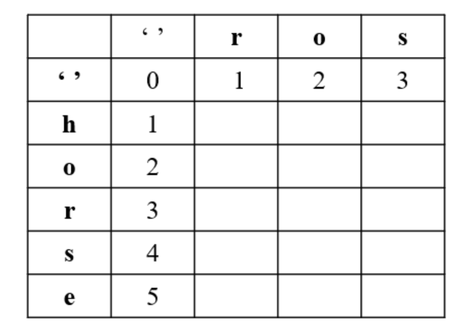
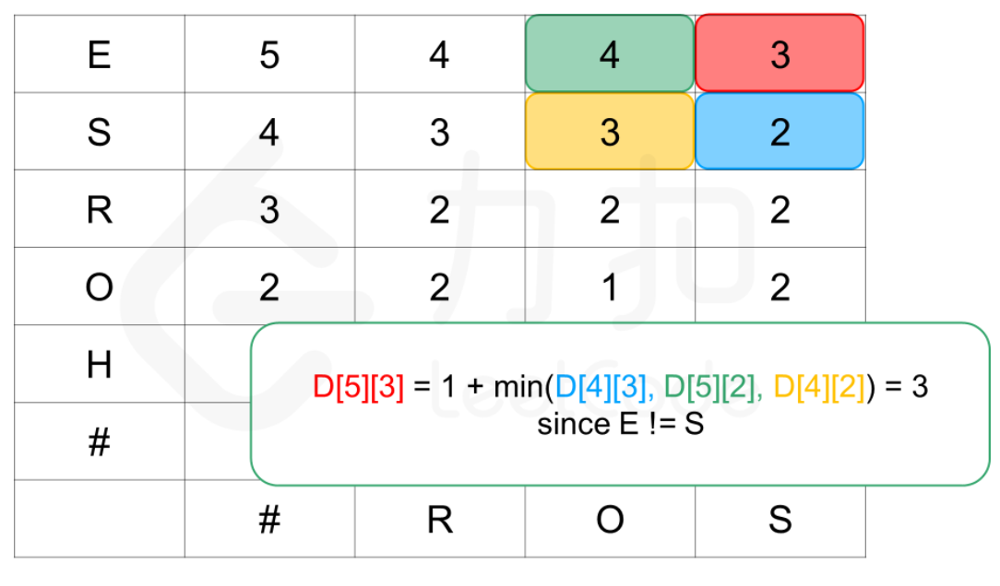
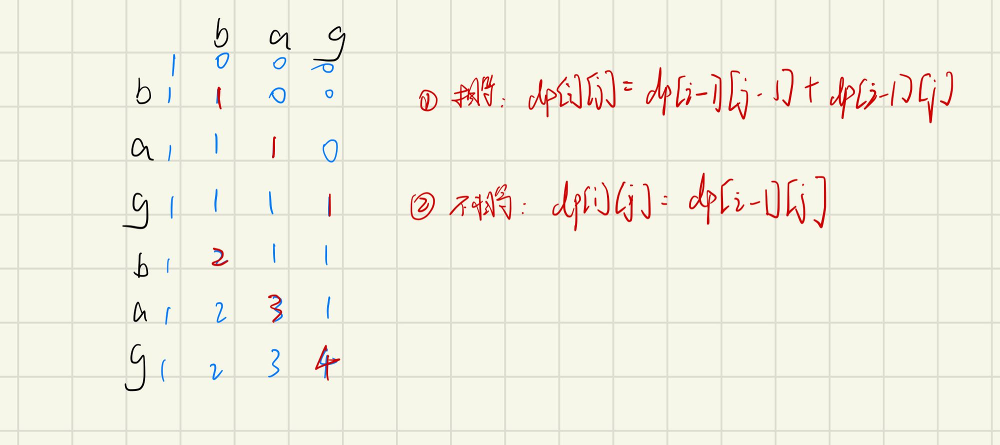
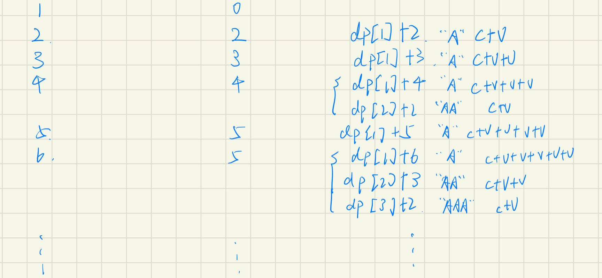

# 编辑距离

[TOC]  

### [72. 编辑距离](https://leetcode-cn.com/problems/edit-distance/)

```java
class Solution {
    public int minDistance(String word1, String word2) {
        int n = word1.length(), m = word2.length();
        int[][] dp = new int[n + 1][m + 1];
        for(int i = 0; i <= n; i++) {
            dp[i][0] = i;
        }
        for(int j = 0; j <= m; j++){
            dp[0][j] = j;
        }
        for(int i = 1; i <= n; i++) {
            for(int j = 1; j <= m; j++) {
                if(word1.charAt(i - 1) == word2.charAt(j - 1)) {
                    dp[i][j] = dp[i - 1][j - 1];
                } else {
                    dp[i][j] = Math.min(dp[i - 1][j], Math.min(dp[i - 1][j - 1], dp[i][j - 1])) + 1;
                }
            }
        }
        return dp[n][m];
    }
}
```

##### 思路

1. 首先初始化二维数组，当有一个字符串为空，当前位置值由字符串长度决定，即`dp[i][0] = i`



2. 分情况讨论
   1. 当字符相同，则不需要进行任何操作，则继承上一位置的值`dp[i][j] = dp[i - 1][j - 1]`
   2. 当字符不同，则在三个操作中选择一个操作数最小的，也就是`Math.min(dp[i - 1][j], Math.min(dp[i - 1][j - 1], dp[i][j - 1])) + 1`



### [115. 不同的子序列](https://leetcode-cn.com/problems/distinct-subsequences/)

```java
class Solution {
    public int numDistinct(String s, String t) {
        int n = s.length(), m = t.length();
        int[][] dp = new int[n + 1][m + 1];
        for(int i = 0; i <= n; i++) {
            dp[i][0] = 1;
        }
        for(int j = 1; j <= m; j++) {
            dp[0][j] = 0;
        }
        for(int i = 1; i <= n; i++) {
            for(int j = 1; j <= m; j++) {
                if(s.charAt(i - 1) == t.charAt(j - 1)) {
                    dp[i][j] = dp[i - 1][j - 1] + dp[i - 1][j];
                } else {
                    dp[i][j] = dp[i - 1][j];
                }
            }
        }
        return dp[n][m];
    }
}
```

##### 思路

1. 首先进行初始化
   1. s串为空，则不可能将s串进行删除，得到t串，所以均为0
   2. t串为空，则只有1种方案可以得到t串（即全删），则均为1
2. 计算过程中
   1. 相等时，有两种策略
      1. s[i]进行匹配。 则为`dp[i - 1][j - 1]`
      2. s[i]不进行匹配。则为`dp[i - 1][j]`
   2. 不相等，则之前能匹配多少种方案，就继承过来多少种，`dp[i][j] = dp[i - 1][j];`




### [392. 判断子序列](https://leetcode-cn.com/problems/is-subsequence/)

#### 双指针

```java
class Solution {
    public boolean isSubsequence(String s, String t) {
        int n = s.length(), m = t.length();
        int i = 0, j = 0;
        while(j < m) {
            if(i < n && s.charAt(i) == t.charAt(j)) {
                i++;
            }
            j++;
        }
        return i == n;
    }
}
```

##### 思路

1. 相等时s向前一步，否则停留，最后判断是否到达s字符串结尾

#### 动态规划

```java
if (s[i - 1] == t[j - 1]) dp[i][j] = dp[i - 1][j - 1] + 1;
else dp[i][j] = dp[i][j - 1];
```

### [650. 只有两个键的键盘](https://leetcode-cn.com/problems/2-keys-keyboard/)

```java
class Solution {
    public int minSteps(int n) {
        int[] dp = new int[n + 1];
        Arrays.fill(dp, n + 1);
        dp[0] = 0;
        dp[1] = 0;
        for(int i = 2; i <= n; i++) {
            for(int j = i - 1; j > 0; j--){
                if(i % j == 0) {
                    dp[i] = Math.min(dp[i], dp[j] + i / j);
                }
            }
        }
        return dp[n];
    }
}
```

#### 思路

1. 动态规划，找到可以重复利用的状态。
2. 确认当前状态是由哪个状态进行复制粘贴得到的。比如dp[6]可能由
   1. "A"+6次操作
   2. "AA"+3次操作
   3. "AAA"+2次操作

