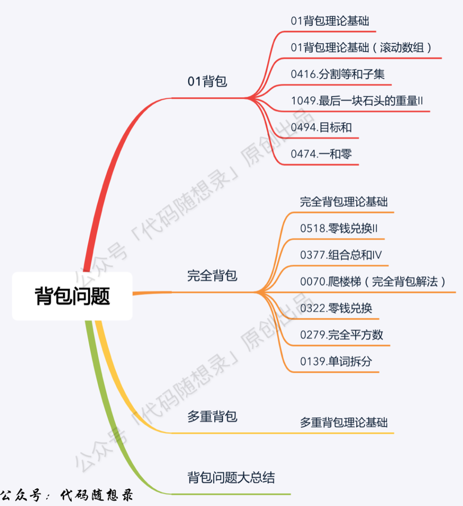
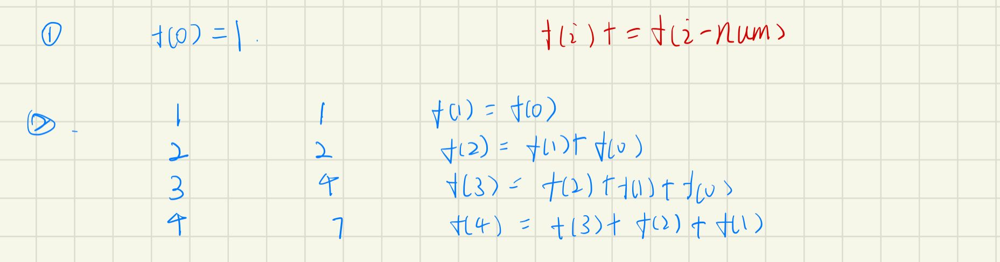
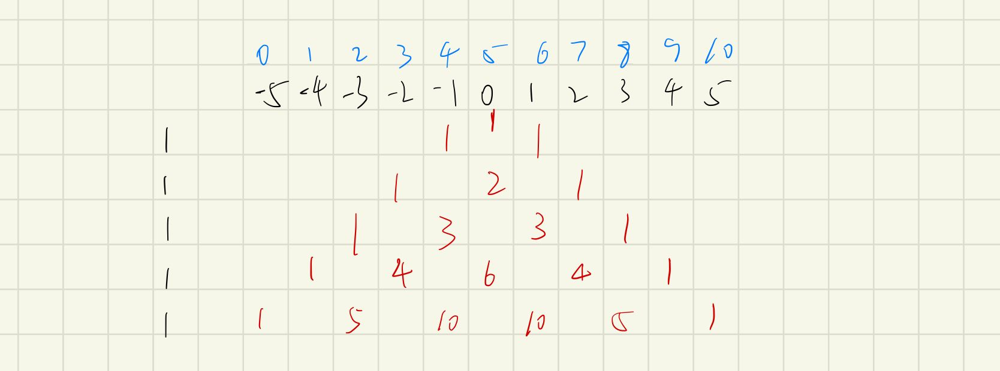
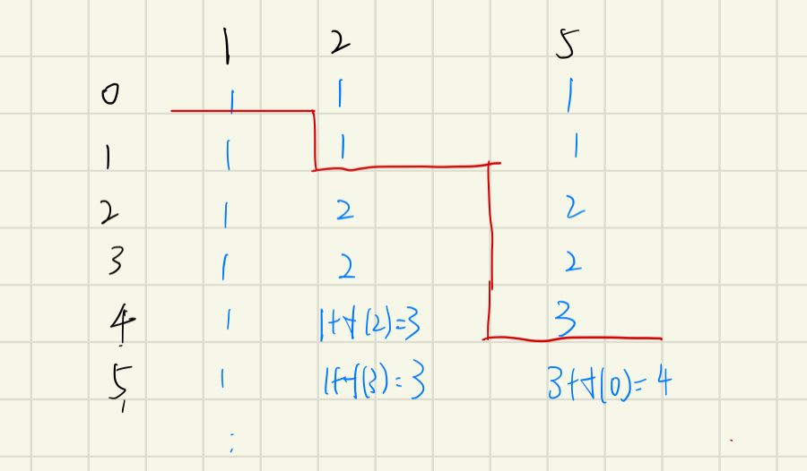
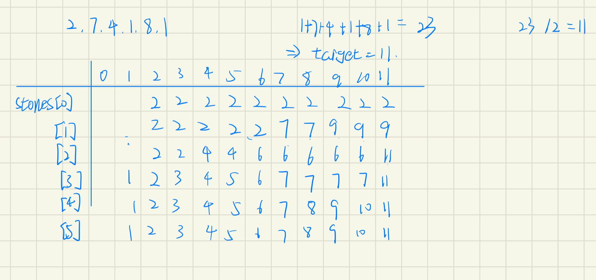
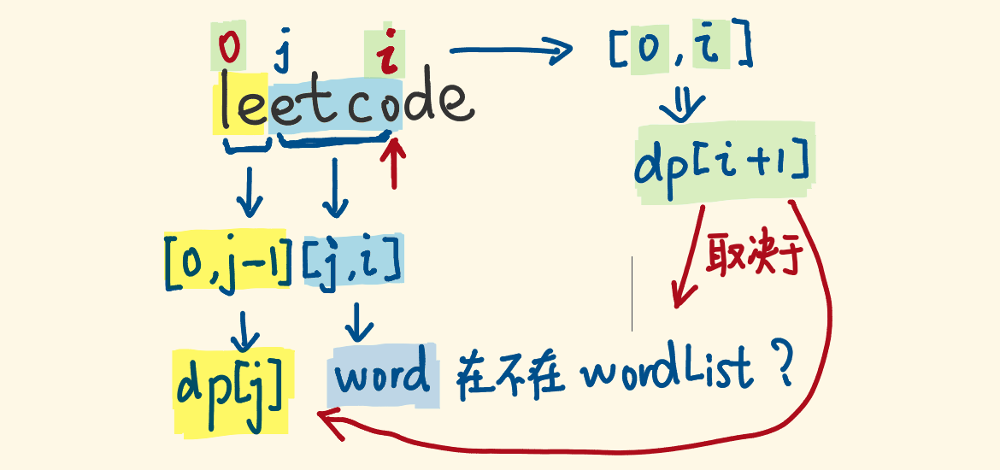
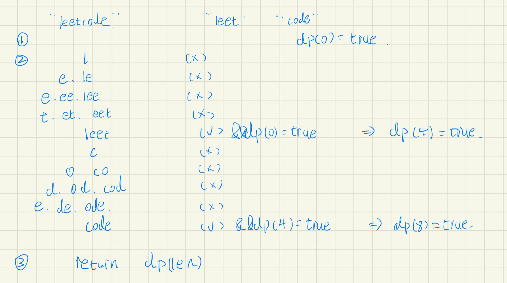
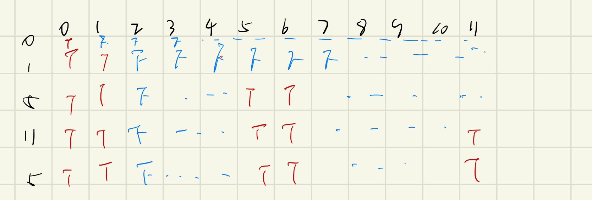
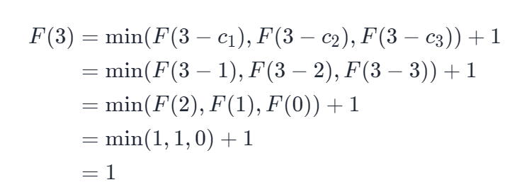

# 背包问题



[TOC] 

  

## 组合问题

`dp[i] += dp[i-num]`

### [377. 组合总和 Ⅳ](https://leetcode-cn.com/problems/combination-sum-iv/)

```java
class Solution {
    public int combinationSum4(int[] nums, int target) {
        int[] dp = new int[target + 1];
        dp[0] = 1;
        for(int i = 1; i <= target; i++) {
            for(int num :nums){
                if(i >= num) {
                    dp[i] += dp[i - num];
                }
            }
        }
        return dp[target];
    }
}
```

#### 思路

1. 初始化f(0)
2. 第一层循环扫描子问题，第二层循环扫描可选数组，逐个尝试



### [494. 目标和](https://leetcode-cn.com/problems/target-sum/)

```java
class Solution {
    public int findTargetSumWays(int[] nums, int target) {
        int n = nums.length;
        int sum = 0, len;
        for(int i = 0; i < n; i++) {
            sum += nums[i];
        }
        if(sum < target || target < -sum) {
            return 0;
        }
        len = sum * 2 + 1;
        int[][] dp = new int[n + 1][len];
        dp[0][sum] = 1;
        for(int i = 1; i <= n; i++){
            for(int j = 0; j < len; j++) {
                if(dp[i - 1][j] != 0) {
                    dp[i][j - nums[i - 1]] += dp[i - 1][j];
                    dp[i][j + nums[i - 1]] += dp[i - 1][j];
                }
            }
        }
        return dp[n][sum + target];
    }
}
```

##### 思路

1. 首先找出这组数组的最大值，由于都是正数，所以累加为最大值

2. 在最大值的基础上，扩大范围为-max……0……max，作为计算的dp数组

   1. 从0的位置开始，初始化为1，即`dp[0][sum] = 1;`

   2. 遍历数组，对每个数进行+跟-操作，即

          dp[i][j - nums[i - 1]] += dp[i - 1][j];
          dp[i][j + nums[i - 1]] += dp[i - 1][j];



### [518. 零钱兑换 II](https://leetcode-cn.com/problems/coin-change-2/)

```java
class Solution {
    public int change(int amount, int[] coins) {
        int[] dp = new int[amount + 1];
        dp[0] = 1;
        for(int i = 0; i < coins.length; i++) {
            for(int j = coins[i]; j <= amount; j++) {
                dp[j] += dp[j - coins[i]];
            }
        }
        return dp[amount];
    }
}
```

完全背包问题：必须刚好装满

#### 思路：

如果只有硬币1，会有多少种情况。

而增加了硬币2后，每个容量的背包又会变成多少种情况

即依次增加coins的硬币量

所以第一层循环为硬币数，第二层循环为背包量依次增加。

其中dp[0]初始为1。过程如下图所示



### [1049. 最后一块石头的重量 II](https://leetcode-cn.com/problems/last-stone-weight-ii/)

#### 递归(超时)

```java
class Solution {
    int sum = Integer.MAX_VALUE;
    int tmp = 0;
    public int lastStoneWeightII(int[] stones) {
        int all = 0;
        for(int stone : stones) {
            all += stone;
        }
        int half = all / 2;
        helper(stones, 0, half);
        return 2 * sum - all;
    }

    public void helper(int[] stones, int start ,int k) {
        if(tmp > k) {
            sum = Math.min(tmp, sum);
        }
        for(int i = start; i < stones.length; i++) {
            tmp += stones[i];
            helper(stones, start + 1, k);
            tmp -= stones[i];
        }
    }
}
```

#### 动态规划

```java
class Solution {
    public int lastStoneWeightII(int[] stones) {
        int all = 0; 
        for(int stone :stones) {
            all += stone;
        }
        int half = all / 2;
        boolean[] dp = new boolean[half + 1];
        dp[0] = true;
        for(int i = 0; i <stones.length; i++) {
            //会覆盖，需要倒序
            for(int j = half - stones[i]; j >= 0; j--) {
                if(dp[j]) {
                    dp[j + stones[i]] = true;
                }
            }
        }
        for(int j = half; j >= 0; j-- ) {
            if(dp[j]) {
                return all - 2 * j;
            }
        }
        return all;
    }
}
```

解法类似“题494：目标和”  采用数组统计所有出现的数值，最靠近临界点的值则为分配两堆最平均的值

#### 动态规划解法二

```java
class Solution {
    public int lastStoneWeightII(int[] stones) {
        int sum = 0;
        for(int stone : stones) {
            sum += stone;
        }
        int[] dp = new int[sum / 2 + 1];
        for(int i = 0; i < stones.length; i++) {
            for(int j = sum / 2; j >= stones[i]; j--) {
                dp[j] = Math.max(dp[j], dp[j - stones[i]] + stones[i]);
            }
        }
        return sum - 2 * dp[sum / 2];
    }
}
```




## True、False问题

`dp[i] = dp[i] or dp[i-num]`

### [139. 单词拆分](https://leetcode-cn.com/problems/word-break/)

```java
class Solution {
    public boolean wordBreak(String s, List<String> wordDict) {
        int len = s.length();
        boolean[] dp = new boolean[len + 1];
        Set<String> set = new HashSet<>(wordDict);
        dp[0] = true;
        for(int i = 1; i <= len; i++) {
            for(int j = i - 1; j >= 0; j--) {
                if(set.contains(s.substring(j, i)) && dp[j]) {
                    dp[i] = true;
                    break;
                }
            }
        }
        return dp[len];
    }
}
```

#### 思路

1. 将list转set，方便快速匹配
2. 当前匹配+上一轮dp[j]已经匹配成功，则当前dp[i]匹配成功
3. 一旦匹配上，用break进行剪枝





### [416. 分割等和子集](https://leetcode-cn.com/problems/partition-equal-subset-sum/)

```java
class Solution {
    public boolean canPartition(int[] nums) {
        int n = nums.length;
        int sum = 0;
        for(int i = 0; i < nums.length; i++) {
            sum += nums[i];
        }
        if(sum % 2 != 0) {
            return false;
        }
        boolean[][] dp = new boolean[n + 1][sum / 2 + 1];
        for(int i = 0; i < n; i++) {
            dp[i][0] = true;
        }
        for(int i = 1; i <= n; i++) {
            for(int j = 1; j <= sum / 2; j++) {
                dp[i][j] = dp[i - 1][j];
                if(j - nums[i - 1] >= 0) {
                    dp[i][j] = dp[i][j] || dp[i - 1][j - nums[i - 1]];
                }
                //剪枝
                if(dp[n][sum / 2] == true) {
                    return true;
                }
            }
        }
        return dp[n][sum / 2];
    }
}
```

##### 思路

1. 总和不为偶数，直接返回false
2. 初始化，一开始0均为true
   1. 当小于nums[i]  由上一层决定
   2. 当大于等于nums[i]由上一层的当前值跟`j - nums[i - 1]`共同决定



## 最大最小问题

`dp[i] = min(dp[i], dp[i-num]+1)或者dp[i] = max(dp[i], dp[i-num]+1)`

### [322. 零钱兑换](https://leetcode-cn.com/problems/coin-change/)

```java
class Solution {
    public int coinChange(int[] coins, int amount) {
        int[] dp = new int[amount + 1];
        Arrays.fill(dp, amount + 1);
        dp[0] = 0;
        for(int i = 1; i <= amount; i++) {
            for(int j = 0; j < coins.length; j++) {
                if(i - coins[j] >= 0) {
                    dp[i] = Math.min(dp[i], dp[i - coins[j]] + 1);
                }
            }
        }
        return dp[amount] == amount + 1? -1: dp[amount];
    }
}
```

##### 思路

1. 首先进行初始化，除0索引位置外，其他都设置为最大值。
2. 从1开始，到amount进行遍历，记录所走路径
3. 遍历硬币值，当可以兑换时，进行`dp[i] = Math.min(dp[i], dp[i - coins[j]] + 1)`操作

举例：




### [474. 一和零](https://leetcode-cn.com/problems/ones-and-zeroes/)

```java
class Solution {
    public int findMaxForm(String[] strs, int m, int n) {
        int len = strs.length;
        int[][][] dp = new int[len + 1][m + 1][n + 1];
        for(int i = 1; i <= len; i++) {
            int[] cnt = getZeroAndOne(strs[i - 1]);
            for(int j = 0; j <= m; j++) {
                for(int k = 0; k <= n; k++) {
                    int zero = cnt[0];
                    int one = cnt[1];
                    if(j >= zero && k >= one) {
                        dp[i][j][k] = Math.max(dp[i - 1][j][k], dp[i - 1][j - zero][k -one] + 1);
                    } else {
                        dp[i][j][k] = dp[i - 1][j][k];
                    }
                }
            }
        }
        return dp[len][m][n];
    }

    public int[] getZeroAndOne(String strs){
        int[] cnt = new int[2];
        for(char c : strs.toCharArray()) {
            cnt[c - '0']++;
        }
        return cnt;
    }
}
```

##### 思路

把0和1的数量作为背包的容量，每个字符串为装入背包的物品，用0-1背包思路完成，目标值是能放入背包的数量

1. `dp[i][j][k]` 表示输入字符串在子区间 [0, i] 能够使用 j 个 0 和 k 个 1 的字符串的最大数量。
2. 状态转移方程
   1. 不考虑当前字符串， `dp[i - 1][j][k]`
   2. 考虑当前字符串，则考虑进行后是否能得到最大的0和1，`Math.max(dp[i - 1][j][k], dp[i - 1][m - 0个数][n - 1个数] + 1)`

#### 空间降维

```java
class Solution {
    public int findMaxForm(String[] strs, int m, int n) {
        int len = strs.length;
        int[][] dp = new int[m + 1][n + 1];
        for(int i = 0; i < len; i++) {
            int[] zeroOrOne = new int[2];
            //放在后面会大量增加复杂度
            zeroOrOne = getCnt(strs[i]);
            for(int j = m; j >= 0; j--) {
                for(int k = n; k >= 0; k--) {
                    int zero = zeroOrOne[0];
                    int one = zeroOrOne[1];
                    if(j >= zero && k >= one) {
                        dp[j][k] = Math.max(dp[j - zero][k - one] + 1, dp[j][k]);
                    }
                }
            }
        }
        return dp[m][n];
    } 

    public int[] getCnt(String strs) {
        int[] cnt = new int[2];
        for(char c : strs.toCharArray()) {
            cnt[c - '0']++;
        }
        return cnt;
    }
}
```

##### 思路

1. 由于每层只需要用到上层的数值，所以可以将len进行降为
2. 必须采用后序处理，否则会发生数据重叠

## 背包问题技巧

#### 0-1背包

即数组中的元素不可重复使用，nums放在外循环，target在内循环，且内循环倒序；

```java
for num in nums:
    for i in range(target, nums-1, -1):
```

#### 完全背包

即数组中的元素可重复使用，nums放在外循环，target在内循环。且内循环正序。

```java
for num in nums:
    for i in range(nums, target+1):
```

#### 组合问题

需考虑元素之间的顺序，需将target放在外循环，将nums放在内循环。

```java
for i in range(1, target+1):
    for num in nums:
```


