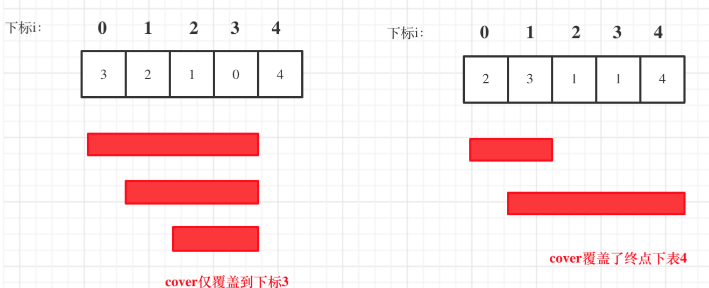
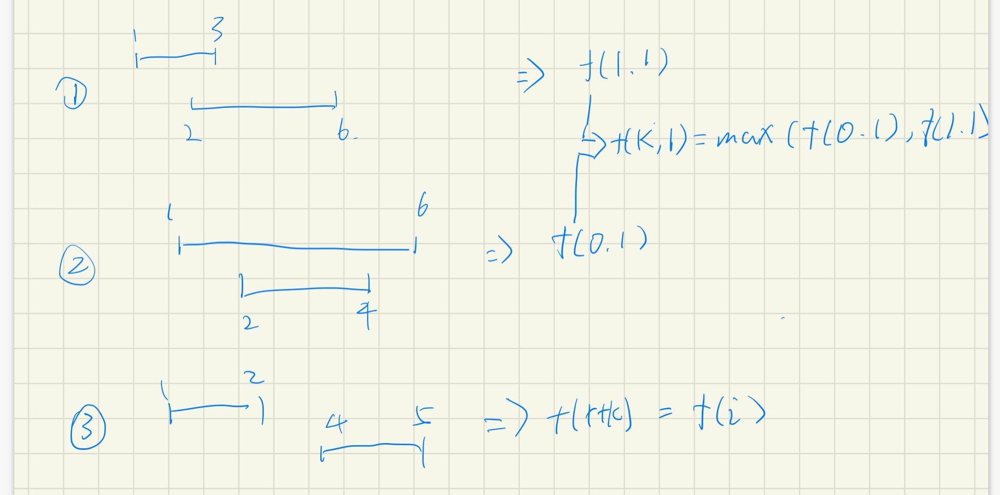
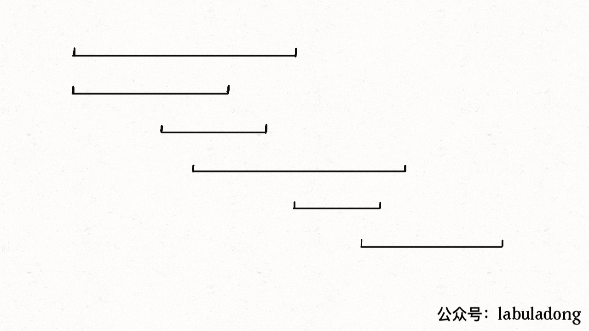

# 区间问题

[TOC]


### [45. 跳跃游戏 II](https://leetcode-cn.com/problems/jump-game-ii/)

```java
class Solution {
    public int jump(int[] nums) {
        int n = nums.length;
        int i = 0, j = 0, ans = 0;
        while(j < n - 1) {
            int k = i;
            for(int t = i; t <= j; t++) {
                k = Math.max(k, t + nums[t]);
            }
            ans++;
            i = j + 1;
            j = k;
        }
        return ans;
    }
}
```

从起点开始，计算能到达的位置，作为一轮，同时更新i,j的值

直到某一轮到达目的地，则停止

轮数即为答案


### [55. 跳跃游戏](https://leetcode-cn.com/problems/jump-game/)

```java
class Solution {
    public boolean canJump(int[] nums) {
        int k = 0, n = nums.length;
        for(int i = 0; i < n; i++) {
            if (k < i) {
                return false;
            }
            k = Math.max(i + nums[i], k);
            if(k == n) {
                break;
            }
        }
        return true;
    }
}
```

遍历数组，更新k值为当前能到达最大值，到达终点则终止循环，当k < i 说明无法到达后续数组。



### [56. 合并区间](https://leetcode-cn.com/problems/merge-intervals/)

```java
class Solution {
    public int[][] merge(int[][] intervals) {
        Arrays.sort(intervals, (a, b) -> (a[0] - b[0]));
        int k = 0;
        for(int i = 1; i < intervals.length; i++) {
            if(intervals[i][0] <= intervals[k][1]){
                intervals[k][1] = Math.max(intervals[i][1], intervals[k][1]);
            } else {
                intervals[++k] = intervals[i];
            }
        }
        return Arrays.copyOf(intervals, k + 1);
    }
}
```

举例三种情况

1. 重叠且前者的后端小于后者的前端：取后者的后端
2. 重叠且前者的后端大于后者的前端：取前者的后端
3. 不重叠：复制




### [435. 无重叠区间](https://leetcode-cn.com/problems/non-overlapping-intervals/)

```java
class Solution {
    public int eraseOverlapIntervals(int[][] intervals) {
        Arrays.sort(intervals, (a, b)->(a[1] - b[1]));
        int pre = Integer.MIN_VALUE, cnt = 0;
        for(int[] nums : intervals) {
            if(nums[0] < pre) {
                cnt++;
            } else {
                pre = nums[1];
            }
        }
        return cnt;
    }
}
```

##### 思路

1. 首先先判断采用哪位作为排序依据，由于是用上一个数字的后位比较当前的前位值，所以采用a[1] - b[1]
2. 根据题意分类
   1. 重叠，cnt++
   2. 不重叠，更新pre


### [452. 用最少数量的箭引爆气球](https://leetcode-cn.com/problems/minimum-number-of-arrows-to-burst-balloons/)

```java
class Solution {
    public int findMinArrowShots(int[][] points) {
        Arrays.sort(points, (a, b)-> (a[1] >= b[1] ? 1 : -1));
        int cnt = 0;
        long pre = Long.MIN_VALUE;
        for(int[] nums : points) {
            if(pre < nums[0]) {
                cnt++;
                pre = nums[1];
            }
        }
        return cnt;
    }
}
```

##### 思路

1. 首先依旧采用右端升序，并且等同于无重叠问题
2. 特殊用例`[[-2147483646,-2147483645],[2147483646,2147483647]]`
   1. 由于在`(a,b)->(a[0] - b[0]);`进行减法操作会发生溢出，导致无法得到正确结果
   2. 故可以采用`(a, b)-> (a[1] >= b[1] ? 1 : -1)`解决

### [763. 划分字母区间](https://leetcode-cn.com/problems/partition-labels/)

#### 暴力

```java
class Solution {
    public List<Integer> partitionLabels(String s) {
        List<Integer> list = new ArrayList();
        int pre = 0, i = 0, max = 0, n = s.length();
        while(i < n) {
            //从后往前会快一倍
            for(int j = n - 1; j >= 0; j--) {
                if(s.charAt(i) == s.charAt(j)) {
                    max = Math.max(max, j);
                    break;
                }
            }
            if(max == i) {
                list.add(i - pre + 1);
                pre = i + 1;
            }
            i++;
        }
        return list;
    }
}
```

#### 哈希

```java
class Solution {
    public List<Integer> partitionLabels(String s) {
        int[] dp = new int[26];
        int n = s.length();
        for(int i = 0; i < n; i++) {
            dp[s.charAt(i) - 'a'] = i;
        }
        int max = 0, pre = 0;
        List<Integer> list = new ArrayList();
        for(int i = 0; i < n; i++) {
            max = Math.max(max, dp[s.charAt(i) - 'a']);
            if(max == i) {
                list.add(i - pre + 1);
                pre = i + 1;
            }
        }
        return list;
    }
}
```

### [1024. 视频拼接](https://leetcode-cn.com/problems/video-stitching/)

```java
class Solution {
    public int videoStitching(int[][] clips, int time) {
        Arrays.sort(clips, (a, b) -> (a[0] - b[0]));
        int max = 0, cnt = 0, n = clips.length, cur = 0;
        int i = 0;
        while(i < n && clips[i][0] <= cur) {
            while(i < n && clips[i][0] <= cur) {
                max = Math.max(max, clips[i][1]);
                i++;
            }
            cnt++;
            if(max >= time) return cnt;
            cur = max;
        }
        return -1;
    }
}
```

实际上就是判断有多少层重叠区间。

每层能到达的后端最大值，将后端作为下一轮的前端，继续向下层寻找。



