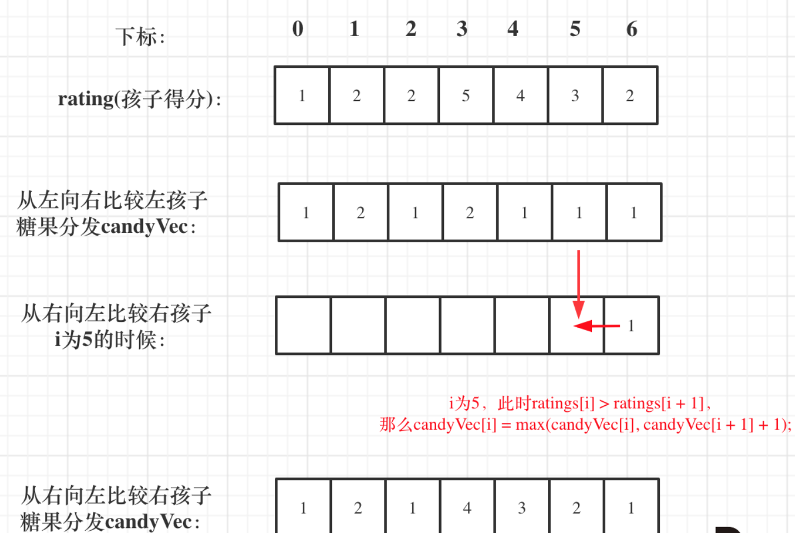
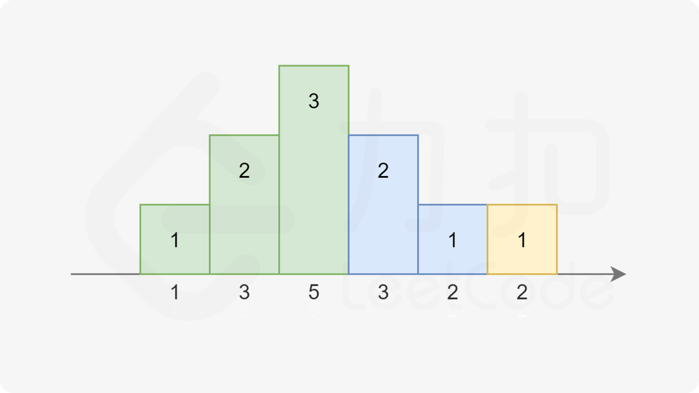
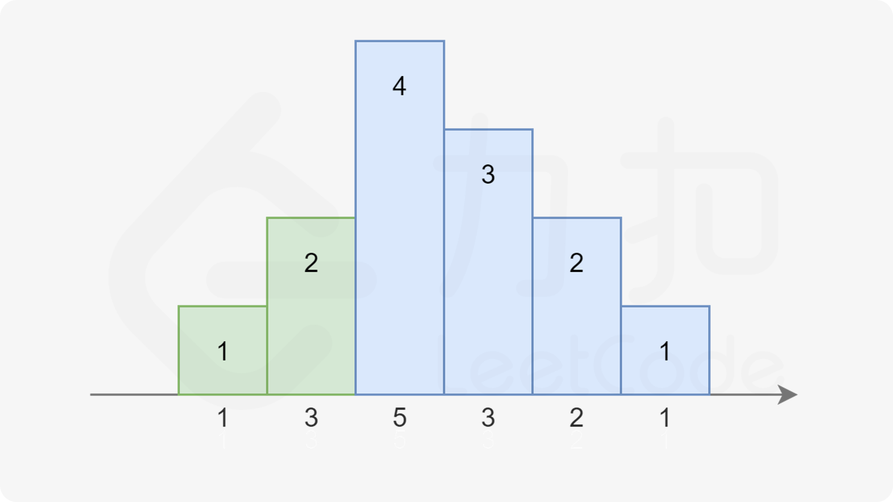
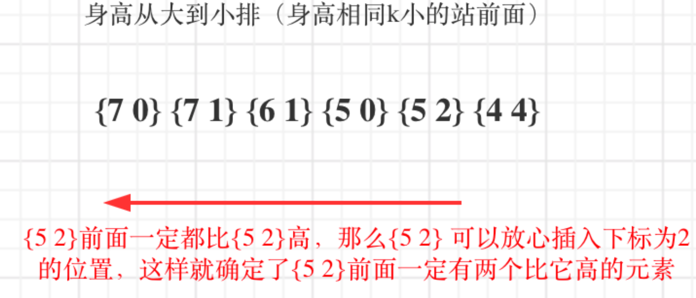

# 双维度权衡问题

[TOC]

### [135. 分发糖果](https://leetcode-cn.com/problems/candy/)

```java
class Solution {
    public int candy(int[] ratings) {
        int n = ratings.length;
        int[] ans = new int[n];
        Arrays.fill(ans, 1);
        for(int i = 1; i < n; i++){
            if(ratings[i] > ratings[i - 1]) {
                ans[i] = ans[i - 1] + 1;
            }
        }
        for(int i = n - 2; i >= 0; i--){
            if(ratings[i] > ratings[i + 1]) {
                ans[i] = Math.max(ans[i + 1] + 1, ans[i]);
            }
        }
        int sum = 0;
        for(int num : ans) {
            sum += num;
        }
        return sum;
    }
}
```

1. 先给所有小孩分配1个糖果，然后逐边考虑，不会顾此失彼
2. 遵循左规则，`ratings[i] > ratings[i - 1]`，则给评分高的分多一个糖果
3. 遵循有规则，`ratings[i] > ratings[i + 1]`，比较取左规则和右规则分配糖果数的最大值。`ans[i] = Math.max(ans[i + 1] + 1, ans[i])`
4. 累加为结果。



#### 常数优化

```java
class Solution {
    public int candy(int[] ratings) {
        int n = ratings.length;
        int inc = 1, dec = 0, pre = 1, ret = 1;
        for(int i = 1; i < n; i++) {
            if(ratings[i] >= ratings[i - 1]) {
                dec = 0;
                pre = ratings[i] == ratings[i - 1] ? 1 : pre + 1;
                ret += pre;
                inc = pre;
            } else {
                dec++;
                if(dec == inc) {
                    dec++;
                }
                ret += dec;
                pre = 1;
            }
        }
        return ret;
    }
}
```

递增后递增，则直接从1累加即可


累加后递减，则糖果数先增加后减少，



当递增长度跟递减长度相同，则将中间节点转为递减的起点。



### [406. 根据身高重建队列](https://leetcode-cn.com/problems/queue-reconstruction-by-height/)

```java
class Solution {
    public int[][] reconstructQueue(int[][] people) {
        Arrays.sort(people, (a, b)-> a[0] == b[0] ? a[1] - b[1] : b[0] - a[0]);
        List<int[]> list = new ArrayList();
        for(int i = 0; i < people.length; i++) {
            list.add(people[i][1], people[i]);
        }
        return list.toArray(new int[list.size()][2]);
    }
}
```

解题思路：先排序再插入

1.排序规则：按照先H高度降序，K个数升序排序

2.遍历排序后的数组，根据K插入到K的位置上

核心思想：高个子先站好位，矮个子插入到K位置上，前面肯定有K个高个子，矮个子再插到前面也满足K的要求

```java
// [7,0], [7,1], [6,1], [5,0], [5,2], [4,4]
// 再一个一个插入。
// [7,0]
// [7,0], [7,1]
// [7,0], [6,1], [7,1]
// [5,0], [7,0], [6,1], [7,1]
// [5,0], [7,0], [5,2], [6,1], [7,1]
// [5,0], [7,0], [5,2], [6,1], [4,4], [7,1]
```

