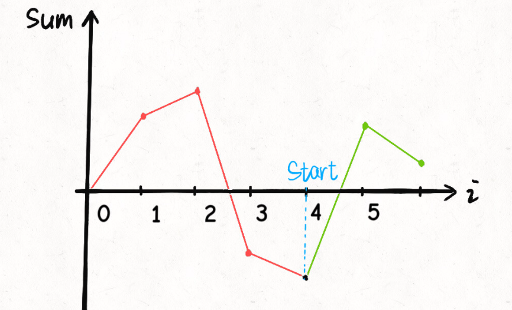
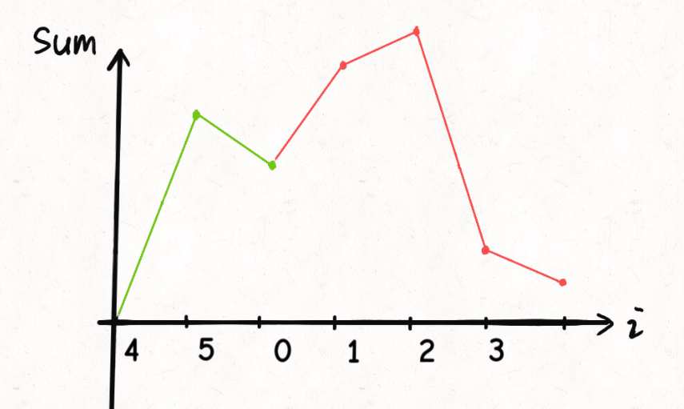
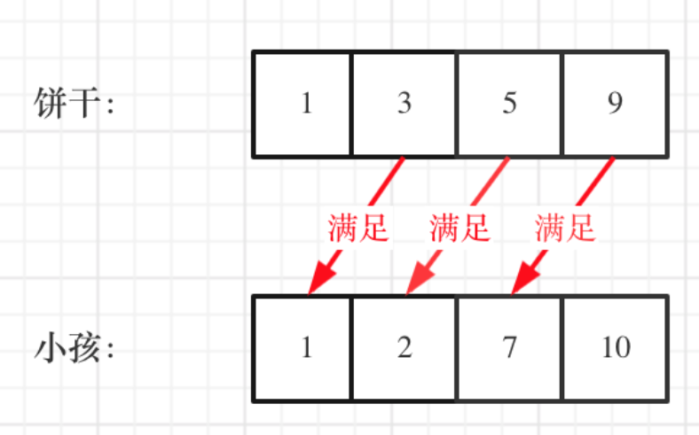
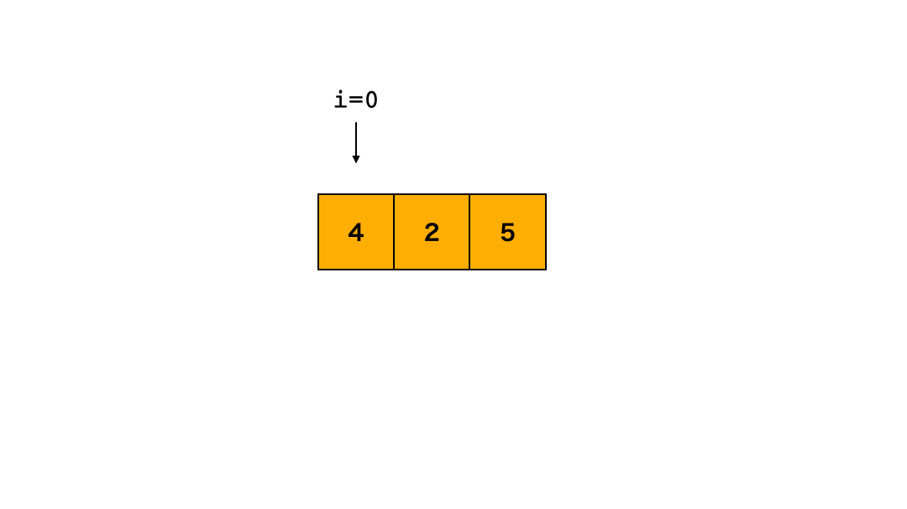
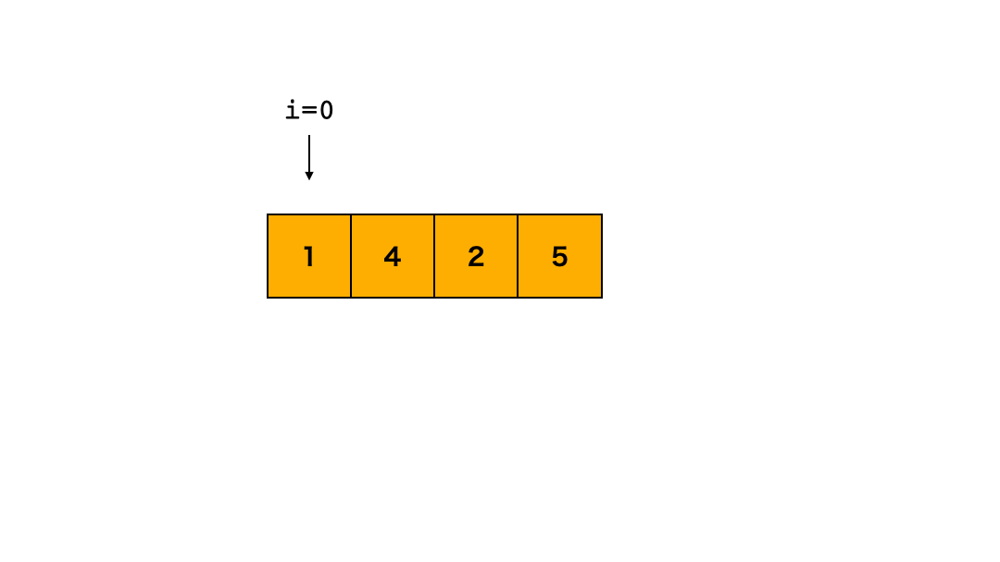
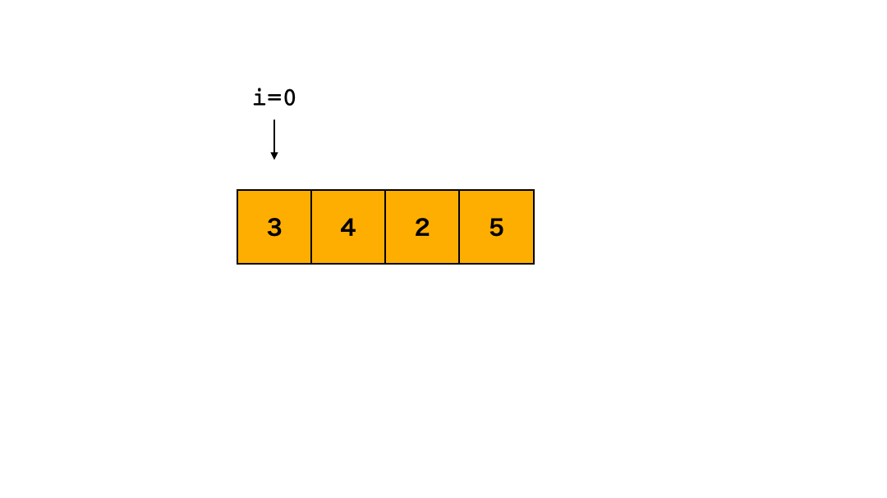

# 贪心

[TOC]

### [134. 加油站](https://leetcode-cn.com/problems/gas-station/)

```java
class Solution {
    public int canCompleteCircuit(int[] gas, int[] cost) {
        int min = Integer.MAX_VALUE, sum = 0, ans = 0;
        for(int i = 0; i < gas.length; i++) {
            sum = sum + gas[i] - cost[i];
            if(sum < min) {
                min = sum;
                ans = i + 1;
            }
        }
        return sum >= 0 ? ans % gas.length : - 1;
    }
}
```

* 找到sum累加得最低节点，则下一个节点为起始节点，可以将油充分利用，让油量一直在坐标轴之上
* 当sum最终小于0，则油不够用，返回-1






### [376. 摆动序列](https://leetcode-cn.com/problems/wiggle-subsequence/)

### 贪心

```java
class Solution {
    public int wiggleMaxLength(int[] nums) {
        int n = nums.length, cnt = 1;
        for(int i = 1; i < n;) {
            if(nums[i] > nums[i - 1]) {
                while(i < n && nums[i] >= nums[i - 1]) {
                    i++;
                }
                cnt++;
            } else if(nums[i] < nums[i - 1]) {
                while(i < n && nums[i] <= nums[i - 1]) {
                    i++;
                }
                cnt++;
            } else {
                i++;
            }
        }
        return cnt;
    }
}
```

#### 双指针

```java
public int wiggleMaxLength(int[] nums) {
    int down = 1, up = 1;
    for (int i = 1; i < nums.length; i++) {
        if (nums[i] > nums[i - 1])
            up = down + 1;
        else if (nums[i] < nums[i - 1])
            down = up + 1;
    }
    return nums.length == 0 ? 0 : Math.max(down, up);
}
```


### [455. 分发饼干](https://leetcode-cn.com/problems/assign-cookies/)

```java
class Solution {
    public int findContentChildren(int[] g, int[] s) {
        Arrays.sort(g);
        Arrays.sort(s);
        int i = g.length - 1, j = s.length - 1;
        int cnt = 0;
        while(i >= 0 && j >= 0) {
            if(s[j] >= g[i]) {
                j--;
                cnt++;
            } 
            i--;    
        }
        return cnt;
    }
}
```

先进行排序，让两个数组从小到大，

从后到前开始遍历，当饼干量大于胃口，则cnt++



### [605. 种花问题](https://leetcode-cn.com/problems/can-place-flowers/)

```java
class Solution {
    // 2,4,6,8
    // 3,5,7,9
    public boolean canPlaceFlowers(int[] flowerbed, int n) {
        int i = 0, j = 0, m = flowerbed.length, sum = 0;
        if(m == 1 && flowerbed[0] == 0) return true;
        while(j < m) {
            if(flowerbed[j] == 0){
                while(j < m && flowerbed[j] == 0) {
                    j++;
                }
                if(i == 0 && j == m) {
                    sum +=  (j - i + 1) / 2 ;
                } else if(i == 0 || j == m) {
                    sum +=  (j - i) / 2 ;
                } else {
                    sum += (j - i - 1) / 2;
                }
            }
            j++;
            i = j;
        }
        return n <= sum;
    }
}
```

分情况讨论。

```java
class Solution {
    public boolean canPlaceFlowers(int[] flowerbed, int n) {
        int m = flowerbed.length;
        for(int i = 0; i < m; i += 2) {
            if(flowerbed[i] == 0) {
                if(i == m - 1 || flowerbed[i + 1] == 0) {
                    n--;
                } else {
                    i++;
                }
            }
        }
        return n <= 0;
    }
}
```

* 当遇到1，跳2格
* 当遇到0，看下一格，
  * 为0，则置1，n-1，跳2格
  * 为1，跳过当前1格和后2格

### [665. 非递减数列](https://leetcode-cn.com/problems/non-decreasing-array/)

```java
class Solution {
    public boolean checkPossibility(int[] nums) {
        int n = nums.length, cnt = 1;
        for(int i = 0; i < n - 1; i++) {
            if(nums[i] > nums[i + 1]) {
                cnt--;
                if(cnt < 0) return false;
                if(i == 0 || nums[i + 1] >= nums[i - 1]) {
                    nums[i] = nums[i + 1];
                } else {
                    nums[i + 1] = nums[i];
                }
            }
        }
        return true;
    }
}
```

三种情况

* `4 2`      让前面 = 后面 `nums[i] = nums[i + 1]`



* `1 4 2`   让中间的等于后面  `nums[i] = nums[i + 1]`, 同上



* `3 4 2`  让后面的等于中间 `nums[i + 1] = nums[i];`



### [738. 单调递增的数字](https://leetcode-cn.com/problems/monotone-increasing-digits/)

#### 倒序

```java
class Solution {
    public int monotoneIncreasingDigits(int n) {
        if(n < 10) {
            return n;
        }
        char[] c = String.valueOf(n).toCharArray();
        int len = c.length;
        for(int i = len - 2; i >= 0; i--) {
            if(c[i] > c[i + 1]){
                while(i >= 0 && c[i] >= c[i + 1]) {
                    i--;
                }
                c[++i]--;
                for(int j = i + 1; j < len; j++) {
                    c[j] = '9';
                }
            } 
        }
        int sum = 0;
        for(int i : c) {
            sum = sum * 10 + (i - '0'); 
        }
        return sum;
    }
}
```

#### 正序

```java
class Solution {
    public int monotoneIncreasingDigits(int n) {
        char[] c = (n + "").toCharArray();
        int max = -1, idx = -1;
        for(int i = 0; i < c.length - 1; i++) {
            if(max < c[i]) {
                max = c[i];
                idx = i;
            }
            if(c[i] > c[i + 1]) {
                c[idx]--;
                for(int j = idx + 1; j < c.length; j++) {
                    c[j] = '9';
                }
                break;
            }
        }
        return Integer.parseInt(new String(c));
    }
}
```

情况1：单调递增，找到最大值，作为起点，c[idx] - 1，后面的值都变为9

```java
n   = 1234321
res = 1233999
```

情况2：当情况1操作完，发现后面前面不满足前面的c[i] > c[i + 1],则只要重复最大值的第一个索引位置作为起点，进行操作即可

```java
n    = 2333332
res  = 2299999
```

#### 数学法

```java
class Solution {
    public int monotoneIncreasingDigits(int n) {
        int ones = 111111111;
        int res = 0;
        for(int i = 0; i < 9; i++) {
            while(res + ones > n) {
                ones /= 10;
            }
            res += ones;
        }
        return res;
    }
}
```

由于结果要求各位数字单调递增，那么这些数字必然形如 a0a1a2……an (1 <= a0 <= a1 <= a2 <= …… <= an <= 9)

最多是9个1，累加结果超出n，则去掉一个1继续循环。

比如

```
332 =
111 => 222 => 233 => 244 => …… => 299
```


### [860. 柠檬水找零](https://leetcode-cn.com/problems/lemonade-change/)

```java
class Solution {
    public boolean lemonadeChange(int[] bills) {
        int five = 0, ten = 0;
        for(int i = 0; i < bills.length; i++) {
            if(bills[i] == 5){
                five++;
            } else if(bills[i] == 10) {
                ten++;
                five--;
            } else {
                if(ten > 0) {
                    ten--;
                } else {
                    five -= 2;
                }
                five--;
            }
            if(five < 0) {
                return false;
            }
        }
        return true;
    }
}
```


### [1005. K 次取反后最大化的数组和](https://leetcode-cn.com/problems/maximize-sum-of-array-after-k-negations/)

#### 优先队列

```java
class Solution {
    public int largestSumAfterKNegations(int[] nums, int k) {
        PriorityQueue<Integer> queue = new PriorityQueue<>();
        int sum = 0;
        for(int num:nums) {
            queue.add(num);
        }
        while(k > 0) {
            queue.add(- queue.poll());
            k--;
        }
        while(!queue.isEmpty()) {
            sum += queue.poll();
        }
        return sum;
    }
}
```

#### 计数统计

```java
class Solution {
    public int largestSumAfterKNegations(int[] nums, int k) {
        int[] arr = new int[201];
        for(int num : nums) {
            arr[num + 100]++;
        }
        int i = 0;
        while(k > 0) {
            while(arr[i] == 0) {
                i++;
            }
            arr[i]--;
            arr[200 - i]++;
            if(i > 100) {
                i = 200 - i;
            }
            k--;
        }
        int sum = 0;
        for(int j = 0; j < arr.length; j++){
            sum+=arr[j] * (j - 100);
        }
        return sum;
    }
}
```

* 创建数组，进行计数
* k>0 对最小的数进行取反，如果最小值大于零，则需要修改索引位置`i = 200 - i;`
* K == 0 对整个数组

