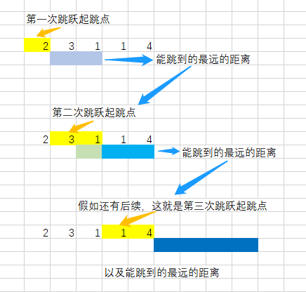

# 贪心

[TOC]


### [45. 跳跃游戏 II](https://leetcode-cn.com/problems/jump-game-ii/)

```java
class Solution {
    public int jump(int[] nums) {
        int n = nums.length;
        int i = 0, j = 0, ans = 0;
        while(j < n - 1) {
            int k = i;
            for(int t = i; t <= j; t++) {
                k = Math.max(k, t + nums[t]);
            }
            ans++;
            i = j + 1;
            j = k;
        }
        return ans;
    }
}
```

从起点开始，计算能到达的位置，作为一轮，同时更新i,j的值

直到某一轮到达目的地，则停止

轮数即为答案



### [55. 跳跃游戏](https://leetcode-cn.com/problems/jump-game/)

```java
class Solution {
    public boolean canJump(int[] nums) {
        int k = 0, n = nums.length;
        for(int i = 0; i < n; i++) {
            if (k < i) {
                return false;
            }
            k = Math.max(i + nums[i], k);
            if(k == n) {
                break;
            }
        }
        return true;
    }
}
```

遍历数组，更新k值为当前能到达最大值，到达终点则终止循环，当k < i 说明无法到达后续数组。


### [376. 摆动序列](https://leetcode-cn.com/problems/wiggle-subsequence/)

### 贪心

```java
class Solution {
    public int wiggleMaxLength(int[] nums) {
        int n = nums.length, cnt = 1;
        for(int i = 1; i < n;) {
            if(nums[i] > nums[i - 1]) {
                while(i < n && nums[i] >= nums[i - 1]) {
                    i++;
                }
                cnt++;
            } else if(nums[i] < nums[i - 1]) {
                while(i < n && nums[i] <= nums[i - 1]) {
                    i++;
                }
                cnt++;
            } else {
                i++;
            }
        }
        return cnt;
    }
}
```

#### 双指针

```java
public int wiggleMaxLength(int[] nums) {
    int down = 1, up = 1;
    for (int i = 1; i < nums.length; i++) {
        if (nums[i] > nums[i - 1])
            up = down + 1;
        else if (nums[i] < nums[i - 1])
            down = up + 1;
    }
    return nums.length == 0 ? 0 : Math.max(down, up);
}
```


