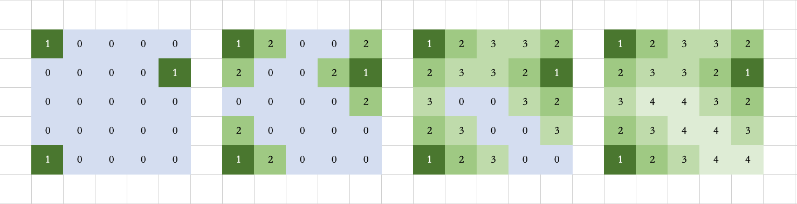

# bfs

### [542. 01 矩阵](https://leetcode-cn.com/problems/01-matrix/)

#### 动态规划

```java
class Solution {
    public int[][] updateMatrix(int[][] mat) {
        int n = mat.length, m = mat[0].length;
        for(int i = 0; i < n; i++) {
            for(int j = 0; j < m; j++ ){
                mat[i][j] = mat[i][j] == 0 ? 0 : 10000;
            }
        }
        for(int i = 0; i < n; i++) {
            for(int j = 0; j < m; j++) {
                if (i > 0) {
                    mat[i][j] = Math.min(mat[i][j], mat[i - 1][j] + 1);
                }
                if (j > 0) {
                    mat[i][j] = Math.min(mat[i][j], mat[i][j - 1] + 1);
                }
            }
        }
        for(int i = n - 1 ; i >= 0; i--) {
            for(int j = m - 1 ; j >= 0; j--) {                
                if (i < n - 1) {
                    mat[i][j] = Math.min(mat[i][j], mat[i + 1][j] + 1);
                }
                if (j < m - 1) {
                    mat[i][j] = Math.min(mat[i][j], mat[i][j + 1] + 1);
                }
            }
        }
        return mat;
    }
}
```

由于当前位置到0的最小距离由四个方向决定，故状态方程为

* 若`mat[i][j] == 0,  `，则`dp[i][j] == 0`
* 若`mat[i][j] != 0`，则`dp[i][j] = min(dp[i - 1][j], dp[i + 1][j], dp[i][j - 1], dp[i][j + 1])`

可以直接将mat替换dp，最后根据边界条件分情况将状态方程拆为2个双重循环和4个条件。

#### bfs

```java
class Solution {
    public int[][] updateMatrix(int[][] mat) {
        //初始化方向数组
        int[] dx = new int[]{-1, 0, 1, 0};
        int[] dy = new int[]{0, -1, 0, 1};
        int n = mat.length, m = mat[0].length;
        Queue<int[]> queue = new LinkedList();
        for(int i = 0; i < n; i++) {
            for(int j = 0; j < m; j++) {
                //从0作为入口，
                if(mat[i][j] == 0) {
                    queue.add(new int[]{i, j});
                } else {
                    //-1表示还没有访问过
                    mat[i][j] = -1;
                }
            }
        }

        while(!queue.isEmpty()) {
            int[] cur = queue.poll();
            int x = cur[0];
            int y = cur[1];
            for(int i = 0; i < 4; i++) {
                int newX = x + dx[i];
                int newY = y + dy[i];
                if(newX >= 0 && newX < n && newY >= 0 && newY < m && mat[newX][newY] == -1) {
                    mat[newX][newY] = mat[x][y] + 1;
                    queue.add(new int[]{newX, newY}); 
                }
            }
        }
        return mat;

    }
}
```

* 先收集所有的0，加入队列，作为每次深搜的入口，并且对1加入未访问标识
* 深搜过程，符合边界和未访问标识， 则更新最近距离值，并加入到队列，最为以后的入口。

### [1162. 地图分析](https://leetcode-cn.com/problems/as-far-from-land-as-possible/)

```java
class Solution {
    public int maxDistance(int[][] grid) {
        int[] dx = new int[]{-1, 0, 1, 0};
        int[] dy = new int[]{0, -1, 0, 1};
        int n = grid.length, m = grid[0].length;
        Queue<int[]> queue = new LinkedList();
        for(int i = 0; i < n; i++) {
            for(int j = 0; j < m; j++) {
                if(grid[i][j] == 1) {
                    queue.add(new int[]{i, j});
                } 
            }
        }
        int[] cur = null;
        boolean hasOcean = false;
        while(!queue.isEmpty()) {
            cur = queue.poll();
            int x = cur[0];
            int y = cur[1];
            for(int i = 0; i < 4; i++){
                int newX = x + dx[i];
                int newY = y + dy[i];
                if(newX >= 0 && newX < n && newY >= 0 && newY < m && grid[newX][newY] == 0) {
                    grid[newX][newY] = grid[x][y] + 1;
                    queue.add(new int[]{newX, newY});
                    hasOcean = true;
                }
            }
        }
        if(!hasOcean || cur == null) {
            return -1;
        }
        return grid[cur[0]][cur[1]] - 1;
    }
}
```

思路同`542. 01 矩阵`


