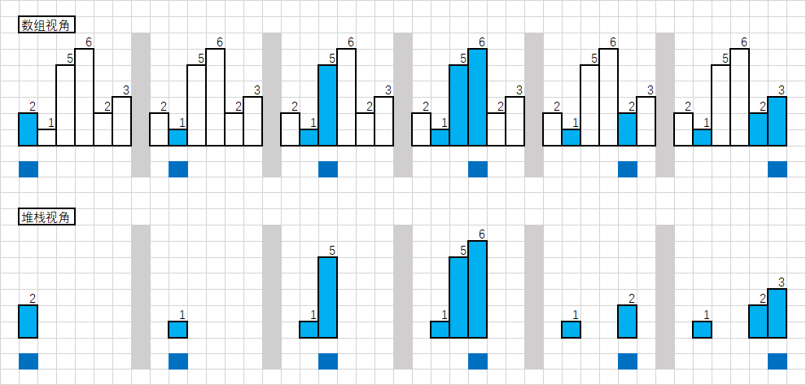

### [84. 柱状图中最大的矩形](https://leetcode-cn.com/problems/largest-rectangle-in-histogram/)

#### 暴力（超时）

```java
class Solution {
    public int largestRectangleArea(int[] heights) {
        int n = heights.length;
        int max = 0;
        for(int i = 0; i < heights.length; i++) {
            int left = i - 1, right = i + 1;
            while(left >=0 && heights[i] <= heights[left]) {
                left--;
            }
            while(right < n && heights[i] <= heights[right]) {
                right++;
            }
            max = Math.max(max, (right - left - 1) * heights[i]);
        }
        return max;
    }
}
```

#### 单调栈

```java
class Solution {
    public int largestRectangleArea(int[] heights) {
        int n = heights.length;
        //创建新数组，增加哨兵
        int res = 0;
        int[] newHeight = new int[n + 2];
        System.arraycopy(heights, 0, newHeight, 1, n);
        heights = newHeight;
        //构建单调栈
        Deque<Integer> stack = new ArrayDeque<>();
        //加入起始哨兵
        stack.add(0);
        //这里需要遍历到最后一个哨兵，把所有的栈弹出
        for(int i = 1; i < n + 2 ; i++) {
            //这里是while而不是if，遇到较小值会持续弹出
            while(heights[i] < heights[stack.peekLast()]) {
                int curHeight = heights[stack.pollLast()];
                int curWid = i - stack.peekLast() - 1;
                res = Math.max(res, curHeight * curWid);
            }
            stack.add(i);
        }
        return res;
    }
}
```

加入**收尾哨兵**，减少栈判空情况。

思路如下图，当i=4时，此时栈内有{1,2,3}，比较发现栈顶i=3的高度高于当前i=4，所以进行弹出计算，计算对应的高度`heights[stack.pollLast()]`和宽度`i - stack.peekLast() - 1`，并计算全局最大值res。


弹出i=3后，此时栈顶i=2依然满足高度大于i=4，重复上述操作，直至不满足条件，继续往下压栈


下图过程



### [85. 最大矩形](https://leetcode-cn.com/problems/maximal-rectangle/)

```java
class Solution {
    public int maximalRectangle(char[][] matrix) {
        int n = matrix.length, m = matrix[0].length;
        int max = 0;
        //给矩阵添加哨兵
        int[][] newMatrix = new int[n + 1][m + 2];
        for(int i = 0; i < n; i++) {
            for(int j = 0; j < m; j++){
                if(matrix[i][j] == '1'){
                    newMatrix[i + 1][j + 1] = newMatrix[i][j + 1] + 1;
                }
            }
        }
        Deque<Integer> stack = new ArrayDeque();
        for(int i = 1; i <= n; i++) {
            //单调栈
            stack.add(0);
            for(int j = 1; j < m + 2; j++) {
                while(newMatrix[i][j] < newMatrix[i][stack.peekLast()]) {
                    int curheight = newMatrix[i][stack.pollLast()];
                    int curWid = j - stack.peekLast() - 1;
                    max = Math.max(max, curheight * curWid);
                }
                stack.add(j);
            }
        }
        return max;
    }
}
```

类似`84. 柱状图中最大的矩形`，首先创建带收尾哨兵的直方图，接下来每层循环调用，执行单调栈计算最大矩阵

