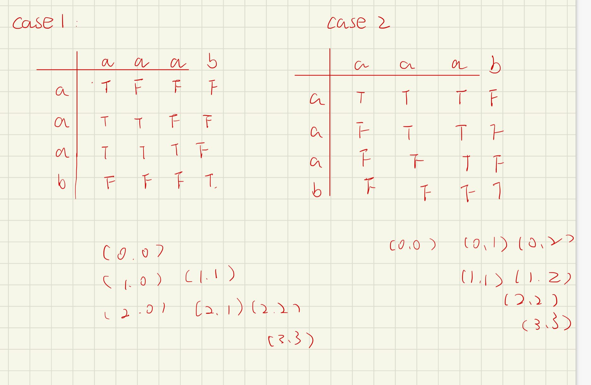

# 分割

[TOC]

### [93. 复原 IP 地址](https://leetcode-cn.com/problems/restore-ip-addresses/)

#### 回溯+动态规划预处理

```java
class Solution {
    boolean[][] dp;
    List<String> list = new ArrayList();
    int n;
    public List<String> restoreIpAddresses(String s) {
        n = s.length();
        //增加长度判断
        if(n < 4 || n > 12) {
            return list;
        }
        //动态规划预处理，将255以下进行标记
        dp = new boolean[n][n];
        for(int i = 0; i < n; i++) {
            for(int j = 0; j <= i; j++) {
                if(Long.parseLong(s.substring(j, i + 1)) <= 255) {
                    dp[i][j] = true;
                }
            }
        }
        backtracking(s, 0, 0, "");
        return list;
    }

    public void backtracking(String s, int start, int cnt, String str) {
        if(cnt == 4) {
            if(start == n) {
                str = str.substring(0, str.length() - 1);
                list.add(str);
            }
            return;
        }

        for(int i = start; i < n; i++) {
            if(dp[i][start]) {
                //多个字符，判断首字符是否为0
                if(i - start > 0 && s.charAt(start) == '0') {
                    continue;
                }
                cnt++;
                backtracking(s, i + 1, cnt, str + s.substring(start, i + 1) + ".");
                cnt--;
            }
        }
    }
}
```

思路同`131.分割回文串`

### [131. 分割回文串](https://leetcode-cn.com/problems/palindrome-partitioning/)

#### 回溯+动态规划预处理

```java
class Solution {
    boolean[][] dp;
    List<List<String>> list = new ArrayList();
    List<String> cur = new ArrayList();
    public List<List<String>> partition(String s) {
        int n = s.length();
        dp = new boolean[n][n];

		//d
        for (int i = 0; i < n; i++) {
            for (int j = 0 ; j <= i; j++) {
                if(s.charAt(i) == s.charAt(j) && (i - j < 2 || dp[i - 1][j + 1])){
                    dp[i][j] = true;
                }
            }
        }
        backtracking(s, n, 0);
        return list;
    }

    public void backtracking (String s, int n, int start) {
        if(start == n) {
            list.add(new ArrayList(cur));
            return;
        }

        for(int j = 0; j < n; j++ ){
            if(dp[j][start]){
                cur.add(s.substring(start, j + 1));
                backtracking(s, n, j + 1);
                cur.remove(cur.size() - 1);
            }
        }
    }
}
```

**动态规划初始化方式**

```java
//方式1
for (int i = 0; i < n; i++) {
    for (int j = 0 ; j <= i; j++) {
        if(s.charAt(i) == s.charAt(j) && (i - j < 2 || dp[i - 1][j + 1])){
            dp[i][j] = true;
        }
    }
}
//方式2
for (int i = n - 1; i >= 0; i--) {
    for (int j = i ; j < n; j++) {
        if(s.charAt(i) == s.charAt(j) && (j - i < 2 || dp[i + 1][j - 1])){
            dp[i][j] = true;
        }
    }
}
```



**故回溯访问数组的方式为**

```java
//case1.1
for(int j = 0; j < n; j++ ){
    if(dp[j][start]){
//case1.2
for(int j = start; j < n; j++){
    if(dp[j][start]){

//case2
for(int j = start; j < n; j++ ){
    if(dp[start][j]){
```

#### 回溯+中心扩散预处理

```java
class Solution {
    boolean[][] dp;
    List<List<String>> list = new ArrayList();
    List<String> cur = new ArrayList();
    public List<List<String>> partition(String s) {
        int n = s.length();
        dp = new boolean[n][n];
        //中心扩散预处理
        int k = 2 * n - 1;
        for(int i = 0; i < k; i++) {
            int l = i / 2, r = (i + 1) / 2;
            while(l >= 0 && r < n && s.charAt(l) == s.charAt(r)) {
                dp[l][r] = true;
                l--;
                r++;
            }
        }
        backtracking(s, n, 0);
        return list;
    }

    public void backtracking (String s, int n, int start) {
        if(start == n) {
            list.add(new ArrayList(cur));
            return;
        }

        for(int j = start; j < n; j++){
            if(dp[start][j]){
                cur.add(s.substring(start, j + 1));
                backtracking(s, n, j + 1);
                cur.remove(cur.size() - 1);
            }
        }
    }
}
```

