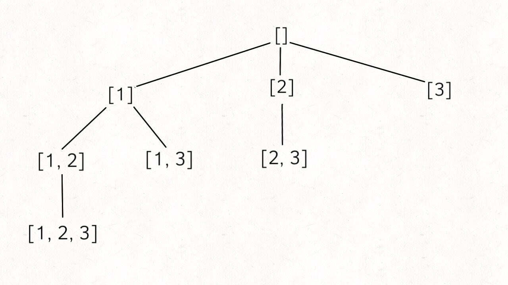

# 子集

### [78. 子集](https://leetcode-cn.com/problems/subsets/)

```java
class Solution {
    List<List<Integer>> list = new ArrayList();
    List<Integer> cur = new ArrayList();
    public List<List<Integer>> subsets(int[] nums) {
        backtracking(nums, 0);
        return list;
    }

    public void backtracking(int[] nums, int start) {
        list.add(new ArrayList(cur));
        for(int i = start; i < nums.length; i++) {
            cur.add(nums[i]);
            backtracking(nums, i + 1);
            cur.remove(cur.size() - 1);
        }
    }
}
```

存入所有节点。



### [90. 子集 II](https://leetcode-cn.com/problems/subsets-ii/)

```java
class Solution {
    List<List<Integer>> list = new ArrayList();
    List<Integer> cur = new ArrayList();
    public List<List<Integer>> subsetsWithDup(int[] nums) {
        Arrays.sort(nums);
        backtracking(nums, 0);
        return list;
    }

    public void backtracking(int[] nums, int start) {
        list.add(new ArrayList(cur));
        for(int i = start; i < nums.length; i++){
            //使用i > start 能不跳过第一次选中，如(1,2,2)情况的2不会被跳过
            if(i > start && nums[i] == nums[i - 1]) {
                continue;
            }
            cur.add(nums[i]);
            backtracking(nums, i + 1);
            cur.remove(cur.size() - 1);
        }
    }
}
```

类似`40.组合总和Ⅱ`的去重方式

* 先排序  后判断当前数字跟前面是否相同。

### [491. 递增子序列](https://leetcode-cn.com/problems/increasing-subsequences/)

```java
class Solution {
    List<List<Integer>> list = new ArrayList();
    List<Integer> cur = new ArrayList();
    int n;
    public List<List<Integer>> findSubsequences(int[] nums) {
        n = nums.length;
        backtracking(nums, -1);
        return list;
    }

    public void backtracking(int[] nums, int start) {
        if(cur.size() > 1) {
            list.add(new ArrayList(cur));
        }
        Set<Integer> set = new HashSet<>();
        // 在 [start + 1, n - 1] 范围内遍历搜索递增序列的后一个值。
        for(int i = start + 1; i < n; i++) {
            //去重
            if(set.contains(nums[i])) {
                continue;
            }
            set.add(nums[i]);
            //nums[i] >= nums[start]递归序列，加入cur中，进入下一层
            if(start == -1 || nums[i] >= nums[start]) {
                cur.add(nums[i]);
                backtracking(nums, i);
                cur.remove(cur.size() - 1);
            }
        }
    }
}
```

`backtracking(nums, -1);`和`if(start == -1)`可以保证对每个元素都作为起始元素进行递归

`nums[i] >= nums[start]`和`cur.add(nums[i]);`可以保证在当前层，后一个元素大于进入当前层的起始元素，则加入后一个元素作为递增元素，并进入递归。

`if(set.contains(nums[i]))` 去重，同一层不会对同一个元素进行多次加入。

