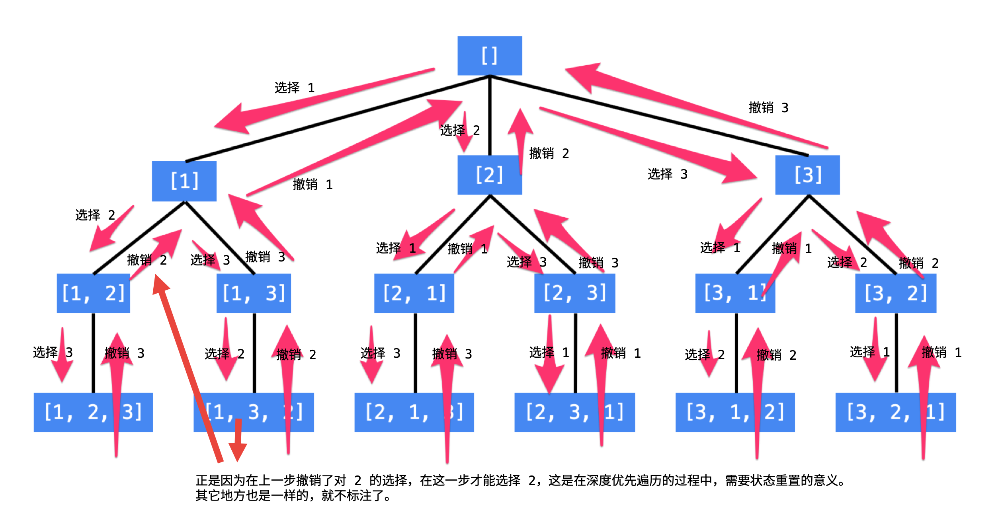

### [46. 全排列](https://leetcode-cn.com/problems/permutations/)

```java
class Solution {
    List<List<Integer>> list = new ArrayList();
    List<Integer> cur = new ArrayList();
    //也可以用used数组
    Set<Integer> set = new HashSet<>();
    public List<List<Integer>> permute(int[] nums) {
        backtracking(nums);
        return list;
    }

    public void backtracking(int[] nums) {
        if(cur.size() == nums.length) {
            list.add(new ArrayList(cur));
            return;
        }

        for(int i = 0; i < nums.length; i++){
            if(set.contains(nums[i])) {
                continue;
            }
            set.add(nums[i]);
            cur.add(nums[i]);
            backtracking(nums);
            set.remove(nums[i]);
            cur.remove(cur.size() - 1);
        }
    }
}
```



### [47. 全排列 II](https://leetcode-cn.com/problems/permutations-ii/)

#### 数组+哈希去重

```java
class Solution {
    List<List<Integer>> list = new ArrayList();
    List<Integer> cur = new ArrayList();
    Set<List<Integer>> set = new HashSet<>();
    boolean[] used;
    public List<List<Integer>> permuteUnique(int[] nums) {
        used = new boolean[nums.length];
        backtracking(nums);
        return list;
    }

    public void backtracking(int[] nums) {
        if(cur.size() == nums.length) {
            if(!set.contains(cur)){
                list.add(new ArrayList(cur));
                set.add(new ArrayList(cur));
            }
            return;
        }

        for(int i = 0; i < nums.length; i++){
            if(used[i]) {
                continue;
            }
            used[i] = true;
            cur.add(nums[i]);
            backtracking(nums);
            cur.remove(cur.size() - 1);
            used[i] = false;
        }
    }
}
```

#### 数组去重

```java
class Solution {
    List<List<Integer>> list = new ArrayList();
    List<Integer> cur = new ArrayList();
    boolean[] used;
    public List<List<Integer>> permuteUnique(int[] nums) {
        //不要忘记排序
        Arrays.sort(nums);
        used = new boolean[nums.length];
        backtracking(nums);
        return list;
    }

    public void backtracking(int[] nums) {
        if(cur.size() == nums.length) {
            list.add(new ArrayList(cur));
            return;
        }

        for(int i = 0; i < nums.length; i++){
            //去重的核心
            if(used[i] || (i > 0 && nums[i] == nums[i - 1] && !used[i - 1])) {
                continue;
            }
            used[i] = true;
            cur.add(nums[i]);
            backtracking(nums);
            cur.remove(cur.size() - 1);
            used[i] = false;
        }
    }
}
```

* 首先对待选数组进行排序
* 其次`used[i] || (i > 0 && nums[i] == nums[i - 1] && !used[i - 1])`当前索引位置被使用过或者当前位置和前面位置相同，而且前面位置没被使用(即当前位置作为首节点)，则进行跳过或剪枝


#### 拓展

大家发现，去重最为关键的代码为：

```cpp
if (i > 0 && nums[i] == nums[i - 1] && used[i - 1] == false) {
    continue;
}
```

**如果改成 `used[i - 1] == true`， 也是正确的!**，去重代码如下：

```cpp
if (i > 0 && nums[i] == nums[i - 1] && used[i - 1] == true) {
    continue;
}
```

这是为什么呢，就是上面我刚说的，如果要对树层中前一位去重，就用`used[i - 1] == false`，如果要对树枝前一位去重用`used[i - 1] == true`。

**对于排列问题，树层上去重和树枝上去重，都是可以的，但是树层上去重效率更高！**

这么说是不是有点抽象？

来来来，我就用输入: [1,1,1] 来举一个例子。

树层上去重(used[i - 1] == false)，的树形结构如下：


树枝上去重（used[i - 1] == true）的树型结构如下：


大家应该很清晰的看到，树层上对前一位去重非常彻底，效率很高，树枝上对前一位去重虽然最后可以得到答案，但是做了很多无用搜索。

故**使用(used[i - 1] == false)，即树层去重，效率更高！**