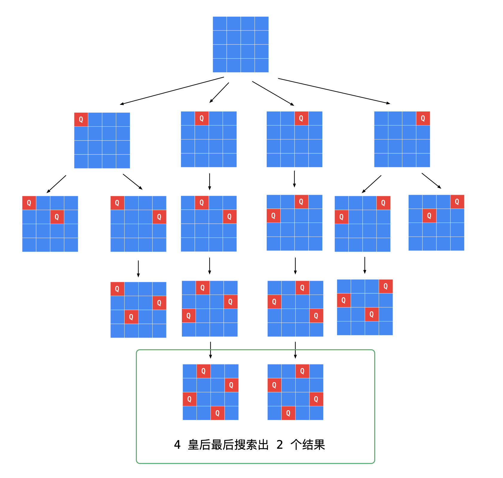

### [51. N 皇后](https://leetcode-cn.com/problems/n-queens/)

约束条件：

1. 不能同行
2. 不能同列
3. 不能同斜线（主对角线、副对角线）

#### 数组标记

```java
class Solution {
    List<List<String>> list = new ArrayList();
    List<String> cur = new ArrayList();
    int[][] used;
    public List<List<String>> solveNQueens(int n) {
        used = new int[n][n];
        backtracking(n, 0);
        return list;
    }

    public void backtracking (int n, int k) {
        if(k == n) {
            list.add(new ArrayList(cur));
            return;
        }

        for(int i = 0; i < n; i++) {
            if(used[k][i] != 0) {
                continue;
            }
            String s = "";
            for(int j = 0; j < n; j++) {
                if(j == i) {
                    s += "Q";
                } else {
                    s += ".";
                }
            }
            usedFlag(i, k, n, true);
            cur.add(s);
            backtracking(n, k + 1);
            cur.remove(cur.size() - 1);
            usedFlag(i, k, n, false);
        }
    }
    public void usedFlag(int i, int k, int n, boolean flag) {
        int cnt = flag ? 1 : -1;
        for(int j = k; j < n; j++) {
            used[j][i] += cnt;
        }
        for(int j = 0; j < n - k; j++) {
            if(i + j < n) {
                used[k + j][i + j] += cnt;
            }
            if(i - j >= 0) {
                used[k + j][i - j] += cnt;
            }
        }
    }
} 
```



#### 回头检查