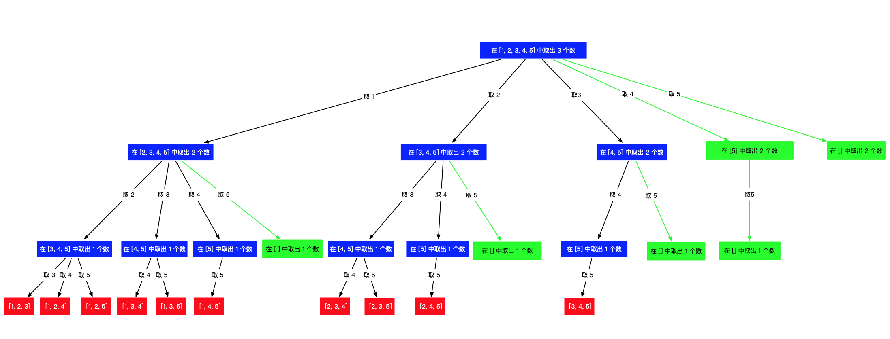

# 组合

[TOC]

### [17. 电话号码的字母组合](https://leetcode-cn.com/problems/letter-combinations-of-a-phone-number/)

```java
class Solution {
    List<String> list = new ArrayList<>();
    public List<String> letterCombinations(String digits) {
        if(digits.length() == 0) return list;
        String[] str = new String[]{"#", "#", "abc","def","ghi","jkl","mno","pqrs","tuv","wxyz"};
        backtracking(digits, str, 0, "");
        return list;
    }

    public void backtracking(String digits, String[] str, int start, String tmp) {
        if(tmp.length() == digits.length()) {
            list.add(tmp);
            return;
        }

        for(int i = start; i < digits.length(); i++) {
            for(char c : str[digits.charAt(i) - '0'].toCharArray()){
                backtracking(digits, str, i + 1, tmp + c);
            }
        }
    }
}
```

* 创建映射关系
* 按照数字取出字符串，逐个尝试


### [39. 组合总和](https://leetcode-cn.com/problems/combination-sum/)

```java
class Solution {
    List<List<Integer>> list = new ArrayList();
    List<Integer> cur = new ArrayList();
    public List<List<Integer>> combinationSum(int[] candidates, int target) {
        backtracking(candidates, target, 0);
        return list;
    }

    int sum = 0;
    public void backtracking(int[] candidates, int target, int start) {
        if(sum >= target) {
            if(sum == target) {
                list.add(new ArrayList(cur));
            }
            return;
        }

        for(int i = start; i < candidates.length; i++) {
            cur.add(candidates[i]);
            sum += candidates[i];
            backtracking(candidates, target, i);
            cur.remove(cur.size() - 1);
            sum -= candidates[i];
        }
    }
}
```

### [40. 组合总和 II](https://leetcode-cn.com/problems/combination-sum-ii/)

```java
class Solution {
    List<List<Integer>> list = new ArrayList();
    List<Integer> cur = new ArrayList();
    public List<List<Integer>> combinationSum2(int[] candidates, int target) {
        Arrays.sort(candidates);
        backtracking(candidates, target, 0);
        return list;
    }

    int sum = 0;
    public void backtracking(int[] candidates, int target, int start) {
        if(sum >= target) {
            if(sum == target) {
                list.add(new ArrayList(cur));
            }
            return;
        }

        for(int i = start; i < candidates.length; i++) {
            //剪枝
            if(target - candidates[i] < 0) {
                break;
            }
            //去重，这里是i > start 而不是 i > 0
            if(i > start && candidates[i] == candidates[i - 1]) {
                continue;
            }
            cur.add(candidates[i]);
            sum += candidates[i];
            backtracking(candidates, target, i + 1);
            cur.remove(cur.size() - 1);
            sum -= candidates[i];
        }
    }
}
```


### [77. 组合](https://leetcode-cn.com/problems/combinations/)

```java
class Solution {
    List<List<Integer>> list = new ArrayList();
    List<Integer> cur = new ArrayList();
    public List<List<Integer>> combine(int n, int k) {
        backtracking(n, k, 1);
        return list;
    }

    public void backtracking(int n , int k, int start) {
        if(cur.size() == k) {
            list.add(new ArrayList(cur));
            return;
        }
        for(int i = start; i <= n; i++) {
            cur.add(i);
            backtracking(n, k, i + 1);
            cur.remove(cur.size() - 1);
        }
    }
}
```


#### 剪枝

```java
class Solution {
    List<List<Integer>> list = new ArrayList();
    List<Integer> cur = new ArrayList();
    public List<List<Integer>> combine(int n, int k) {
        backtracking(n, k, 1);
        return list;
    }

    public void backtracking(int n , int k, int start) {
        if(cur.size() == k) {
            list.add(new ArrayList(cur));
            return;
        }
        //x
        for(int i = start; i <= n - (k - cur.size()) + 1; i++) {
            cur.add(i);
            backtracking(n, k, i + 1);
            cur.remove(cur.size() - 1);
        }
    }
}
```




### [216. 组合总和 III](https://leetcode-cn.com/problems/combination-sum-iii/)

```java
class Solution {
    List<List<Integer>> list = new ArrayList();
    List<Integer> cur = new ArrayList();
    int sum = 0;
    public List<List<Integer>> combinationSum3(int k, int n) {
        backtracking(k, n, 1);
        return list;
    }

    public void backtracking(int k, int n, int start) {
        if(cur.size() == k) {
            if(sum == n){
                list.add(new ArrayList(cur));
            }
            return;
        }

        for(int i = start; i <= 9 - (k - cur.size()) + 1; i++) {
            cur.add(i);
            sum += i;
            backtracking(k, n, i + 1);
            cur.remove(cur.size() - 1);
            sum -= i;
        }
    }
}
```

类似`77.组合`