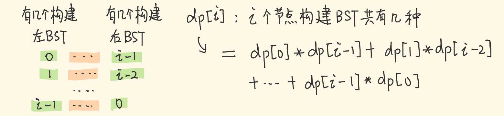

## 二叉搜索树（BST）

### [95. 不同的二叉搜索树 II](https://leetcode-cn.com/problems/unique-binary-search-trees-ii/)

#### 递归

```java
class Solution {
    public List<TreeNode> generateTrees(int n) {
        if(n < 1) {
            return new ArrayList<TreeNode>();
        }
        return generateTrees(1, n);
    }

    public List<TreeNode> generateTrees(int start, int end) {
        List<TreeNode> list = new ArrayList();
        if(start > end) {
            list.add(null);
            return list;
        }
        for(int i = start; i <= end; i++) {
            List<TreeNode> left = generateTrees(start, i - 1);
            List<TreeNode> right = generateTrees(i +1, end);

            for(TreeNode l : left) {
                for(TreeNode r : right) {
                    TreeNode root = new TreeNode(i);
                    root.left = l;
                    root.right = r;
                    list.add(root);
                }
            }
        }
        return list;
    }
}
```

##### 思路

1. 用辅助函数，添加start、end变量，去构造左右子树
2. 用`for(int i = start; i <= end; i++)` ，去循环构造根节点。
3. 拿到下层所有的`left`和`right`，用二次循环逐个构造二叉搜索树。

### [96. 不同的二叉搜索树](https://leetcode-cn.com/problems/unique-binary-search-trees/)

#### 动态规划

```java
class Solution {
    public int numTrees(int n) {
        int[] dp = new int[n + 1];
        dp[0] = 1;
        dp[1] = 1;
        for(int i = 2; i <= n; i++) {
            for(int j = 1; j <= i; j++){
                dp[i] += dp[j-1]*dp[i-j];
            }
        }
        return dp[n];
    }
}
```

##### 思路

如下图所示，推导卡特兰数


>卡特兰数是[组合数学](https://baike.baidu.com/item/组合数学)中一个常出现于各种计数问题中的[数列](https://baike.baidu.com/item/数列)。以中国蒙古族数学家[明安图](https://baike.baidu.com/item/明安图/24682)和[比利时](https://baike.baidu.com/item/比利时)的数学家[欧仁·查理·卡特兰](https://baike.baidu.com/item/欧仁·查理·卡特兰/16718709)的名字来命名，其前几项为（从第0项开始）：1, 1, 2, 5, 14, 42, 132, 429, 1430, 4862, 16796, 58786, 208012, 742900, 2674440, 9694845, 35357670, 129644790, 477638700, 1767263190, 6564120420, 24466267020, 91482563640, 343059613650, 1289904147324, 4861946401452, ...

如下图构造**重复子问题**


n=3的时候，分别计算根节点为1,2,3的个数，  每个作为根节点的个数，为左右子树乘积。

**转移方程**如下图



#### 数学法

```java
class Solution {
    public int numTrees(int n) {
        long C = 1;
        for(int i = 1; i < n; i++) {
            C = (2 *(2 * i + 1) * C) / (i + 2);
        }
        return (int)C;
    }
}
```

直接使用解法一卡特兰数的通项公式


### [98. 验证二叉搜索树](https://leetcode-cn.com/problems/validate-binary-search-tree/)

```java
class Solution {
    long pre = Long.MIN_VALUE;
    public boolean isValidBST(TreeNode root) {
        return dfs(root);
    }
    public boolean dfs(TreeNode root) {
        if(root == null) return true;
        if(!dfs(root.left)){
            return false;
        }
        if(root.val <= pre) {
            return false;
        }
        pre = root.val;
        return dfs(root.right);
    }
}
```

##### 思路

1. 维护一个全局变量，记录中序遍历上一个节点的值。
2. 利用二叉搜索树的特性，中序遍历按序增大。
3. 比Integer.MIN_VALUE更小的可以用Long.MIN_VALUE。
4. 中序可以在中间增加判断

```java
if(!dfs(root.left)){
    return false;
}
```

### [99. 恢复二叉搜索树](https://leetcode-cn.com/problems/recover-binary-search-tree/)

```java
class Solution {
    TreeNode pre = new TreeNode(Integer.MIN_VALUE);
    TreeNode start = null, end = null;
    public void recoverTree(TreeNode root) {
        dfs(root);
        int tmp = start.val;
        start.val = end.val;
        end.val = tmp;
    }

    public void dfs(TreeNode root) {
        if(root == null) {
            return;
        }
        dfs(root.left);
        if(root.val < pre.val){
            start = start == null ? pre : start;
            end = root;
        }
        pre = root;
        dfs(root.right);
    }
}
```

##### 思路

1. 看到二叉搜索树，无脑中序遍历

2. 关键在于找到乱序后如何处理，以下两种情况

   1. 情况1：刚好相邻，则第一次找到顺序有误的，将两个节点位置用start、end存储起来。
   2. 情况2：不相邻，则start为第一次逆序的前一个节点，end为第二次逆序的后一个节点。

   

3. 最后将节点值进行交换

> 注：当前解法由于使用了递归，没法实现O(1)的空间复杂度，所以需要用 莫里斯遍历，解法暂时跳过。

### [108. 将有序数组转换为二叉搜索树](https://leetcode-cn.com/problems/convert-sorted-array-to-binary-search-tree/)

```java
class Solution {
    public TreeNode sortedArrayToBST(int[] nums) {
        return sorted(nums, 0, nums.length - 1);
    }

    public TreeNode sorted(int[] nums, int l, int r){
        if(l > r) {
            return null;
        }
        int mid = l + (r - l) / 2;
        TreeNode root = new TreeNode(nums[mid]);
        root.left = sorted(nums, l, mid - 1);
        root.right = sorted(nums, mid + 1, r);
        return root;
    }
}
```

##### 思路

1. 二分法构造树节点，能保证平衡
2. root.left，root.right 接收下层return 的root。

### [109. 有序链表转换二叉搜索树](https://leetcode-cn.com/problems/convert-sorted-list-to-binary-search-tree/)

#### 普通递归

```java
class Solution {
    public TreeNode sortedListToBST(ListNode head) {
        List<Integer> list = new ArrayList();
        while(head != null) {
            list.add(head.val);
            head = head.next;
        }
        int[] nums = list.stream().mapToInt(Integer :: valueOf).toArray();
        return sortedArray(nums, 0, nums.length - 1);
    }

    public TreeNode sortedArray(int[] nums, int l , int r) {
        if(l > r) return null;
        int mid = l + (r - l) / 2;
        TreeNode root = new TreeNode(nums[mid]);
        root.left = sortedArray(nums, l , mid - 1);
        root.right = sortedArray(nums, mid + 1, r);
        return root;
    }
}
```

暴力解法，效率低。

##### 思路

1. 链表转数组，再采用108题的解法。

#### 快慢指针

```java
class Solution {
    public TreeNode sortedListToBST(ListNode head) {
        if(head == null ) return null;
        if(head.next == null) return new TreeNode(head.val);
        ListNode pre = null, slow = head, fast = head;
        while(fast != null && fast.next != null) {
            pre = slow;
            slow = slow.next;
            fast = fast.next.next;
        }
        TreeNode root = new TreeNode(slow.val);
        pre.next = null;
        root.left = sortedListToBST(head);
        root.right = sortedListToBST(slow.next);
        return root;
    }
}
```

##### 思路

1. 快慢指针找中点，然后用108题思路解


#### 中序遍历

```java
class Solution {
    ListNode node = null;
    public TreeNode sortedListToBST(ListNode head) {
        int n = 0;
        node = head;
        while(head != null) {
            n++;
            head = head.next;
        }
        return ListToBST(0, n - 1);
    }

    public TreeNode ListToBST(int left, int right) {
        if(left > right) return null;
        int mid = left + (right - left) / 2;
        TreeNode left_child = ListToBST(left, mid - 1);
        TreeNode father = new TreeNode(node.val);
        node = node.next;
        father.left = left_child;
        father.right = ListToBST(mid + 1, right);
        return father;
    }
}
```

##### 思路

1. 模拟中序遍历过程，下一层的返回值作为上一层的左子树。
2. 链表从头到尾推进
3. 先计算出链表总长度，后面计算mid用于二分，构建平衡二叉树

### [230. 二叉搜索树中第K小的元素](https://leetcode-cn.com/problems/kth-smallest-element-in-a-bst/)

```java
class Solution {
    int ans = 0;
    int cnt;
    public int kthSmallest(TreeNode root, int k) {
        cnt = k;
        dfs(root);
        return ans;
    }

    public void dfs(TreeNode root) {
        if(root == null || cnt == 0) return ;
        dfs(root.left);
        cnt--;
        if(cnt == 0){
            ans = root.val;
        }
        dfs(root.right);
    }
}
```

##### 思路

1. 建立全局cnt、ans，分别暂存还有cnt个节点、第k小的值。
2. 中序遍历、cnt==0得到第k小的值，最后进行剪枝。

### [235. 二叉搜索树的最近公共祖先](https://leetcode-cn.com/problems/lowest-common-ancestor-of-a-binary-search-tree/)

```java
class Solution {
    public TreeNode lowestCommonAncestor(TreeNode root, TreeNode p, TreeNode q) {
        if(root == null) return root;
        if(root == p || root == q) return root;
        TreeNode left =lowestCommonAncestor(root.left, p, q);
        TreeNode right =lowestCommonAncestor(root.right, p, q);
        if(left == null) {
            return right;
        }
        if(right == null) {
            return left;
        }
        return root;
    }
}
```

##### 思路

1. 找到p或者q用新建的left、right节点暂存。
2. 如果当前层级的left不存在，则将right往上传，反之传right
3. 只有当左右子树都存在值，即left、right节点不为null   则当前节点为公共节点。

#### 利用BST性质

```java
class Solution {
    public TreeNode lowestCommonAncestor(TreeNode root, TreeNode p, TreeNode q) {
        if(root.val < p.val && root.val < q.val) {
            return lowestCommonAncestor(root.right, p, q);
        }
        if(root.val > p.val && root.val > q.val) {
            return lowestCommonAncestor(root.left, p, q);
        }
        return root;
    }
}
```

##### 思路

1. 从上到下开始搜索，如果第一个出现值分在p.val和q.val两边的节点，则为最终的公共祖先。

### [236. 二叉树的最近公共祖先](https://leetcode-cn.com/problems/lowest-common-ancestor-of-a-binary-tree/)

```java
class Solution {
    public TreeNode lowestCommonAncestor(TreeNode root, TreeNode p, TreeNode q) {
        if(root == null) return root;
        if(root == p || root == q) return root;
        TreeNode left =lowestCommonAncestor(root.left, p, q);
        TreeNode right =lowestCommonAncestor(root.right, p, q);
        if(left == null) {
            return right;
        }
        if(right == null) {
            return left;
        }
        return root;
    }
}
```

##### 思路

同235解法1

### [530. 二叉搜索树的最小绝对差](https://leetcode-cn.com/problems/minimum-absolute-difference-in-bst/)

```java
class Solution {
    int pre = -10000, min = Integer.MAX_VALUE;
    public int getMinimumDifference(TreeNode root) {
        if(root == null ||root.left == null && root.right == null){
            return 0;
        }
        dfs(root);
        return min;
    }

    public void dfs(TreeNode root) {
        if(root == null) {
            return;
        }
        dfs(root.left);
        min = Math.min(min, root.val - pre);
        pre = root.val;
        dfs(root.right);
    }
}
```

##### 思路

1. 利用pre暂存上一节点值
2. 相邻两节点存在最小值，所以采用中序遍历。

### [501. 二叉搜索树中的众数](https://leetcode-cn.com/problems/find-mode-in-binary-search-tree/)

```java
class Solution {
    int pre = Integer.MAX_VALUE, cur = 0, max = 0;
    List<Integer> list = new ArrayList();
    public int[] findMode(TreeNode root) {
        Helper(root);
        return list.stream().mapToInt(Integer::valueOf).toArray();
    }

    public void Helper(TreeNode root) {
        if(root == null) {
            return ;
        }
        Helper(root.left);
        if(pre == root.val){
            cur++;
        } else {
            cur = 1;
            pre = root.val;
        }
        if(cur == max) {
            list.add(root.val);
        }
        if(cur > max) {
            list.clear();
            list.add(root.val);
            max = cur;
        }
        Helper(root.right);
    }
}
```

##### 思路

1. 分情况讨论
   1. 当前节点等于上一节点，cur++，否则cur=1，更新pre；
   2. cur数量等于max，添加root.val，超过max，则情况list，再添加root，更新max。

##### 扩展：list转int[]

```java
list.stream().mapToInt(Integer::valueOf).toArray();
```


### [538. 把二叉搜索树转换为累加树](https://leetcode-cn.com/problems/convert-bst-to-greater-tree/)

```java
class Solution {
    //右中左
    int pre = 0;
    public TreeNode convertBST(TreeNode root) {
        dfs(root);
        return root;
    }

    public void dfs(TreeNode root) {
        if(root == null) return;
        dfs(root.right);
        root.val = root.val + pre;
        pre = root.val;
        dfs(root.left);
    }
}
```

##### 思路

1. 首先确定递归思路，是采用右中左。
2. 用pre暂存上一节点值，用于累加

### [653. 两数之和 IV - 输入 BST](https://leetcode-cn.com/problems/two-sum-iv-input-is-a-bst/)

```java
class Solution {
    Set<Integer> set = new HashSet();
    boolean flag = false;
    public boolean findTarget(TreeNode root, int k) {
        dfs(root, k);
        return flag;
    }

    public void dfs(TreeNode root, int k) {
        if(root == null) return ;
        dfs(root.left, k);
        if(flag) return;
        if(set.contains(k - root.val)){
            flag = true;
            return;
        }
        set.add(root.val);
        dfs(root.right, k);
    }
}
```

##### 思路

1. 用flag暂存结果，用set哈希表，来检查两数之和。

### [669. 修剪二叉搜索树](https://leetcode-cn.com/problems/trim-a-binary-search-tree/)

```java
class Solution {
    public TreeNode trimBST(TreeNode root, int low, int high) {
        if(root == null) return root;
        if(root.val < low) {
            return trimBST(root.right, low, high);
        }
        if(root.val > high) {
            return trimBST(root.left, low, high);
        }
        root.left = trimBST(root.left, low, high);
        root.right = trimBST(root.right, low, high);
        return root;
    }
}
```

##### 思路


1. 把节点0的右子树中节点2返回给上层。

```java
if(root.val < low) {
    return trimBST(root.right, low, high);
}
```

2. 上层用节点3将和返回给上层的节点2连接

```java
root.left = trimBST(root.left, low, high);
```

## 写树算法的套路框架

###  BST 的遍历框架

```java
void BST(TreeNode root, int target) {
    if (root.val == target)
        // 找到目标，做点什么
    if (root.val < target) 
        BST(root.right, target);
    if (root.val > target)
        BST(root.left, target);
```

### [450. 删除二叉搜索树中的节点](https://leetcode-cn.com/problems/delete-node-in-a-bst/)

```java
class Solution {
    public TreeNode deleteNode(TreeNode root, int key) {
        if(root == null) return root;
        if(root.val == key) {
            //情况1 情况2
            if(root.left == null) {
                return root.right;
            }
            if(root.right == null) {
                return root.left;
            }
            //情况3
            int minValue = getMin(root.right);
            root.val = minValue;
            root.right = deleteNode(root.right, minValue);
        }
        if(root.val > key) {
            root.left = deleteNode(root.left, key);
        }
        if(root.val < key) {
            root.right = deleteNode(root.right, key);
        }
        return root;
    }

    public int getMin (TreeNode root) {
        while(root.left != null) {
            root = root.left;
        }
        return root.val;
    }
}
```

##### 思路

删除节点分三种情况

1. 左右子树均为空，直接删除
2. 其中一个子树非空，接替节点位置


3. 均非空

```java
if (root.left != null && root.right != null) {
    // 找到右子树的最小节点
    TreeNode minNode = getMin(root.right);
    // 把 root 改成 minNode
    root.val = minNode.val;
    // 转而去删除 minNode
    root.right = deleteNode(root.right, minNode.val);
}
```


#### 不修改节点值做法

```java
class Solution {
    public TreeNode deleteNode(TreeNode root, int key) {
        if(root == null) return root;
        if(root.val == key) {
            //情况1 情况2
            if(root.left == null) {
                return root.right;
            }
            if(root.right == null) {
                return root.left;
            }
            //情况3
            TreeNode node = root.right;
            while(node.left != null) {
                node = node.left;
            }
            node.left = root.left;
            root = root.right;
        }
        if(root.val > key) {
            root.left = deleteNode(root.left, key);
        }
        if(root.val < key) {
            root.right = deleteNode(root.right, key);
        }
        return root;
    }
}
```

##### 思路

第三种情况如下图所示


### [700. 二叉搜索树中的搜索](https://leetcode-cn.com/problems/search-in-a-binary-search-tree/)

```java
class Solution {
    TreeNode node = null;
    public TreeNode searchBST(TreeNode root, int val) {
        dfs(root, val);
        return node;
    }
    
    public void dfs(TreeNode root, int val) {
        if(node != null ||root == null) return ;
        if(root.val == val) {
            node = root;
        }
        dfs(root.left, val);
        dfs(root.right, val);
    }
}
```

##### 思路

1. 用node暂存找到的根节点，顺便实现剪枝操作。
2. 中序遍历。

#### 利用二叉搜索树性质

```java
class Solution {
    public TreeNode searchBST(TreeNode root, int val) {
        if(root == null || root.val == val ){
            return root;
        }
        if(root.val < val) {
            return searchBST(root.right, val);
        } else { 
            return searchBST(root.left, val);
        }
    }
}
```

##### 思路

1. 从顶向下进行二分，符合条件的往下搜索，不符合的跳过。
2. 找到val或者不存在节点执行return，将节点送回递归顶层。

### [701. 二叉搜索树中的插入操作](https://leetcode-cn.com/problems/insert-into-a-binary-search-tree/)

```java
class Solution {
    public TreeNode insertIntoBST(TreeNode root, int val) {
        if(root == null) return new TreeNode(val);
        if(root.val < val) {
            root.right =  insertIntoBST(root.right, val);
        }
        if(root.val > val) {
            root.left = insertIntoBST(root.left, val);
        }
        return root;
    }
}
```

##### 思路

1. 利用二叉搜索树的特性，大于往左边找，小于往右边找，直到找到空节点，就可以插入。

### [1038. 把二叉搜索树转换为累加树](https://leetcode-cn.com/problems/binary-search-tree-to-greater-sum-tree/)

```java
class Solution {
    int pre = 0;
    public TreeNode bstToGst(TreeNode root) {
        dfs(root);
        return root;
    }

    public void dfs(TreeNode root) {
        if(root == null) return;
        dfs(root.right);
        root.val += pre;
        pre = root.val;
        dfs(root.left);
    }
}
```

##### 思路

右中左，逆中序累加根节点值，没啥好讲的

## Trie（前缀树）


Trie，又称前缀树或字典树，用于判断字符串是否存在或者是否具有某种字符串前缀。

### [208. 实现 Trie (前缀树)](https://leetcode-cn.com/problems/implement-trie-prefix-tree/)

```java
class Trie {

    private class TrieNode{
        private boolean isEnd;
        private TrieNode[] next;

        public TrieNode() {
            isEnd = false;
            next = new TrieNode[26];
        } 
    }

    private TrieNode root;
    public Trie() {
        root = new TrieNode();
    }
    
    public void insert(String word) {
        TrieNode cur = root;
        for(int i = 0; i < word.length(); i++){
            char c = word.charAt(i);
            if(cur.next[c - 'a'] == null) {
                cur.next[c - 'a'] = new TrieNode();
            }
            cur = cur.next[c - 'a'];
        }
        cur.isEnd = true;
    }
    
    public boolean search(String word) {
        TrieNode cur = root;
        for(int i = 0; i < word.length(); i++){
            char c = word.charAt(i);   
            if(cur.next[c - 'a'] == null) {
                return false;
            }
            cur = cur.next[c - 'a'];
        }
        return cur.isEnd;
    }
    
    public boolean startsWith(String prefix) {
        TrieNode cur = root;
        for(int i = 0; i < prefix.length(); i++){
            char c = prefix.charAt(i);   
            if(cur.next[c - 'a'] == null) {
                return false;
            }
            cur = cur.next[c - 'a'];
        }
        return true;
    }
}
```

##### 思路

1. 首先构造一个TrieNode，这里的结构用一个isEnd判断是否为最后一个节点。next数组，存储26个字母

```java
    private class TrieNode{
        private boolean isEnd;
        private TrieNode[] next;

        public TrieNode() {
            isEnd = false;
            next = new TrieNode[26];
        } 
    }
```

2. 插入：当创建的next中不存在当前字符的TrieNode，则在创建一个。到最后一个节点，设置isEnd=true

```java
if(cur.next[c - 'a'] == null) {
    cur.next[c - 'a'] = new TrieNode();
}
```

3. 查找：在查找路径上缺少某个节点，则返回false；

```java
if(cur.next[c - 'a'] == null) {
    return false;
}
```

当所有节点都找到，则验证最后一个节点是否isEnd

```java
return cur.isEnd;
```

4. 前缀查找：在查找的基础上，最后直接return即可。

### [677. 键值映射](https://leetcode-cn.com/problems/map-sum-pairs/)

```java
class MapSum {
    private class TrieNode {
        private int val;
        private TrieNode[] next;

        public TrieNode() {
            val = 0;
            next = new TrieNode[26];
        }
    }

    private TrieNode root;
    public MapSum() {
        root = new TrieNode();
    }
    
    public void insert(String key, int val) {
        TrieNode cur = root;
        for(int i = 0; i < key.length(); i++) {
            char c = key.charAt(i);
            if(cur.next[c - 'a'] == null) {
                cur.next[c - 'a'] = new TrieNode();
            }
            cur = cur.next[c - 'a'];
        }
        cur.val = val;
    }
    
    public int sum(String prefix) {
        TrieNode cur = root;
        for(int i = 0; i < prefix.length(); i++) {
            char c = prefix.charAt(i);
            if(cur.next[c - 'a'] == null) {
                return 0;
            }
            cur = cur.next[c - 'a'];
        }
        return dfs(cur);
    }

    public int dfs(TrieNode root) {
        if(root == null) return 0;
        int ans = 0;
        for(int i = 0; i < 26; i++) {
            if(root.next[i] != null) {
                ans += dfs(root.next[i]);
            }
        }
        return root.val + ans;
    }
}
```

##### 思路

1. 将查找前缀树的isEnd替换成val，在最后一个节点记录key值对应的val。
2. 计算sum，找到最后一个节点cur，将该cur下所有节点进行递归的val总和，为最终答案。否则返回0。

