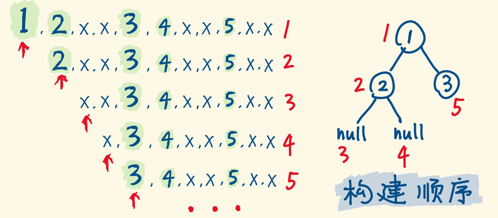

## 构建树

### [105. 从前序与中序遍历序列构造二叉树](https://leetcode-cn.com/problems/construct-binary-tree-from-preorder-and-inorder-traversal/)

```java
class Solution {
    Map<Integer, Integer> map = new HashMap<>();
    public TreeNode buildTree(int[] preorder, int[] inorder) {
        for(int i = 0; i < inorder.length; i++) {
            map.put(inorder[i], i);
        }
        return Helper(preorder, 0, 0, inorder.length - 1);
    }

    public TreeNode Helper(int[] preorder, int cur, int left, int right) {
        if(left > right) {
            return null;
        }

        TreeNode root = new TreeNode(preorder[cur]);
        int mid = map.get(preorder[cur]);
        root.left = Helper(preorder, cur + 1, left, mid - 1);
        root.right = Helper(preorder, cur + mid - left + 1, mid + 1, right);
        return root;
    }
}
```

##### 思路

1. 把inorder用map作为媒介，存储起来，中序的特点在于，找到根，则左边为左子树，右边为右子树。
2. 利用前序建立root过程中左右子树。
   1. 左子树：cur为当前节点的下一个节点，起点不变为left，终点为利用中序找到的根位置 - 1。
   2. 右子树，中序找到根位置mid，再-left位置，为左子树的长度范围，cur为上一节点根节点，+1为跳过当前根节点。   所以是cur + (mid-left) + 1

### [106. 从中序与后序遍历序列构造二叉树](https://leetcode-cn.com/problems/construct-binary-tree-from-inorder-and-postorder-traversal/)

```java
class Solution {
    Map<Integer, Integer> map = new HashMap<>();
    public TreeNode buildTree(int[] inorder, int[] postorder) {
        for(int i = 0; i < inorder.length; i++) {
            map.put(inorder[i], i);
        }
        return buildTree(postorder, postorder.length - 1, 0, postorder.length - 1);
    }

    public TreeNode buildTree(int[] postorder, int cur, int left, int right) {
        if(left > right) {
            return null;
        }

        TreeNode root = new TreeNode(postorder[cur]);
        int mid = map.get(postorder[cur]);
        root.left = buildTree(postorder, cur - (right - mid + 1) , left, mid - 1);
        root.right = buildTree(postorder, cur - 1, mid + 1, right);
        return root;
    }
}
```

思路

1. 用map暂存inorder，用来找到根节点位置，计算右子树长度。

2. 树的还原过程如图

   

3. `cur - (right - mid + 1) `可以理解为根节点位置(cur)-右子树长度-1（cur根位置占长度1），则为左子树的根节点位置。

### [654. 最大二叉树](https://leetcode-cn.com/problems/maximum-binary-tree/)

```java
class Solution {
    public TreeNode constructMaximumBinaryTree(int[] nums) {
        return constructMaximumBinaryTree(nums, 0, nums.length - 1);
    }

    public TreeNode constructMaximumBinaryTree(int[] nums, int left, int right) {
        if(left > right) {
            return null;
        }
        int mid = getMax(nums, left, right);
        TreeNode root = new TreeNode(nums[mid]);
        root.left = constructMaximumBinaryTree(nums, left, mid - 1);
        root.right = constructMaximumBinaryTree(nums, mid + 1, right);
        return root;
    }

    public int getMax(int[] nums, int left, int right) {
        //注意max的取值，保险起见用最小值
        int max = Integer.MIN_VALUE, inx = 0;
        for(int i = left; i <= right; i++) {
            if(nums[i] > max) {
                max = nums[i];
                inx = i;
            }
        }
        return inx;
    }
}
```

##### 思路

按照题目描述用前序遍历处理即可

1. 辅助函数增加变量left、right
2. mid为当前left、right中最大值的索引位置，用getMax函数实现，作为root的值
3. 递归构建左右子树

## 序列化

### [297. 二叉树的序列化与反序列化](https://leetcode-cn.com/problems/serialize-and-deserialize-binary-tree/)

```java
public class Codec {

    // Encodes a tree to a single string.
    public String serialize(TreeNode root) {
        if (root == null) {
            return "#";
        }

        return root.val + "," + serialize(root.left) + "," + serialize(root.right);
    }

    // Decodes your encoded data to tree.
    public TreeNode deserialize(String data) {
        Queue<String> queue = new LinkedList(Arrays.asList(data.split(",")));
        return dfs(queue);
    }

    public TreeNode dfs(Queue<String> queue) {
        String s = queue.poll();
        if (s.equals("#")) {
            return null;
        }
        TreeNode root = new TreeNode(Integer.parseInt(s));
        root.left = dfs(queue);
        root.right = dfs(queue);
        return root;
    }
}
```

##### 思路

1. 正常先序序列化
2. 解序列化的时候，首先用Arrays.asList(data.split(","))传递给队列，调用递归，每层弹出列首
3. 按照先序生成二叉树



### [652. 寻找重复的子树](https://leetcode-cn.com/problems/find-duplicate-subtrees/)

```java
class Solution {
    Map<String, Integer> map;
    List<TreeNode> list;
    public List<TreeNode> findDuplicateSubtrees(TreeNode root) {
        map = new HashMap<>();
        list = new ArrayList();
        collect(root);
        return list;
    }

    public String collect(TreeNode root) {
        if(root == null) return "#";
        String str = root.val + "," + collect(root.left) + "," + collect(root.right);
        map.put(str, map.getOrDefault(str, 0) + 1);
        if(map.get(str) == 2) {
            list.add(root);
        }
        return str;
    }
}
```

##### 思路

1. 将二叉树转换成一个可以用map进行识别的形式，也就是字符串，通过字符串来验重
2. 只有当数量为2的时候才会加入到链表，对答案去重。

