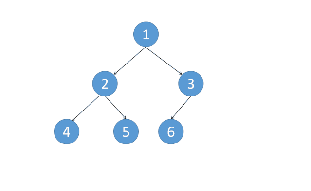

# 树专题

## 表格

| 题目                  | 已完成 | 难度 | 好题 | 错题 | 备注                   |
| --------------------- | ------ | ---- | ---- | ---- | ---------------------- |
| 94. 二叉树的中序遍历  | √      | esay | √    |      | 栈、莫里斯遍历可以重做 |
| 100. 相同的树         | √      | easy |      |      |                        |
| 101. 对称二叉树       | √      | easy |      |      |                        |
| 110. 平衡二叉树       | √      | easy |      |      | 阻断可以看下           |
| 111. 二叉树的最小深度 | √      | esay |      |      |                        |
| 112. 路径总和         | √      | easy |      |      | 代码优化               |
| 226. 翻转二叉树       | √      | esay |      |      |                        |
| 404. 左叶子之和       | √      | easy |      |      | 代码优化               |
| 437. 路径总和 III     | √      | mid  | √    |      | 前缀和没写出来         |
| 543. 二叉树的直径     | √      | esay |      |      |                        |
| 572. 另一棵树的子树   | √      | esay |      |      |                        |
| 617. 合并二叉树       | √      | easy |      |      |                        |
|                       |        |      |      |      |                        |
|                       |        |      |      |      |                        |
|                       |        |      |      |      |                        |


## 递归

### [100. 相同的树（easy）](https://leetcode-cn.com/problems/same-tree/)

#### 递归

```java
class Solution {
    public boolean isSameTree(TreeNode p, TreeNode q) {
        if(p == null && q == null) return true;
        if(p == null || q == null) return false;
        return p.val == q.val && isSameTree(p.left, q.left) && isSameTree(p.right, q.right);
    }
}
```

##### 思路

1. 先写return语句，要保证当前节点相同&&左子树相同&&右子树相同
2. 写终结条件：分都为空、其中一棵树为空2中情况

##### Go版本

```go
func isSameTree(p *TreeNode, q *TreeNode) bool {
    if p  == nil && q == nil {
        return true
    }
    if p == nil || q == nil {
        return false
    }
    return p.Val == q.Val &&isSameTree(p.Left, q.Left) && isSameTree(p.Right,q.Right)
}
```

### [101. 对称二叉树（easy）](https://leetcode-cn.com/problems/symmetric-tree/)

```java
class Solution {
    public boolean isSymmetric(TreeNode root) {
        return isTrue(root, root);
    }
    public boolean isTrue(TreeNode r1, TreeNode r2){
        if(r1 == null && r2 == null) return true;
        if(r1 == null || r2 == null) return false;
        return r1.val == r2.val && isTrue(r1.left, r2.right) && isTrue(r1.right, r2.left);
    }
}
```

##### 思路

模拟生成2个root，思路类似100.相同的树，递归时r1左子树对应r2右子树

### [104. 二叉树的最大深度（easy）](https://leetcode-cn.com/problems/maximum-depth-of-binary-tree/)

```java
class Solution {
    public int maxDepth(TreeNode root) {
        if(root == null) return 0;
        int left = maxDepth(root.left);
        int right = maxDepth(root.right);
        return Math.max(left, right) + 1;
    }
}
```

1. 先到达底层，每回到上一层，深度+1。
2. left、right存储上一层的左右子树深度。

### [110. 平衡二叉树（easy）](https://leetcode-cn.com/problems/balanced-binary-tree/)

#### 单哨兵

```java
class Solution {
    boolean flag = true;
    public boolean isBalanced(TreeNode root) {
        dfs(root);
        return flag;
    }

    public int dfs(TreeNode root) {
        if(root == null ){
            return 0;
        }
        if(!flag) return -1;
        int left = dfs(root.left);
        int right = dfs(root.right);
        if(flag && Math.abs(left - right) > 1) {
            flag =false;
        }
        return Math.max(left, right) + 1;
    }
}
```

思路

1. 用flag暂存是否出现不平衡的状态。
2. 用dfs函数实现一个最大深度计算，中间检验不平衡状态。
3. 存在不平衡，提前阻断，提高效率。

#### 双哨兵

```java
class Solution {
    public boolean isBalanced(TreeNode root) {
        return recur(root) != -1;
    }
    
    public int recur(TreeNode root) {
        if(root == null) return 0;
        int left = recur(root.left);
        if(left == -1) return -1;
        int right = recur(root.right);
        if(right == -1) return -1;
        return Math.abs(left - right) > 1 ? -1 : Math.max(left, right) +1;
    }
}
```

### [111. 二叉树的最小深度（esay）](https://leetcode-cn.com/problems/minimum-depth-of-binary-tree/)

#### 路径和

```java
class Solution {
    int min = Integer.MAX_VALUE;
    public int minDepth(TreeNode root) {
        if(root == null) return 0;
        dfs(root, 0);
        return min;
    }

    public void dfs(TreeNode root, int cur) {
        if(root == null) return ;
        cur++;
        if(root.left == null && root.right == null) {
            min = Math.min(cur, min);
        }
        dfs(root.left, cur);
        dfs(root.right, cur);
        cur--;
    }
}
```

##### 思路

1. 起始跟路径和的思路一样，只是这道题每次路径+1

#### 代码优化

```java
class Solution {
    public int minDepth(TreeNode root) {
        if(root == null) return 0;
        if(root.left == null && root.right == null) return 1;
        int m1 = minDepth(root.left);
        int m2 = minDepth(root.right);
        if(root.left == null || root.right == null) return m1 + m2 + 1;
        return Math.min(m1, m2) + 1;
    }
}
```

##### 思路

1. 四种情况
   1. 根为空，返回0
   2. 左右子树为空，则回到上层应返回1
   3. 左子树或右子树为空，其中有一个是0，则直接可以用m1+m2+1
   4. 都不为空，则用Math.min取较小深度。

### [112. 路径总和（easy）](https://leetcode-cn.com/problems/path-sum/)

#### 单哨兵

```java
class Solution {
    boolean flag;
    public boolean hasPathSum(TreeNode root, int targetSum) {
        flag = false;
        recur(root, targetSum);
        return flag;
    }

    public void recur(TreeNode root, int targetSum) {
        if(root == null) {
            return;
        }
        if(flag) return;
        targetSum -= root.val;
        if(!flag && root.left == null && root.right == null && targetSum == 0) {
            flag = true;
        }
        recur(root.left, targetSum);
        recur(root.right, targetSum);
        targetSum += root.val;
    }
}
```

##### 思路

1. 单哨兵flag，暂存是否符合条件的状态。
2. 每个节点，都将targetSum-cur值
3. 左右节点为空，targetSum=0，则符合路径总和。
4. 最后回溯变更的targetSum值
5. 若flag=true阻断剩下无用操作。

#### 深搜

```java
class Solution {
    public boolean hasPathSum(TreeNode root, int targetSum) {
        if(root == null) return false;

        if(root.left == null && root.right == null) {
            return targetSum == root.val;
        }
        
        return hasPathSum(root.left, targetSum - root.val) || hasPathSum(root.right, targetSum - root.val);
    }
}
```

##### 思路

1. 将targetSum-root.val 并同时处理左右子树
2. 左右子树为空，验证root.val是否等于剩下的targetSum

### [226. 翻转二叉树（esay）](https://leetcode-cn.com/problems/invert-binary-tree/)

```java
class Solution {
    public TreeNode invertTree(TreeNode root) {
        if(root == null) return root;
        TreeNode tmp = root.left;
        root.left = root.right;
        root.right = tmp;
        invertTree(root.left);
        invertTree(root.right);
        return root;
    }
}
```

#### 思路

1. 交换左右子树
2. 前序遍历
3. return root，最终会回到根节点。

### [404. 左叶子之和（easy）](https://leetcode-cn.com/problems/sum-of-left-leaves/)

#### 递归

```java
class Solution {
    int res = 0;
    public int sumOfLeftLeaves(TreeNode root) {
        dfs(root);
        return res;
    }

    public void dfs(TreeNode root) {
        if(root == null) {
            return;
        }
        //root.left.right写成root.right.right   调试了好久
        if(root.left != null && root.left.left == null && root.left.right == null) {
            res += root.left.val;
        } 
        dfs(root.left);
        dfs(root.right);
    }
}
```

##### 思路

核心代码如下：

```java
if(root.left != null && root.left.left == null && root.left.right == null) {
    res += root.left.val;
} 
```

根据题目左叶子的定义，围绕核心代码写即可。

#### 代码优化

```java
class Solution {
    public int sumOfLeftLeaves(TreeNode root) {
        if(root == null) {
            return 0;
        }
        int res = 0;
        if(root.left != null && root.left.left == null && root.left.right == null) {
            res += root.left.val;
        } 
        res +=sumOfLeftLeaves(root.left);
        res +=sumOfLeftLeaves(root.right);
        return res;
    }
}
```

##### 思路

1. res计算符合左叶子条件的值，通过return返回给上一级。
2. res接受左右子树传回的res值

### [437. 路径总和 III（mid）](https://leetcode-cn.com/problems/path-sum-iii/)

#### 暴力求解

```java
class Solution {
    int cnt = 0;
    public int pathSum(TreeNode root, int targetSum) {
        if(root == null) return 0;
        recur(root, targetSum);
        pathSum(root.left, targetSum);
        pathSum(root.right, targetSum);
        return cnt;
    }

    public void recur(TreeNode root, int targetSum) {
        if(root == null) return;
        if(targetSum == root.val) {
            cnt++;
        }
        recur(root.left, targetSum -root.val);
        recur(root.right, targetSum - root.val);
    }
}
```

##### 思路

1. 根节点遍历求符合路径和
2. 左右子树各个节点进行遍历。

#### 前缀和

```java
class Solution {
    int res = 0;
    Map<Integer, Integer> map = new HashMap<>(); 
    public int pathSum(TreeNode root, int targetSum) {
        map.put(0 ,1);
        return recur(root, targetSum, 0);
    }

    public int recur(TreeNode root, int targetSum, int curSum) {
        if(root == null) return 0;
        //当前路径和
        curSum += root.val;
        //curSum - targetSum如果前缀和中存在，当前节点，到之前某个节点满足targetSum
        res = map.getOrDefault(curSum - targetSum , 0);
        //更新当前路径和
        map.put(curSum, map.getOrDefault(curSum, 0) + 1);
        //先序遍历，将结果来回上层
        res += recur(root.left, targetSum, curSum);
        res += recur(root.right, targetSum, curSum);
        //回溯
        map.put(curSum, map.get(curSum) - 1);
        return res;
    }
}
```

##### 思路

1. 前缀和用map存储状态
2. 计算当前前缀和，计算当前节点满足targetSum数量，map更新当前节点前缀和
3. res存储当前节点和左右子树满足targetSum的数量。

### [543. 二叉树的直径（easy）](https://leetcode-cn.com/problems/diameter-of-binary-tree/)

```java
class Solution {
    int max = 0;
    public int diameterOfBinaryTree(TreeNode root) {
        if(root == null) return 0;
        recur(root);
        return max;
    }

    public int recur(TreeNode root) {
        if(root == null) return 0;
        int left = recur(root.left);
        int right = recur(root.right);
        max = Math.max(max, left + right);
        return Math.max(left, right) + 1;
    }
}
```

#### 思路

1. left、right是左右子树最大深度
2. 用max暂存每个节点当前的左右子树最大路径长度。

### [572. 另一棵树的子树（esay）](https://leetcode-cn.com/problems/subtree-of-another-tree/)

```java
class Solution {
    public boolean isSubtree(TreeNode root, TreeNode subRoot) {
        if(root == null) return false; 
        return dfs(root, subRoot) || isSubtree(root.left, subRoot) || isSubtree(root.right, subRoot);
    }

    public boolean dfs(TreeNode r1, TreeNode r2) {
        if(r1 == null && r2 == null) return true;
        if(r1 == null || r2 == null) return false;
        return r1.val == r2.val && dfs(r1.left, r2.left) && dfs(r1.right, r2.right);
    }
}
```

##### 思路

1. 当前节点dfs，套路同100.相同的树
2. root的左右子树也重复步骤1

### [617. 合并二叉树（easy）](https://leetcode-cn.com/problems/merge-two-binary-trees/)

```java
class Solution {
    public TreeNode mergeTrees(TreeNode root1, TreeNode root2) {
        if(root1 == null && root2 == null) return null;
        if(root1 == null) return root2;
        if(root2 == null) return root1;
        root1.val += root2.val;
        root1.left = mergeTrees(root1.left, root2.left);
        root1.right = mergeTrees(root1.right, root2.right);
        return root1;
    }
}
```

#### 思路

1. 终止条件分三种情况，都为空，root1为空，root2为空。
2. 都不为空，累加到root1，并且左右节点将子树返回值填充到root1，最后返回root1。


## 遍历

### [94. 二叉树的中序遍历(Esay)](https://leetcode-cn.com/problems/binary-tree-inorder-traversal/)

#### 方案1：递归

```java
class Solution {
    List<Integer> list;
    public List<Integer> inorderTraversal(TreeNode root) {
        list = new ArrayList();
        inOrder(root);
        return list;
    }
    public void inOrder(TreeNode root) {
        if(root == null) return;
        inOrder(root.left);
        list.add(root.val);
        inOrder(root.right);
    }
}
```

##### 思路

1. 可以先将要返回的结果和中序遍历两个步骤拆开。`inorderTraversal`函数负责新建list、调用中序遍历、返回list。`inOrder`负责执行中序遍历，汇聚数据。
2. 中序遍历是进行左、中、右遍历的结构

##### Go版本

```go
func inorderTraversal(root *TreeNode)(res []int) { // 声明函数 函数名 (参数 类型) (返回值 类型)
    var inorder func(root *TreeNode)    // 声明变量 变量名 函数类型
    inorder = func(root *TreeNode){     // 初始化变量（函数）
        if root == nil {
            return
        } 
        inorder(root.Left)
        res = append(res, root.Val)
        inorder(root.Right)
    }
    inorder(root)                       //调用变量(函数)
    return								//[]int 为指针  可以直接返回，读取到res为正确答案
}
```

#### 方案2：栈（类型分配法）

```java
/**
 * Definition for a binary tree node.
 * public class TreeNode {
 *     int val;
 *     TreeNode left;
 *     TreeNode right;
 *     TreeNode() {}
 *     TreeNode(int val) { this.val = val; }
 *     TreeNode(int val, TreeNode left, TreeNode right) {
 *         this.val = val;
 *         this.left = left;
 *         this.right = right;
 *     }
 * }
 */
class Solution {
    public List<Integer> inorderTraversal(TreeNode root) {
        Deque<Object> stack = new LinkedList<>();
        List<Integer> list = new LinkedList<>();
        if(root == null) return list;
        stack.push(root);
        while(!stack.isEmpty()){
            Object pop = stack.pop();
            if(pop instanceof Integer){
                list.add((Integer)pop);
            } else {
                TreeNode node = (TreeNode) pop;
                if(node.right != null) {
                    stack.push(node.right);
                }
                stack.push(node.val);
                if(node.left != null) {
                    stack.push(node.left);
                }
            }
        }
        return list;
    }
}
```

##### 思路

**1.假设为    1 2 3 4 5的树结构，变化过程如下所示**


```java
s:r(1)
s:r(3) 1 r(2)
s:r(3) 1 r(5) 2 r(4) 
s:r(3) 1 r(5) 2 4
s:r(3) 1 r(5)    l:4 2
s:r(3)     l:4 2 5 1
l: 4 2 5 1 3
//其中s为stack，l为list，r(1)为val=1的root。
```

2.由于栈是先进先出，所以在插入栈的时候要采用后续遍历，即右、中、左

##### 扩展：Deque

允许两头都进，两头都出，这种队列叫双端队列（Double Ended Queue），简称Deque。


在Java中，我们用Deque可以实现Stack的功能：
①把元素压栈：`push(E)/addFirst(E)`；
②把栈顶的元素“弹出”：`pop(E)/removeFirst()`；
③取栈顶元素但不弹出：`peek(E)/peekFirst()`。

#### 方案3：栈（常规法）

```java
class Solution {
    public List<Integer> inorderTraversal(TreeNode root) {
        List<Integer> list = new ArrayList();
        Deque<TreeNode> stack = new LinkedList();
        while(!stack.isEmpty() || root != null){
            if(root != null) {
                while(root != null) {
                    stack.push(root);
                    root = root.left;
                }
            }
            else {
            TreeNode node = stack.pop();
            list.add(node.val);
            root = node.right;
            }
        }
        return list;
    }
}
```

##### 思路

按照栈先进先出的思路，

1. 左节点依次插入。
2. 到达最左，取出栈顶，插入到list。
3. 将root=当前节点的右节点，重复1 2步骤。

实际上就是先到达左边最底层，然后回到根，进行操作，再到达右子树，继续重复


#### 方案4：莫里斯遍历

```java
class Solution {
    public List<Integer> inorderTraversal(TreeNode root) {
        List<Integer> list = new ArrayList();
        TreeNode pre = null;
        while(root != null) {
            //左子树不为空
            if(root.left != null) {
                //达到左子树的最右边，连接根节点
                pre = root.left;
                while(pre.right != null) {
                    pre = pre.right;
                }
                pre.right = root;
                //断开根节点和左子树连接
                TreeNode tmp = root;
                root = root.left;
                tmp.left = null;
            //若左子树为空，则加入该节点，进入下一个节点，重复上面操作。
            } else {
                list.add(root.val);
                root = root.right;
            }
        }
        return list;
    }
}
```

##### 思路

1. 不需要用到辅助空间
2. 将二叉树转变成链表



## 二叉搜索树（BST）（待补充）

[二叉搜索树套路](https://leetcode-cn.com/problems/same-tree/solution/xie-shu-suan-fa-de-tao-lu-kuang-jia-by-wei-lai-bu-/)

#### [108. 将有序数组转换为二叉搜索树（esay）](https://leetcode-cn.com/problems/convert-sorted-array-to-binary-search-tree/)

