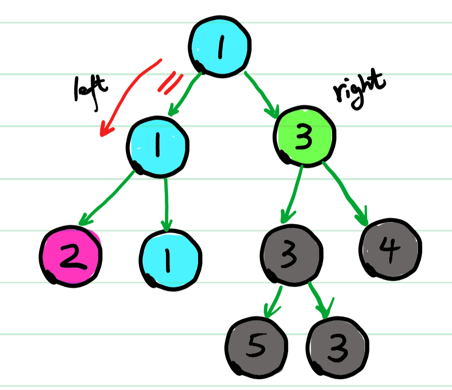

# 递归&前中后层遍历

## 递归

### [100. 相同的树（easy）](https://leetcode-cn.com/problems/same-tree/)

#### 递归

```java
class Solution {
    public boolean isSameTree(TreeNode p, TreeNode q) {
        if(p == null && q == null) return true;
        if(p == null || q == null) return false;
        return p.val == q.val && isSameTree(p.left, q.left) && isSameTree(p.right, q.right);
    }
}
```

##### 思路

1. 先写return语句，要保证当前节点相同&&左子树相同&&右子树相同
2. 写终结条件：分都为空、其中一棵树为空2中情况

##### Go版本

```go
func isSameTree(p *TreeNode, q *TreeNode) bool {
    if p  == nil && q == nil {
        return true
    }
    if p == nil || q == nil {
        return false
    }
    return p.Val == q.Val &&isSameTree(p.Left, q.Left) && isSameTree(p.Right,q.Right)
}
```

### [101. 对称二叉树（easy）](https://leetcode-cn.com/problems/symmetric-tree/)

```java
class Solution {
    public boolean isSymmetric(TreeNode root) {
        return isTrue(root, root);
    }
    public boolean isTrue(TreeNode r1, TreeNode r2){
        if(r1 == null && r2 == null) return true;
        if(r1 == null || r2 == null) return false;
        return r1.val == r2.val && isTrue(r1.left, r2.right) && isTrue(r1.right, r2.left);
    }
}
```

##### 思路

模拟生成2个root，思路类似100.相同的树，递归时r1左子树对应r2右子树

### [104. 二叉树的最大深度（easy）](https://leetcode-cn.com/problems/maximum-depth-of-binary-tree/)

```java
class Solution {
    public int maxDepth(TreeNode root) {
        if(root == null) return 0;
        int left = maxDepth(root.left);
        int right = maxDepth(root.right);
        return Math.max(left, right) + 1;
    }
}
```

1. 先到达底层，每回到上一层，深度+1。
2. left、right存储上一层的左右子树深度。

### [110. 平衡二叉树（easy）](https://leetcode-cn.com/problems/balanced-binary-tree/)

#### 单哨兵

```java
class Solution {
    boolean flag = true;
    public boolean isBalanced(TreeNode root) {
        dfs(root);
        return flag;
    }

    public int dfs(TreeNode root) {
        if(root == null ){
            return 0;
        }
        if(!flag) return -1;
        int left = dfs(root.left);
        int right = dfs(root.right);
        if(flag && Math.abs(left - right) > 1) {
            flag =false;
        }
        return Math.max(left, right) + 1;
    }
}
```

思路

1. 用flag暂存是否出现不平衡的状态。
2. 用dfs函数实现一个最大深度计算，中间检验不平衡状态。
3. 存在不平衡，提前阻断，提高效率。

#### 双哨兵

```java
class Solution {
    public boolean isBalanced(TreeNode root) {
        return recur(root) != -1;
    }
    
    public int recur(TreeNode root) {
        if(root == null) return 0;
        int left = recur(root.left);
        if(left == -1) return -1;
        int right = recur(root.right);
        if(right == -1) return -1;
        return Math.abs(left - right) > 1 ? -1 : Math.max(left, right) +1;
    }
}
```

### [111. 二叉树的最小深度（esay）](https://leetcode-cn.com/problems/minimum-depth-of-binary-tree/)

#### 路径和

```java
class Solution {
    int min = Integer.MAX_VALUE;
    public int minDepth(TreeNode root) {
        if(root == null) return 0;
        dfs(root, 0);
        return min;
    }

    public void dfs(TreeNode root, int cur) {
        if(root == null) return ;
        cur++;
        if(root.left == null && root.right == null) {
            min = Math.min(cur, min);
        }
        dfs(root.left, cur);
        dfs(root.right, cur);
        cur--;
    }
}
```

##### 思路

1. 起始跟路径和的思路一样，只是这道题每次路径+1

#### 代码优化

```java
class Solution {
    public int minDepth(TreeNode root) {
        if(root == null) return 0;
        if(root.left == null && root.right == null) return 1;
        int m1 = minDepth(root.left);
        int m2 = minDepth(root.right);
        if(root.left == null || root.right == null) return m1 + m2 + 1;
        return Math.min(m1, m2) + 1;
    }
}
```

##### 思路

1. 四种情况
   1. 根为空，返回0
   2. 左右子树为空，则回到上层应返回1
   3. 左子树或右子树为空，其中有一个是0，则直接可以用m1+m2+1
   4. 都不为空，则用Math.min取较小深度。

### [112. 路径总和（easy）](https://leetcode-cn.com/problems/path-sum/)

#### 单哨兵

```java
class Solution {
    boolean flag;
    public boolean hasPathSum(TreeNode root, int targetSum) {
        flag = false;
        recur(root, targetSum);
        return flag;
    }

    public void recur(TreeNode root, int targetSum) {
        if(root == null) {
            return;
        }
        if(flag) return;
        targetSum -= root.val;
        if(!flag && root.left == null && root.right == null && targetSum == 0) {
            flag = true;
        }
        recur(root.left, targetSum);
        recur(root.right, targetSum);
        targetSum += root.val;
    }
}
```

##### 思路

1. 单哨兵flag，暂存是否符合条件的状态。
2. 每个节点，都将targetSum-cur值
3. 左右节点为空，targetSum=0，则符合路径总和。
4. 最后回溯变更的targetSum值
5. 若flag=true阻断剩下无用操作。

#### 深搜

```java
class Solution {
    public boolean hasPathSum(TreeNode root, int targetSum) {
        if(root == null) return false;

        if(root.left == null && root.right == null) {
            return targetSum == root.val;
        }
        
        return hasPathSum(root.left, targetSum - root.val) || hasPathSum(root.right, targetSum - root.val);
    }
}
```

##### 思路

1. 将targetSum-root.val 并同时处理左右子树
2. 左右子树为空，验证root.val是否等于剩下的targetSum

### [226. 翻转二叉树（esay）](https://leetcode-cn.com/problems/invert-binary-tree/)

```java
class Solution {
    public TreeNode invertTree(TreeNode root) {
        if(root == null) return root;
        TreeNode tmp = root.left;
        root.left = root.right;
        root.right = tmp;
        invertTree(root.left);
        invertTree(root.right);
        return root;
    }
}
```

#### 思路

1. 交换左右子树
2. 前序遍历
3. return root，最终会回到根节点。

### [337. 打家劫舍 III（mid）](https://leetcode-cn.com/problems/house-robber-iii/)

#### 暴力

```java
class Solution {
    public int rob(TreeNode root) {
        if(root == null ) return 0;
        int cur = root.val;
        cur += root.left == null ? 0 : rob(root.left.left) +rob(root.left.right);
        cur += root.right == null ? 0 : rob(root.right.left) +rob(root.right.right);
        int son = rob(root.left) + rob(root.right);
        return Math.max(cur, son);
    }
}
```

上述解法超时，**122 / 124** 个通过测试用例

##### 思路

1. 拆成两个路径
   1. 爷爷+4个孙子
   2. 两个儿子
2. 比较两者最大值。返回到上一层。

#### 记忆化

```java
class Solution {
    Map<TreeNode, Integer> map = new HashMap<>();
    public int rob(TreeNode root) {
        if(root == null ) return 0;
        if(map.containsKey(root)) {
            return map.get(root);
        }
        int cur = root.val;
        cur += root.left == null ? 0 : rob(root.left.left) +rob(root.left.right);
        cur += root.right == null ? 0 : rob(root.right.left) +rob(root.right.right);
        int son = rob(root.left) + rob(root.right);
        int max = Math.max(cur, son);
        map.put(root, max);
        return max;
    }
}
```

##### 思路

在暴力的基础上加入记忆化

1. 在执行操作前，验证是否当前递归已经被记忆化，即`if(map.containsKey(root))`
2. 在执行操作结束后，将操作的结果存入哈希表，即`map.put(root, max)`

#### 动态规划

```java
class Solution {
    public int rob(TreeNode root) {
        int[] result = robInternal(root);
        return Math.max(result[0], result[1]);
    }

    public int[] robInternal(TreeNode root) {
        if(root == null) return new int[2];

        int[] result = new int[2];
        int[] left = robInternal(root.left);
        int[] right = robInternal(root.right);

        result[0] = Math.max(left[0], left[1]) +Math.max(right[0], right[1]);
        result[1] = left[0] +right[0] + root.val;

        return result;
    }
}
```

##### 思路

1. 将每个节点定义为偷result[1]跟不偷result[0]两种状态， 
2. 不偷，如果根节点不偷，则看下子节点偷还是不偷两种情况，哪种能得到较高值
3. 偷，则根节点值+子树不偷。
4. 将这两种状态传回递归上层

### [404. 左叶子之和（easy）](https://leetcode-cn.com/problems/sum-of-left-leaves/)

#### 递归

```java
class Solution {
    int res = 0;
    public int sumOfLeftLeaves(TreeNode root) {
        dfs(root);
        return res;
    }

    public void dfs(TreeNode root) {
        if(root == null) {
            return;
        }
        //root.left.right写成root.right.right   调试了好久
        if(root.left != null && root.left.left == null && root.left.right == null) {
            res += root.left.val;
        } 
        dfs(root.left);
        dfs(root.right);
    }
}
```

##### 思路

核心代码如下：

```java
if(root.left != null && root.left.left == null && root.left.right == null) {
    res += root.left.val;
} 
```

根据题目左叶子的定义，围绕核心代码写即可。

#### 代码优化

```java
class Solution {
    public int sumOfLeftLeaves(TreeNode root) {
        if(root == null) {
            return 0;
        }
        int res = 0;
        if(root.left != null && root.left.left == null && root.left.right == null) {
            res += root.left.val;
        } 
        res +=sumOfLeftLeaves(root.left);
        res +=sumOfLeftLeaves(root.right);
        return res;
    }
}
```

##### 思路

1. res计算符合左叶子条件的值，通过return返回给上一级。
2. res接受左右子树传回的res值

### [437. 路径总和 III（mid）](https://leetcode-cn.com/problems/path-sum-iii/)

#### 暴力求解

```java
class Solution {
    int cnt = 0;
    public int pathSum(TreeNode root, int targetSum) {
        if(root == null) return 0;
        recur(root, targetSum);
        pathSum(root.left, targetSum);
        pathSum(root.right, targetSum);
        return cnt;
    }

    public void recur(TreeNode root, int targetSum) {
        if(root == null) return;
        if(targetSum == root.val) {
            cnt++;
        }
        recur(root.left, targetSum -root.val);
        recur(root.right, targetSum - root.val);
    }
}
```

##### 思路

1. 根节点遍历求符合路径和
2. 左右子树各个节点进行遍历。

#### 前缀和

```java
class Solution {
    int res = 0;
    Map<Integer, Integer> map = new HashMap<>(); 
    public int pathSum(TreeNode root, int targetSum) {
        map.put(0 ,1);
        return recur(root, targetSum, 0);
    }

    public int recur(TreeNode root, int targetSum, int curSum) {
        if(root == null) return 0;
        //当前路径和
        curSum += root.val;
        //curSum - targetSum如果前缀和中存在，当前节点，到之前某个节点满足targetSum
        res = map.getOrDefault(curSum - targetSum , 0);
        //更新当前路径和
        map.put(curSum, map.getOrDefault(curSum, 0) + 1);
        //先序遍历，将结果来回上层
        res += recur(root.left, targetSum, curSum);
        res += recur(root.right, targetSum, curSum);
        //回溯
        map.put(curSum, map.get(curSum) - 1);
        return res;
    }
}
```

##### 思路

1. 前缀和用map存储状态
2. 计算当前前缀和，计算当前节点满足targetSum数量，map更新当前节点前缀和
3. res存储当前节点和左右子树满足targetSum的数量。

### [543. 二叉树的直径（easy）](https://leetcode-cn.com/problems/diameter-of-binary-tree/)

```java
class Solution {
    int max = 0;
    public int diameterOfBinaryTree(TreeNode root) {
        if(root == null) return 0;
        recur(root);
        return max;
    }

    public int recur(TreeNode root) {
        if(root == null) return 0;
        int left = recur(root.left);
        int right = recur(root.right);
        max = Math.max(max, left + right);
        return Math.max(left, right) + 1;
    }
}
```

#### 思路

1. left、right是左右子树最大深度
2. 用max暂存每个节点当前的左右子树最大路径长度。

### [572. 另一棵树的子树（esay）](https://leetcode-cn.com/problems/subtree-of-another-tree/)

```java
class Solution {
    public boolean isSubtree(TreeNode root, TreeNode subRoot) {
        if(root == null) return false; 
        return dfs(root, subRoot) || isSubtree(root.left, subRoot) || isSubtree(root.right, subRoot);
    }

    public boolean dfs(TreeNode r1, TreeNode r2) {
        if(r1 == null && r2 == null) return true;
        if(r1 == null || r2 == null) return false;
        return r1.val == r2.val && dfs(r1.left, r2.left) && dfs(r1.right, r2.right);
    }
}
```

##### 思路

1. 当前节点dfs，套路同100.相同的树
2. root的左右子树也重复步骤1

### [617. 合并二叉树（easy）](https://leetcode-cn.com/problems/merge-two-binary-trees/)

```java
class Solution {
    public TreeNode mergeTrees(TreeNode root1, TreeNode root2) {
        if(root1 == null && root2 == null) return null;
        if(root1 == null) return root2;
        if(root2 == null) return root1;
        root1.val += root2.val;
        root1.left = mergeTrees(root1.left, root2.left);
        root1.right = mergeTrees(root1.right, root2.right);
        return root1;
    }
}
```

#### 思路

1. 终止条件分三种情况，都为空，root1为空，root2为空。
2. 都不为空，累加到root1，并且左右节点将子树返回值填充到root1，最后返回root1。


### [671. 二叉树中第二小的节点（easy）](https://leetcode-cn.com/problems/second-minimum-node-in-a-binary-tree/)

#### 递归

```java
class Solution {
    int ans = -1;
    public int findSecondMinimumValue(TreeNode root) {
        dfs(root, root.val);
        return ans;
    }

    public void dfs(TreeNode root, int cur) {
        if(root == null) return ;
        if(root.val != cur) {
            if(ans == -1) ans = root.val;
            else ans = Math.min(root.val, ans);
            return;
        }
        dfs(root.left, cur);
        dfs(root.right, cur);
    }
}
```

##### 思路

1. 借助根节点值作为最小值的媒介，遍历过程跳过当前root.val==cur的情况，找出**比cur大的全局最小值**。
2. ans作为媒介，第一次赋值直接取当前根节点值，后续赋值取较小值。
3. 先序遍历  根左右。

#### 剪枝

```java
class Solution {
    public int findSecondMinimumValue(TreeNode root) {
        if(root == null || root.left == null) return -1;
        int left = root.left.val == root.val ?
                    findSecondMinimumValue(root.left) :
                    root.left.val;
        int right = root.right.val == root.val ?
                    findSecondMinimumValue(root.right) :
                    root.right.val;
        int min = Math.min(left, right);
        return min > 0 ? min : Math.max(left, right) ;
    }
}
```

##### 思路

将第二最小值从底向上传递。


1. 剪枝部分通过判断当前节点值cur跟左右子树节点是否相等确定
   1. cur == root.left   说明子树下可能存在第二小值，往下递归
   2. cur != root.left   则root.left.val为待选第二最小值，往下只有更大值，不需要再继续递归。
2. 终止条件为根节点为空或左右子树为空，  此时预设值为-1。
3. 当递归过程，假设left为-1， 则min为-1， 则应选择right作为最小值，即Math.max(left, right) 。
4. 若left、right均为-1   则返回上层的值也为-1。



### [687. 最长同值路径（mid）](https://leetcode-cn.com/problems/longest-univalue-path/)

```java
class Solution {
    int ans;
    public int longestUnivaluePath(TreeNode root) {
        ans = 0;
        dfs(root);
        return ans;
    }

    public int dfs(TreeNode root) {
        if(root == null) return 0;
        int left = dfs(root.left);
        int right = dfs(root.right);
        int leftValue = 0, rightValue = 0;
        if(root.left != null && root.val == root.left.val) {
            leftValue = left + 1;
        }
        if(root.right != null && root.val == root.right.val) {
            rightValue = right + 1;
        }
        ans = Math.max(ans, leftValue + rightValue);
        return Math.max(leftValue, rightValue);
    }
}
```

##### 思路

1. ans暂存每个节点的子树路径中存在的最长同值路径。
2. 从底向上，当满足条件，则当前`left+1`，用`Math.max(leftValue, rightValue)`传递到上层。用left、right接收递归的root.left、root.right
3. 由于路径可以经过也可以不经过根节点。所以要用leftValue + rightValue

## 层次遍历

### [102. 二叉树的层序遍历(mid)](https://leetcode-cn.com/problems/binary-tree-level-order-traversal/)

```java
class Solution {
    public List<List<Integer>> levelOrder(TreeNode root) {
        List<List<Integer>> list = new ArrayList();
        Queue<TreeNode> queue = new LinkedList();
        if(root == null) {
            return list;
        }
        queue.add(root);
        while(!queue.isEmpty()){
            int size = queue.size();
            List<Integer> tmp = new LinkedList();
            for(int i = 0; i < size; i++) {
                TreeNode node = queue.poll();
                tmp.add(node.val);
                if(node.left != null) {
                    queue.add(node.left);
                }
                if(node.right != null) {
                    queue.add(node.right);
                }
            }
            list.add(tmp);
        }
        return list;
    }
}
```

##### 思路

标准模板

### [107. 二叉树的层序遍历 II(mid)](https://leetcode-cn.com/problems/binary-tree-level-order-traversal-ii/)

```java
class Solution {
    public List<List<Integer>> levelOrderBottom(TreeNode root) {
        LinkedList<List<Integer>> list = new LinkedList();
        Queue<TreeNode> queue = new LinkedList();
        if(root == null) {
            return list;
        }
        queue.add(root);
        while(!queue.isEmpty()){
            int size = queue.size();
            List<Integer> tmp = new LinkedList();
            for(int i = 0; i < size; i++) {
                TreeNode node = queue.poll();
                tmp.add(node.val);
                if(node.left != null) {
                    queue.add(node.left);
                }
                if(node.right != null) {
                    queue.add(node.right);
                }
            }
            list.addFirst(tmp);
        }
        return list;
    }
}
```

##### 思路

在标准模板基础上将List改为LinkedList，利用addFirst实现从底向上。

### [116. 填充每个节点的下一个右侧节点指针（mid）](https://leetcode-cn.com/problems/populating-next-right-pointers-in-each-node/)

```java
class Solution {
    public Node connect(Node root) {
        Queue<Node> queue = new LinkedList();
        if(root == null) return root;
        queue.add(root);
        while(!queue.isEmpty()){
            int size = queue.size();
            Node node = new Node(0);
            for(int i = 0; i < size; i++) {
                if(i == 0) {
                    node = queue.poll();
                }
                if(node.left != null) {
                    queue.add(node.left);
                }
                if(node.right != null) {
                    queue.add(node.right);
                }
                if(i == size - 1){
                    node.next = null;
                    break;
                }
                Node next = queue.poll();
                node.next = next;
                node = next;

            }
        }
        return root;
    }
}

//代码优化
class Solution {
    public Node connect(Node root) {
        LinkedList<Node> queue = new LinkedList();
        if(root == null) return root;
        queue.add(root);
        while(!queue.isEmpty()){
            int size = queue.size();
            //先进行拉链
            Node node = queue.get(0);
            for(int i = 1; i < size; i++) {
                Node next = queue.get(i);
                node.next = next;
                node = next;
            }
            node.next = null;
            //再构造下层队列
            for(int i = 0; i < size; i++) {
                node  = queue.remove();
                if(node.left != null) {
                    queue.add(node.left);
                }
                if(node.right != null) {
                    queue.add(node.right);
                }
            }
        }
        return root;
    }
}
```

##### 思路

1. i == 0 创建node 为queue.pop
2. i==size - 1  node.next == null
3. 其余情况  node.next = next   node = next，连接并更新
4. 在判别i == size-1之前  执行左右子树加入队列操作

#### 常量辅助空间迭代

由于要求常量辅助空间，上述解法并不符合条件。

```java
class Solution {
    public Node connect(Node root) {
        if(root == null) return root;
        Node pre = root;
        while(pre.left != null) {
            Node tmp = pre;
            while(tmp != null) {
                tmp.left.next = tmp.right;
                if(tmp.next != null) {
                    tmp.right.next = tmp.next.left;
                }
                tmp = tmp.next;
            }
            pre = pre.left;
        }
        return root;
    }
}
```

##### 思路

分两种情况

1. 根节点左右子树连接：可以直接进行`tmp.left.next = tmp.right;`


2. 两节点的左右子树相连，利用上一层已经连接的特性，实现`tmp.right.next = tmp.next.left;`


在开始连接下层前，每次都能保证上层完成连接，所以下层跟上层连接的逻辑相同。


#### 递归

```java
class Solution {
    public Node connect(Node root) {
        dfs(root);
        return root;
    }
    public void dfs(Node root) {
        if(root == null) return;
        Node left = root.left;
        Node right = root.right;

        while(left != null) {
            left.next = right;
            left = left.right;
            right = right.left;
        }

        dfs(root.left);
        dfs(root.right);
    }
}
```

##### 思路

1. 每次都会从根节点出发，将下列相邻的两个节点连接。
2. 当前根节点解决，进入左右子树重复操作。


完整流程如下图。


### [117. 填充每个节点的下一个右侧节点指针 II](https://leetcode-cn.com/problems/populating-next-right-pointers-in-each-node-ii/)

```java
class Solution {
    public Node connect(Node root) {
        if(root == null) return root;
        Node cur = root;
        while(cur != null) {
            Node dummy = new Node(0);
            Node pre = dummy;
            while(cur != null) {
                if(cur.left != null) {
                    pre.next = cur.left;
                    pre = pre.next;
                }
                if(cur.right != null) {
                    pre.next = cur.right;
                    pre = pre.next;
                }
                cur = cur.next;
            }
            cur = dummy.next;
        }
        return root;
    }
}
```

##### 思路

每层创建一个头结点dummy，通过上一层的连接关系，构造一条当前层新链表。


### [199. 二叉树的右视图](https://leetcode-cn.com/problems/binary-tree-right-side-view/)

```java
class Solution {
    public List<Integer> rightSideView(TreeNode root) {
        List<Integer> list = new ArrayList();
        Queue<TreeNode> queue = new LinkedList();
        if(root == null) {
            return list;
        }
        queue.add(root);
        while(!queue.isEmpty()){
            int size = queue.size();
            for(int i = 0; i < size; i++) {
                TreeNode node = queue.poll();
                if(i == size - 1) {
                    list.add(node.val);
                }
                if(node.left != null) {
                    queue.add(node.left);
                }
                if(node.right != null) {
                    queue.add(node.right);
                }
            }
        }
        return list;
    }
}
```

##### 思路

1. 存入每层的最后一个

### [429. N 叉树的层序遍历](https://leetcode-cn.com/problems/n-ary-tree-level-order-traversal/)

```java
class Solution {
    public List<List<Integer>> levelOrder(Node root) {
        List<List<Integer>> list = new ArrayList();
        Queue<Node> queue = new LinkedList();
        if(root == null) {
            return list;
        }
        queue.add(root);
        while(!queue.isEmpty()){
            int size = queue.size();
            List<Integer> tmp = new LinkedList();
            for(int i = 0; i < size; i++) {
                Node node = queue.poll();
                tmp.add(node.val);
                //for(Node child : node.children){
                //    queue.add(child);
                //}
                queue.addAll(node.children);
            }
            list.add(tmp);
        }
        return list;
    }
}
```

##### 思路

由于`public List<Node> children;`  把children内当list处理即可。

### [637. 二叉树的层平均值](https://leetcode-cn.com/problems/average-of-levels-in-binary-tree/)

```java
class Solution {
    public List<Double> averageOfLevels(TreeNode root) {
        Queue<TreeNode> queue = new LinkedList();
        List<Double> list = new ArrayList();
        if(root == null) {
            return list;
        }
        queue.add(root);
        while(!queue.isEmpty()) {
            int size =  queue.size();
            Double sum = 0.0;
            for(int i = 0; i < size; i++)  {
                TreeNode node = queue.poll();
                sum+=node.val;
                if(node.left != null) {
                    queue.add(node.left);
                }
                if(node.right != null) {
                    queue.add(node.right);
                }
            }
            list.add(sum / size);
        }
        return list;
    }
}
```

##### 思路

1. 队列实现层序遍历、利用size实现一次性遍历一行。

### [513. 找树左下角的值](https://leetcode-cn.com/problems/find-bottom-left-tree-value/)

```java
class Solution {
    public int findBottomLeftValue(TreeNode root) {
        Queue<TreeNode> queue = new LinkedList();
        queue.add(root);
        int ans = 0;
        while(!queue.isEmpty()) {
            int size = queue.size();
            for(int i = 0; i < size; i++) {
                TreeNode node = queue.poll();
                if(i == 0) {
                    ans = node.val;
                }
                if(node.left != null) {
                    queue.add(node.left);
                }
                if(node.right != null) {
                    queue.add(node.right);
                }
            }
        }
        return ans;
    }
}
```

##### 思路

1. 队列实现层序遍历，每层当i==0，用ans暂存当前层最左

#### 逆向思维

```java
class Solution {
    public int findBottomLeftValue(TreeNode root) {
        Queue<TreeNode> queue = new LinkedList();
        queue.add(root);
        TreeNode node = root;
        while(!queue.isEmpty()) {
            int size = queue.size();
            for(int i = 0; i < size; i++) {
                node = queue.poll();
                if(node.right != null) {
                    queue.add(node.right);
                }
                if(node.left != null) {
                    queue.add(node.left);
                }
            }
        }
        return node.val;
    }
}
```

##### 思路

1. 层序从左到右则为第一个，而从右到左插入则为最后一个，最后弹出的则满足条件，不需要变量暂存。

### [515. 在每个树行中找最大值](https://leetcode-cn.com/problems/find-largest-value-in-each-tree-row/)

```java
class Solution {
    public List<Integer> largestValues(TreeNode root) {
        List<Integer> list = new ArrayList();
        Queue<TreeNode> queue = new LinkedList();
        if(root == null) {
            return list;
        }
        queue.add(root);
        while(!queue.isEmpty()){
            int size = queue.size();
            int max = Integer.MIN_VALUE;
            for(int i = 0; i < size; i++) {
                TreeNode node = queue.poll();
                max = Math.max(max, node.val);
                if(node.left != null) {
                    queue.add(node.left);
                }
                if(node.right != null) {
                    queue.add(node.right);
                }
            }
            list.add(max);
        }
        return list;
    }
}
```

##### 思路

1. 用max暂存当前层序的最大值，最后再存入list	

## 前中后序遍历

### [94. 二叉树的中序遍历(Esay)](https://leetcode-cn.com/problems/binary-tree-inorder-traversal/)

#### 方案1：递归

```java
class Solution {
    List<Integer> list;
    public List<Integer> inorderTraversal(TreeNode root) {
        list = new ArrayList();
        inOrder(root);
        return list;
    }
    public void inOrder(TreeNode root) {
        if(root == null) return;
        inOrder(root.left);
        list.add(root.val);
        inOrder(root.right);
    }
}
```

##### 思路

1. 可以先将要返回的结果和中序遍历两个步骤拆开。`inorderTraversal`函数负责新建list、调用中序遍历、返回list。`inOrder`负责执行中序遍历，汇聚数据。
2. 中序遍历是进行左、中、右遍历的结构

##### Go版本

```go
func inorderTraversal(root *TreeNode)(res []int) { // 声明函数 函数名 (参数 类型) (返回值 类型)
    var inorder func(root *TreeNode)    // 声明变量 变量名 函数类型
    inorder = func(root *TreeNode){     // 初始化变量（函数）
        if root == nil {
            return
        } 
        inorder(root.Left)
        res = append(res, root.Val)
        inorder(root.Right)
    }
    inorder(root)                       //调用变量(函数)
    return								//[]int 为指针  可以直接返回，读取到res为正确答案
}
```

#### 方案2：栈（类型分配法）

```java
/**
 * Definition for a binary tree node.
 * public class TreeNode {
 *     int val;
 *     TreeNode left;
 *     TreeNode right;
 *     TreeNode() {}
 *     TreeNode(int val) { this.val = val; }
 *     TreeNode(int val, TreeNode left, TreeNode right) {
 *         this.val = val;
 *         this.left = left;
 *         this.right = right;
 *     }
 * }
 */
class Solution {
    public List<Integer> inorderTraversal(TreeNode root) {
        Deque<Object> stack = new LinkedList<>();
        List<Integer> list = new LinkedList<>();
        if(root == null) return list;
        stack.push(root);
        while(!stack.isEmpty()){
            Object pop = stack.pop();
            if(pop instanceof Integer){
                list.add((Integer)pop);
            } else {
                TreeNode node = (TreeNode) pop;
                if(node.right != null) {
                    stack.push(node.right);
                }
                stack.push(node.val);
                if(node.left != null) {
                    stack.push(node.left);
                }
            }
        }
        return list;
    }
}
```

##### 思路

**1.假设为    1 2 3 4 5的树结构，变化过程如下所示**


```java
s:r(1)
s:r(3) 1 r(2)
s:r(3) 1 r(5) 2 r(4) 
s:r(3) 1 r(5) 2 4
s:r(3) 1 r(5)    l:4 2
s:r(3)     l:4 2 5 1
l: 4 2 5 1 3
//其中s为stack，l为list，r(1)为val=1的root。
```

2.由于栈是先进先出，所以在插入栈的时候要采用后续遍历，即右、中、左

##### 扩展：Deque

允许两头都进，两头都出，这种队列叫双端队列（Double Ended Queue），简称Deque。


在Java中，我们用Deque可以实现Stack的功能：
①把元素压栈：`push(E)/addFirst(E)`；
②把栈顶的元素“弹出”：`pop(E)/removeFirst()`；
③取栈顶元素但不弹出：`peek(E)/peekFirst()`。

#### 方案3：栈（常规法）

```java
class Solution {
    public List<Integer> inorderTraversal(TreeNode root) {
        List<Integer> list = new ArrayList();
        Deque<TreeNode> stack = new LinkedList();
        while(!stack.isEmpty() || root != null){
            if(root != null) {
                while(root != null) {
                    stack.push(root);
                    root = root.left;
                }
            }
            else {
            TreeNode node = stack.pop();
            list.add(node.val);
            root = node.right;
            }
        }
        return list;
    }
}
```

##### 思路

按照栈先进先出的思路，

1. 左节点依次插入。
2. 到达最左，取出栈顶，插入到list。
3. 将root=当前节点的右节点，重复1 2步骤。

实际上就是先到达左边最底层，然后回到根，进行操作，再到达右子树，继续重复


#### 方案4：莫里斯遍历

```java
class Solution {
    public List<Integer> inorderTraversal(TreeNode root) {
        List<Integer> list = new ArrayList();
        TreeNode pre = null;
        while(root != null) {
            //左子树不为空
            if(root.left != null) {
                //达到左子树的最右边，连接根节点
                pre = root.left;
                while(pre.right != null) {
                    pre = pre.right;
                }
                pre.right = root;
                //断开根节点和左子树连接
                TreeNode tmp = root;
                root = root.left;
                tmp.left = null;
            //若左子树为空，则加入该节点，进入下一个节点，重复上面操作。
            } else {
                list.add(root.val);
                root = root.right;
            }
        }
        return list;
    }
}
```

##### 思路

1. 不需要用到辅助空间
2. 将二叉树转变成链表


### [144. 二叉树的前序遍历](https://leetcode-cn.com/problems/binary-tree-preorder-traversal/)

```java
class Solution {
    public List<Integer> preorderTraversal(TreeNode root) {
        Stack<TreeNode> stack = new Stack();
        List<Integer> list = new ArrayList();
        if(root == null) return list;
        stack.add(root);
        while(!stack.isEmpty()) {
            TreeNode node = stack.pop();
            list.add(node.val);
            if(node.right != null){
                stack.push(node.right);
            }
            if(node.left != null){
                stack.push(node.left);
            }
        }
        return list;
    }
}
```

##### 思路

用栈正常处理

### [145. 二叉树的后序遍历](https://leetcode-cn.com/problems/binary-tree-postorder-traversal/)

```java
class Solution {
    public List<Integer> postorderTraversal(TreeNode root) {
        Deque<TreeNode> stack = new LinkedList();
        List<Integer> list = new ArrayList();
        if(root == null) return list;
        stack.push(root);
        while(!stack.isEmpty()){
            TreeNode node = stack.pop();
            list.add(node.val);
            if(node.left != null) {
                stack.push(node.left);
            }
            if(node.right != null) {
                stack.push(node.right);
            }
        }
        Collections.reverse(list);
        return list;
    }
}
```

##### 思路

1. 利用`前序遍历中左右->（先右再左）中右左->（反转）左右中`这样的思路实现。
2. `Collections.reverse`实现list反转

